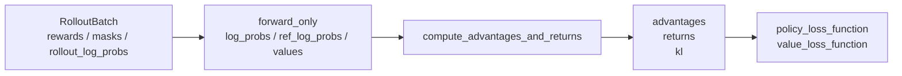

# Advantage计算

## 你为什么要读

这一组解决一个很具体的问题：Rollout 已经给出 response、reward、logprob、mask，训练后端在 policy backward 前如何把这些字段变成每个 token 的 `advantages` 和 `returns`。

读完后应能处理三类事情：

- 首次阅读：知道 reward、KL、value、mask 如何合成训练信号。
- 排障：看到 `advantages` 缺失、KL 异常、CP shape mismatch、OPD teacher 缺失时能找到源码入口。
- 改代码：新增 estimator 或自定义 advantage hook 时，知道必须填哪些字段，不能破坏哪些并行边界。
- 优化 forward：判断“复用 policy-loss logprob”是否仍给 advantage 阶段留下可用于构造 token shape 的 `rollout_log_probs` 或 `values`。
- 识别别名：REINFORCE++ baseline 的 `returns = advantages` 会让 OPD 对 list 的原地替换同时改变 returns，这与其他 estimator 不同。

## 核心模型

Advantage 计算是 RL 闭环里的信用分配转换器。Rollout 给的是“整条回答得了多少分”，policy loss 要的是“每个 response token 该被放大还是压低多少”。

主线不是“逐行读 `loss.py`”，而是跟一条样本走：

`reward scalar + token KL + optional values + loss_masks -> per-token advantages/returns`

## 阅读顺序

| 文档 | 读者问题 |
|------|----------|
| [[Slime-Advantage计算-核心概念]] | reward、KL、value、mask 分别扮演什么角色 |
| [[Slime-Advantage计算-源码走读]] | 一条 batch 在 actor 训练前如何完成 advantage 计算 |
| [[Slime-Advantage计算-数据流]] | `RolloutBatch` 字段、PP/CP/DP 边界、上下游接口 |
| [[Slime-Advantage计算-排障指南]] | 常见报错和配置误解如何排查 |
| [[Slime-Advantage计算-学习检查]] | 如何验证自己真正读懂 |

建议先读 [[Slime-训练数据]]，确认 `tokens`、`loss_masks`、`response_lengths`、`total_lengths` 是如何进入训练后端的；再读本专题；最后接 [[Slime-Policy-Loss]]。

## 源码范围

| 模块 | 本专题关注 |
|------|------------|
| `slime/backends/megatron_utils/actor.py` | actor/critic 在什么时机调用 advantage 计算 |
| `slime/backends/megatron_utils/model.py` | `forward_only` 如何收集 logprob/value |
| `slime/backends/megatron_utils/loss.py` | logprob/value 提取、KL、estimator 分派、OPD、normalization |
| `slime/utils/ppo_utils.py` | GRPO/PPO/REINFORCE++ 的数学 helper |
| `slime/utils/distributed_utils.py` | DP masked whitening |
| `slime/utils/arguments.py` | estimator 与配置互斥校验 |

## 一眼看边界

| 边界 | 结论 |
|------|------|
| 与 [[Slime-训练数据]] | 上游负责把样本整理成 `RolloutBatch` 和 packed batch，本专题不重新解释 DP schedule |
| 与 [[Slime-Policy-Loss]] | 本专题产出 `advantages`，policy loss 才计算 clipped PG、GSPO/CISPO 差异和 mismatch metrics |
| 与 [[Slime-上下文并行与路由重放]] | 本专题只解释 CP 对 advantage/mask 的影响，routing replay 的路由一致性放到 CP 专题 |
| 与 [[Slime-分布式权重同步]] | 本专题发生在 optimizer step 之前，权重同步发生在 step 之后 |

## 首次阅读抓手

先记住六个不变量：

- `compute_advantages_and_returns` 只在 pipeline last stage 写 `rollout_data`。
- `kl_coef == 0` 时仍会构造零 KL 张量，因为 estimator 需要 shape 和 device。
- PPO 需要 `values`，GRPO/GSPO/CISPO 不在 advantage 阶段区分算法差异。
- `normalize_advantages` 使用 DP group 的 masked 统计，CP 下 mask 必须切到本地 response chunk。
- 多处 estimator/helper 使用 `zip(..., strict=False)` 或只比较部分列表长度；sample 数、tensor shape、mask 和 permutation 必须由调用边界额外证明。
- `reinforce_plus_plus_baseline` helper 当前接收 `loss_masks` 却不读取它；mask 仍在下游 reducer/whitening 生效，不能误称已在 helper 内屏蔽。

## 相关验证

- `tests/test_chunked_gae.py`：验证 chunked GAE 与普通 GAE 等价。
- `tests/test_loss_cp_invariance.py`：验证 CP 下 loss/advantage 相关路径的不变性。
- `tests/test_megatron_argument_validation.py`：覆盖部分配置互斥和参数派生。
