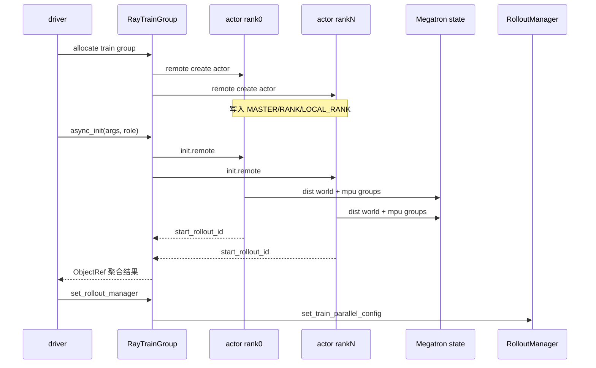
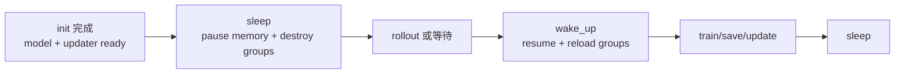

# Megatron-Actor初始化 · 数据流

## 读者任务

这篇不按函数展开，而是看初始化期间哪些对象跨过了 driver、Ray、distributed、Megatron 和 rollout manager 的边界。读完后应能判断一个问题属于启动编排、分布式通信、模型装配、权重同步还是 offload 生命周期。

## 总体时序



## 初始化期间流动的对象

| 对象 | 起点 | 终点 | 机制 | 关键风险 |
|------|------|------|------|----------|
| rank 环境变量 | `TrainRayActor.__init__` | actor 进程 | `os.environ` | `LOCAL_RANK` 错会放错 GPU |
| `args` | driver | 每个 actor | Ray 参数序列化 | debug/offload/colocate 分支必须一致 |
| PyTorch world | actor 内 | 所有 train ranks | `dist.init_process_group` | backend、端口、rank 不一致会卡住 |
| Megatron 子组 | PyTorch world | Megatron `mpu` | `initialize_model_parallel` | TP/PP/DP/CP/EP 维度配置错会 shape 或通信错误 |
| HF config/tokenizer | 磁盘/HF cache | 每个 actor | 节点内按 local slot 串行、节点间并发 + 全局 gloo barrier | 首个 reader 失败会拖住所有 rank |
| checkpoint iteration | checkpoint | driver | actor 返回 `loaded_rollout_id + 1` | 只校验所选 role 的 rank 列表；显式 start id 可覆盖 |
| rollout manager 引用 | driver | actor group | `set_rollout_manager` | init 阶段没有这个引用，不能推权 |

## 进程边界：Ray 创建 actor 与 actor init 是两步

Ray 创建 actor 时只完成进程、GPU 和环境变量准备；模型还没加载。

```python
# 定位骨架（非逐行摘录）：slime/ray/actor_group.py L105-L119
self._actor_handlers = []
master_addr, master_port = None, None
for rank in range(world_size):
    actor = TrainRayActor.options(
        num_cpus=num_gpus_per_actor,
        num_gpus=num_gpus_per_actor,
        scheduling_strategy=PlacementGroupSchedulingStrategy(
            placement_group=pg,
            placement_group_bundle_index=reordered_bundle_indices[rank],
        ),
    ).remote(world_size, rank, master_addr, master_port)
    if rank == 0:
        master_addr, master_port = ray.get(actor.get_master_addr_and_port.remote())
    self._actor_handlers.append(actor)
```

`init` 是后续远程方法调用：

```python
# 定位骨架（非逐行摘录）：slime/ray/actor_group.py L121-L128
def async_init(self, args, role, with_ref=False, with_opd_teacher=False):
    self.args = args
    return [
        actor.init.remote(args, role, with_ref=with_ref, with_opd_teacher=with_opd_teacher)
        for actor in self._actor_handlers
    ]
```

排障抓手：actor 创建失败多看 Ray resources、runtime env、`LD_PRELOAD`；`init.remote` 卡住多看 distributed 或 checkpoint。

## 通信边界：world group 与 gloo 辅助组

`TrainRayActor.init` 建立训练 world，同时初始化 gloo 辅助组。后续 HF 串行读取、一些 CPU 侧同步和 offload 相关 barrier 会用 gloo。

```python
# 来源：slime/ray/train_actor.py L58-L70
local_rank = int(os.environ.get("LOCAL_RANK", 0))
torch.cuda.set_device(f"cuda:{local_rank}")

backend = args.distributed_backend

dist.init_process_group(
    backend=backend,
    timeout=timedelta(minutes=args.distributed_timeout_minutes),
)
init_gloo_group()

args.rank = dist.get_rank()
args.world_size = dist.get_world_size()
```

Megatron 子组之后由 `initialize.init` 创建。两者的关系是“先 world，后切片”。

## 模型边界：actor init 只接住模型对象

本专题不展开 provider 和 optimizer 细节，只看对象如何进入 actor 生命周期。

```python
# 定位骨架（非逐行摘录）：slime/backends/megatron_utils/actor.py L83-L101
self.model, self.optimizer, self.opt_param_scheduler, loaded_rollout_id = initialize_model_and_optimizer(
    args, role
)

vpp_size = mpu.get_virtual_pipeline_model_parallel_world_size() or 1
if vpp_size > 1:
    from megatron.core.utils import get_model_config

    microbatch_group_size_per_vp_stage = get_model_config(self.model[0]).microbatch_group_size_per_vp_stage
else:
    microbatch_group_size_per_vp_stage = 1
self.train_parallel_config = {
    "dp_size": mpu.get_data_parallel_world_size(with_context_parallel=False),
    "cp_size": mpu.get_context_parallel_world_size(),
    "vpp_size": vpp_size,
    "microbatch_group_size_per_vp_stage": microbatch_group_size_per_vp_stage,
}
```

`train_parallel_config` 是 actor 对外暴露的轻量训练拓扑。`set_rollout_manager` 只在 rank 0 把它传给 rollout manager：

```python
# 来源：slime/ray/train_actor.py L125-L128
def set_rollout_manager(self, rollout_manager):
    self.rollout_manager = rollout_manager
    if not self.args.debug_rollout_only and self.args.rank == 0:
        ray.get(self.rollout_manager.set_train_parallel_config.remote(self.train_parallel_config))
```

## 权重边界：init 选 updater，update_weights 才连接 engines

init 阶段只创建 `weight_updater` 对象，并把 `rollout_engines` 初始化为 `None`。

```python
# 定位骨架（非逐行摘录）：slime/backends/megatron_utils/actor.py L162-L180
self.weight_updater = update_weight_cls(
    self.args,
    self.model,
    weights_getter=lambda: self.weights_backuper.get("actor"),
    model_name=type(self.hf_config).__name__.lower() if self.args.model_name is None else self.args.model_name,
    quantization_config=getattr(self.hf_config, "quantization_config", None),
)

clear_memory()
...
self.rollout_engines = None
```

真正跨到 rollout 侧发生在 `update_weights()`：

```python
# 定位骨架（非逐行摘录）：slime/backends/megatron_utils/actor.py L592-L620
(
    rollout_engines,
    rollout_engine_lock,
    num_new_engines,
    engine_gpu_counts,
    engine_gpu_offsets,
    all_engine_actors,
) = ray.get(self.rollout_manager.get_updatable_engines_and_lock.remote())
...
if num_new_engines > 0 or reconnect_rollout_engines:
    self.weight_updater.connect_rollout_engines(
        rollout_engines,
        rollout_engine_lock,
        engine_gpu_counts=engine_gpu_counts,
        engine_gpu_offsets=engine_gpu_offsets,
        all_engine_actors=all_engine_actors,
    )
```

因此“init 成功但推权失败”要继续看 rollout manager、engine lock、NCCL group 与 updater；同时也要检查 actor 是否在 init 后正确收到 `rollout_manager`、offload process groups 是否恢复。不能仅凭 updater 对象已构造就排除 actor 生命周期问题。

## offload 边界：同一个 actor 在两种资源状态间切换



训练 step 内部自动处理 wake/sleep：

```python
# 来源：slime/backends/megatron_utils/actor.py L380-L400
def train(self, rollout_id: int, rollout_data_ref: Box, external_data=None):
    if self.args.debug_rollout_only:
        return None

    if self.args.offload_train:
        self.wake_up()

    with timer("data_preprocess"):
        rollout_data = self._get_rollout_data(rollout_data_ref)

    if self.role == "critic":
        result = self.train_critic(rollout_id, rollout_data)
    else:
        self.train_actor(rollout_id, rollout_data, external_data=external_data)
        result = None

    if self.args.offload_train:
        del rollout_data
        self.sleep()

    return result
```

这条自动处理没有 finally：数据预处理、critic/actor train 任一异常都会跳过末尾 sleep。save 与 update_weights 也有同类边界，资源状态不是事务式切换。

group 级也提供批量接口：

```python
# 来源：slime/ray/actor_group.py L159-L163
def onload(self):
    return ray.get([actor.wake_up.remote() for actor in self._actor_handlers])

def offload(self):
    return ray.get([actor.sleep.remote() for actor in self._actor_handlers])
```

## 数据流复盘

- Ray actor 创建阶段传的是资源与 rank，不传训练数据。
- init 阶段主要传 `args`、checkpoint 恢复出的 rollout id、训练拓扑配置。
- rollout 样本数据在后续 `train(rollout_data_ref)` 进入，见 [[Slime-训练步骤]]。
- rollout engines 在 `update_weights()` 时由 rollout manager 提供，不在 init 内绑定。
- offload 改变的是 actor 的资源状态，不改变 checkpoint 语义。
- init 与 offload 都没有通用失败回滚；distributed/HF/tag load 中途失败后，旧 actor 不能被视为干净初始态。
