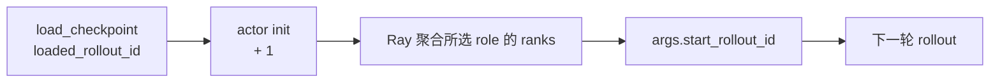
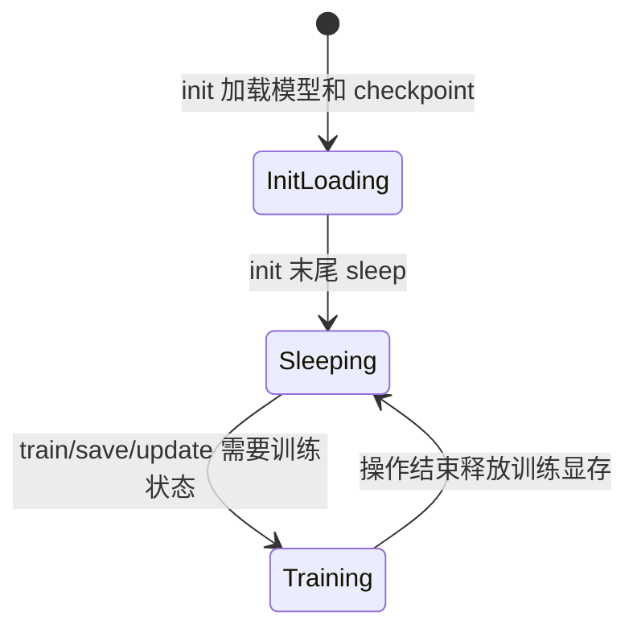

# Megatron-Actor初始化 · 核心概念

## 读者任务

这篇先建立术语和心理模型。读完后再看 [[Slime-Megatron-Actor初始化-源码走读]]，应该能分清哪些事情属于 Ray 进程，哪些属于 PyTorch distributed，哪些属于 Megatron parallel state，哪些只是 Slime 的业务装配。

## 一句话模型

把 `MegatronTrainRayActor.init` 想成训练侧的“启动检查单”：

1. Ray 把一个进程放到某个 GPU 上，并写好 rank 环境变量。
2. PyTorch distributed 让这些进程组成一个 world。
3. Megatron 把 world 切成 TP/PP/DP/CP/EP 等训练子组。
4. Slime 加载模型、checkpoint、辅助权重 tag，并选择向 rollout engine 推权重的桥型。
5. 如果启用 offload，刚初始化好的训练栈立即进入 sleep，等真正训练时再 wake。

## 三层 rank

| 层 | 源码对象 | 读者应记住 |
|----|----------|------------|
| Ray actor | `RayTrainGroup._actor_handlers` | 每个 handler 对应一个远程进程，通常绑定一个 GPU |
| PyTorch world | `RANK`、`WORLD_SIZE`、`dist.init_process_group` | 所有 train actors 先进入同一个 distributed world |
| Megatron parallel state | `mpu.initialize_model_parallel` | 在 world 之上切 TP、PP、DP、CP、EP、VPP 等子组 |

最常见误读是把 Ray actor rank 等同于 Megatron DP rank。它们有关联，但 Megatron 会重新解释这个 world，并形成多个并行维度。

## actor 与 critic 的分工

| role | 会加载模型吗 | 会建 `weights_backuper` 吗 | 会建 `weight_updater` 吗 | init 末尾 |
|------|--------------|----------------------------|---------------------------|-----------|
| `actor` | 会 | 会 | 会 | 可能 `sleep()` |
| `critic` | 会 | 不会 | 不会 | offload 下直接 `sleep()` 后返回；跳过 actor-only 收尾 |

critic 仍然是完整 Megatron 训练模型，只是不负责向 SGLang 推 actor 权重。因此 critic 的初始化比 actor 短，但不是“轻量假模型”。

提前返回还意味着 critic 不执行后面的 `clear_memory()`、`rollout_data_postprocess` 加载与 `prof.on_init_end()`；这些并非 critic 当前训练路径必需，但排查 profiler/自定义 postprocess 时不能假设两种 role 有完全相同的 init 收尾。

## 权重 tag 是同一个模型对象的多份状态

actor init 里维护的不是多套独立模型实例，而是同一个 Megatron model 上的多个权重快照：

| tag | 用途 |
|-----|------|
| `actor` | 当前训练中的 policy 权重 |
| `ref` | KL 或 ref logprob 使用的参考权重 |
| `teacher` | Megatron 版 OPD teacher 权重 |
| `old_actor` | `keep_old_actor` 下的旧 policy |
| `rollout_actor` | 更新间隔为 1 时，用队列语义保存 rollout 侧上一版 actor |

核心抓手：`_switch_model(tag)` 是“把同一个模型恢复到某个 tag 的参数状态”，不是切到另一个 Python model。

## start_rollout_id 是恢复训练的对齐点

`initialize_model_and_optimizer` 读 checkpoint 后返回 `loaded_rollout_id`，actor init 返回 `loaded_rollout_id + 1`。上层只对当前选中的列表做一致性检查：无 critic 时检查 actor ranks，有 critic 时检查 critic ranks；它不比较 actor 与 critic 两组返回值。并且只有 `args.start_rollout_id is None` 才采用返回值，显式起点优先。

这解释了为什么 checkpoint 恢复不是只关心模型权重，还要关心 rollout 计数。

## offload 生命周期

`offload_train` 把训练 actor 做成可暂停资源：

`sleep()` 的重点不是普通清 cache，而是暂停 `torch_memory_saver` 管理的训练内存，并销毁可重建的 process groups。`wake_up()` 则恢复内存、重载 process groups，并把 actor 权重 tag 切回来。

这张图只描述无异常路径。`train/save/update_weights` 都是先 wake、末尾再 sleep，没有 `try/finally`；中途失败会让模型保持唤醒、process group 或 updater 连接停在半状态。恢复策略应以重建 actor 为基线，除非能逐项证明当前资源状态。

## debug 模式边界

| 模式 | train actor init | rollout 侧 | 用途 |
|------|------------------|------------|------|
| `debug_rollout_only` | 只保存 `args` 并返回 `0` | 正常跑 | 单独调 rollout、reward、采样 |
| `debug_train_only` | 正常初始化 Megatron | 跳过或弱化 rollout | 单独调 train、loss、checkpoint |

两者不能同时打开。要验证 Megatron checkpoint、模型 provider、offload、weight updater，不能用 `debug_rollout_only`。

## 最小不变量

- 所有 train actor 必须进入同一个 PyTorch world，再由 Megatron 切子组。
- 每个 rank 都必须返回相同 `start_rollout_id`。
- 更准确地说，是 driver 选中的 actor 或 critic rank 列表内部一致；actor/critic 跨组进度当前没有自动交叉校验。
- actor 的 `weight_updater` 依赖已经初始化好的 model、HF config 和 `weights_backuper`。
- `colocate` 下只能走 full tensor 推权；delta 模式不能与 colocate 组合。
- offload 的动态库注入必须发生在 Ray actor 创建前，不能等到 `init()` 里再补。
- NumPy 1.x 是硬门禁，而且断言发生在 Megatron 子组创建之后；失败 actor 已有部分 distributed 状态。

## 下一步

带着这张启动检查单读 [[Slime-Megatron-Actor初始化-源码走读]]。如果目的是排障，可以直接跳到 [[Slime-Megatron-Actor初始化-排障指南]]。
