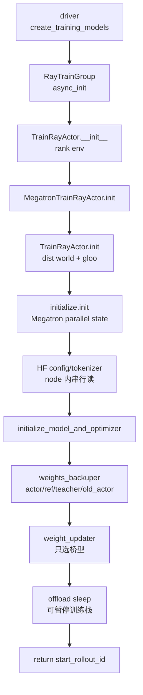

# Megatron-Actor初始化 · 源码走读

## 读者任务

这篇沿一次训练 actor 初始化走：driver 创建 Ray train group，Ray actor 进程写好 rank 环境变量，`init.remote` 让每个进程进入 PyTorch distributed 和 Megatron parallel state，然后 Slime 加载模型、权重 tag、weight updater，并在 offload 模式下进入 sleep。

读完后应能定位：

- `debug_rollout_only` 为什么不会加载 Megatron 模型。
- `TrainRayActor.init` 与 `initialize.init` 为什么不是重复初始化。
- `initialize_model_and_optimizer` 在 actor init 中处于什么位置。
- ref/teacher/old_actor 如何装进同一个权重备份系统。
- `weight_updater` 何时被选型，何时才真正连接 rollout engines。
- `sleep/wake_up` 为什么会销毁和恢复 process groups。

## 长文读法

这篇按“Ray 进程先有 rank 环境，再让 Megatron 接管训练并行状态”读：driver 并发触发 train actors 初始化，Ray actor 先写分布式环境变量，`TrainRayActor.init` 建 PyTorch world，`initialize.init` 建 Megatron parallel state，随后 actor 才加载模型、备份多套权重视图并选定 weight updater。

| 读者任务 | 先读 | 要抓住的判断 |
|----------|------|--------------|
| 第一次建立初始化主线 | 读者任务、主线地图、1 到 3 | driver、RayTrainGroup、Ray actor 分别负责触发、调度和进程内环境 |
| 排查 `debug_rollout_only` | 4 | 这是最早短路，直接返回 rollout 起点，不进入 Megatron 模型加载 |
| 区分两层 init | 5 到 6 | `TrainRayActor.init` 建 PyTorch distributed，`initialize.init` 补 Megatron 全局状态 |
| 排查 HF config/tokenizer 读取 | 7 | 每轮按 local-slot 跨节点并发、节点内串行；任一 rank 失败会卡住全局 barrier |
| 定位模型与 checkpoint 对齐 | 8 到 9 | `initialize_model_and_optimizer` 返回 `loaded_rollout_id`，actor/ref/teacher/old_actor 进入同一套备份系统 |
| 排查权重同步初始化 | 10 | init 阶段只选择 updater 类型，真正连接 rollout engines 发生在后续 `update_weights` |
| 理解 offload 语义 | 11 到 12 | sleep/wake 是训练栈暂停与恢复，会销毁和恢复 process groups |

读的时候不要把 Ray actor 创建、PyTorch distributed 初始化、Megatron parallel 初始化混成一步。它们顺序相邻，但职责不同，排障入口也不同。

## 主线地图



## 1. driver 并发触发所有 train actors 初始化

系统压力：Megatron 训练必须所有 rank 一起初始化；任何单 rank 的 checkpoint 步数不同，后续 rollout id 都会错位。

设计选择：`create_training_models` 先创建 train group，再对每个 actor handler 调 `init.remote`，最后 `ray.get` 聚合返回值，并要求所选 role 的 rank 列表内 `start_rollout_id` 一致。

```python
# 定位骨架（非逐行摘录）：slime/ray/placement_group.py L189-L210
critic_start_rollout_ids = ray.get(critic_model.async_init(critic_model.args, role="critic", with_ref=False))

actor_start_rollout_ids = ray.get(
    actor_model.async_init(
        actor_args,
        role="actor",
        with_ref=actor_args.kl_coef != 0 or actor_args.use_kl_loss,
        with_opd_teacher=actor_args.use_opd and actor_args.opd_type == "megatron",
    )
)
...
assert len(set(start_rollout_ids)) == 1

if args.start_rollout_id is None:
    args.start_rollout_id = start_rollout_ids[0]

actor_model.set_rollout_manager(rollout_manager)
```

执行逻辑：

- `with_ref` 由 KL 相关参数推导，不是用户手工调用。
- 使用 critic 时，当前源码以 critic 返回的 rollout id 作为全局起点。
- 此时只断言 critic ranks 彼此一致，不会对比 actor ranks；当前源码注释也要求 critic 场景由用户显式决定起点。
- 若 `args.start_rollout_id` 已在参数阶段设置，聚合返回值不会覆盖它。
- `set_rollout_manager` 在 init 之后执行；init 阶段并不会连接 SGLang engines。

## 2. Ray actor 创建阶段已经写好 rank 环境变量

系统压力：`dist.init_process_group` 依赖 `MASTER_ADDR`、`MASTER_PORT`、`WORLD_SIZE`、`RANK`、`LOCAL_RANK`。这些必须在 actor 进程内、进入 `init()` 前准备好。

设计选择：`TrainRayActor.__init__` 在远程 actor 创建时设置环境变量；rank 0 生成 master 地址和端口，其余 rank 复用。

```python
# 定位骨架（非逐行摘录）：slime/ray/train_actor.py L28-L49
class TrainRayActor(RayActor):
    def __init__(self, world_size, rank, master_addr, master_port):
        configure_logger()
        self._world_size = world_size
        self._rank = rank
        if master_addr:
            self.master_addr, self.master_port = master_addr, master_port
        else:
            self.master_addr, self.master_port = self._get_current_node_ip_and_free_port(
                start_port=random.randint(20000, 21000)
            )

        os.environ["MASTER_ADDR"] = self.master_addr
        os.environ["MASTER_PORT"] = str(self.master_port)
        os.environ["WORLD_SIZE"] = str(self._world_size)
        os.environ["RANK"] = str(self._rank)
        os.environ["LOCAL_RANK"] = str(get_local_gpu_id())
```

不变量：如果这里的 `LOCAL_RANK` 与 Ray 实际分配 GPU 不一致，后面的 `torch.cuda.set_device` 会把 rank 放到错误设备上。

NUMA affinity 又使用 `global RANK % num_gpus_per_node` 选择 NVML device，而不是上面算出的 `LOCAL_RANK`。当 Ray bundle/GPU id 被重排时，训练 CUDA device 可能正确，但 CPU affinity 绑到另一块物理 GPU；这是性能与拓扑诊断边界，不一定直接报错。

## 3. RayTrainGroup 注入运行环境，并并发调用 init

系统压力：offload 和 routing replay 有进程级环境要求，必须在 Ray actor 启动时注入，而不是模型初始化中途再设置。

设计选择：`_allocate_gpus_for_actor` 构造 `runtime_env.env_vars`，offload 时设置 `LD_PRELOAD` 与 `TMS_*`，routing replay 只对 actor role 开启。

```python
# 定位骨架（非逐行摘录）：slime/ray/actor_group.py L55-L103
env_vars = {
    "NCCL_CUMEM_ENABLE": os.environ.get("NCCL_CUMEM_ENABLE", "0"),
    "NVTE_FP8_BLOCK_SCALING_FP32_SCALES": os.environ.get("NVTE_FP8_BLOCK_SCALING_FP32_SCALES", "1"),
    **{name: "1" for name in NOSET_VISIBLE_DEVICES_ENV_VARS_LIST},
    **self.args.train_env_vars,
}

if self.args.offload_train and self.args.train_backend == "megatron":
    ...
    env_vars["LD_PRELOAD"] = dynlib_path
    env_vars["TMS_INIT_ENABLE"] = "1"
    env_vars["TMS_INIT_ENABLE_CPU_BACKUP"] = "1"

if self.args.use_routing_replay and self.role == "actor":
    env_vars["ENABLE_ROUTING_REPLAY"] = "1"
...
TrainRayActor = ray.remote(**actor_options)(actor_impl)
```

`async_init` 本身只是把调用广播到所有 handlers：

```python
# 定位骨架（非逐行摘录）：slime/ray/actor_group.py L121-L128
def async_init(self, args, role, with_ref=False, with_opd_teacher=False):
    self.args = args
    return [
        actor.init.remote(args, role, with_ref=with_ref, with_opd_teacher=with_opd_teacher)
        for actor in self._actor_handlers
    ]
```

读者抓手：offload 动态库找不到，会在 actor 创建阶段暴露；不是 checkpoint load 问题。

## 4. debug_rollout_only 是最早短路

系统压力：有时只想调 rollout/reward，不想启动 Megatron、读 checkpoint 或占用训练显存。

设计选择：`MegatronTrainRayActor.init` 第一段检查 `debug_rollout_only`，只保存 `args` 并返回 `0`。后续 `train`、`save_model`、`update_weights` 也承认这个轻量状态。

```python
# 来源：slime/backends/megatron_utils/actor.py L46-L62
class MegatronTrainRayActor(TrainRayActor):
    @with_defer(lambda: Timer().start("train_wait"))
    def init(
        self,
        args: Namespace,
        role: str,
        with_ref: bool = False,
        with_opd_teacher: bool = False,
    ) -> int | None:
        if args.debug_rollout_only:
            self.args = args
            return 0

        monkey_patch_torch_dist()
        super().init(args, role, with_ref, with_opd_teacher)

        init(args)
```

配套 guard：

```python
# 来源：slime/backends/megatron_utils/actor.py L380-L385
def train(self, rollout_id: int, rollout_data_ref: Box, external_data=None):
    if self.args.debug_rollout_only:
        return None

    if self.args.offload_train:
        self.wake_up()
```

不变量：使用 `debug_rollout_only` 时，不应期待 `self.model`、`self.weight_updater`、`self.train_parallel_config` 存在。

## 5. 先建 PyTorch world，再建 Megatron parallel state

系统压力：Megatron 子组只能建立在已经初始化好的 torch distributed world 之上。

设计选择：父类 `TrainRayActor.init` 设置 CUDA device、调用 `dist.init_process_group`、初始化 gloo 辅助组；随后 `initialize.init` 调 `mpu.initialize_model_parallel` 切出 Megatron 子组。

```python
# 定位骨架（非逐行摘录）：slime/ray/train_actor.py L50-L70
def init(self, args, role, with_ref=False, with_opd_teacher=False):
    self.args = args
    self.role = role
    self.with_ref = with_ref
    self.with_opd_teacher = with_opd_teacher
    ...
    local_rank = int(os.environ.get("LOCAL_RANK", 0))
    torch.cuda.set_device(f"cuda:{local_rank}")

    backend = args.distributed_backend

    dist.init_process_group(
        backend=backend,
        timeout=timedelta(minutes=args.distributed_timeout_minutes),
    )
    init_gloo_group()

    args.rank = dist.get_rank()
    args.world_size = dist.get_world_size()
```

Megatron 侧只负责切子组：

```python
# 定位骨架（非逐行摘录）：slime/backends/megatron_utils/initialize.py L33-L53
def _initialize_distributed(args, get_embedding_ranks=None, get_position_embedding_ranks=None):
    mpu.initialize_model_parallel(
        args.tensor_model_parallel_size,
        args.pipeline_model_parallel_size,
        args.virtual_pipeline_model_parallel_size,
        pipeline_model_parallel_comm_backend=args.pipeline_model_parallel_comm_backend,
        context_parallel_size=args.context_parallel_size,
        hierarchical_context_parallel_sizes=args.hierarchical_context_parallel_sizes,
        expert_model_parallel_size=args.expert_model_parallel_size,
        num_distributed_optimizer_instances=args.num_distributed_optimizer_instances,
        expert_tensor_parallel_size=args.expert_tensor_parallel_size,
        distributed_timeout_minutes=args.distributed_timeout_minutes,
        nccl_communicator_config_path=args.nccl_communicator_config_path,
        order="tp-cp-ep-dp-pp" if not args.use_tp_pp_dp_mapping else "tp-cp-ep-pp-dp",
        get_embedding_ranks=get_embedding_ranks,
        get_position_embedding_ranks=get_position_embedding_ranks,
        create_gloo_process_groups=args.enable_gloo_process_groups,
    )
```

这不是重复初始化：一个建立 world，一个在 world 里划分训练拓扑。

## 6. initialize.init 补齐 Megatron 全局状态

系统压力：Megatron 的训练函数会读取全局 args、随机种子、tokenizer 占位和 microbatch calculator；这些必须在建模前准备好。

设计选择：Slime 的 `initialize.init` 是 Megatron 初始化的精简入口：设置全局 args，切并行组，设置 seed，初始化 microbatch calculator，并允许最后执行自定义 hook。

```python
# 定位骨架（非逐行摘录）：slime/backends/megatron_utils/initialize.py L56-L104
def init(args):
    set_args(args)
    if args.enable_experimental:
        logger.info("Enable megatron experimental")
        set_experimental_flag(True)

    _initialize_distributed(args)

    assert np.__version__.startswith("1."), "Megatron does not support numpy 2.x"
    ...
    _set_random_seed(
        args.seed,
        args.data_parallel_random_init,
        args.te_rng_tracker,
        args.inference_rng_tracker,
    )
    _build_tokenizer(args)
    init_num_microbatches_calculator(...)
    ...
    if getattr(args, "custom_megatron_init_path", None):
        custom_init = load_function(args.custom_megatron_init_path)
        custom_init(args)
```

执行逻辑：

- seed 会随 PP rank、可选 DP rank 变化，避免所有并行 rank 使用同一随机流。
- NumPy 2.x 会被显式拒绝，这是 Megatron 兼容性边界。
- 自定义 init hook 位于标准初始化之后，适合补注册，不适合替代 parallel state 初始化。
- NumPy 2.x 断言位于 `_initialize_distributed` 之后；失败时 TP/PP/DP 等子组已经部分创建，当前函数没有清理回滚。
- 任一后续 seed/tokenizer/microbatch/custom hook 异常同样不会自动销毁 world 与 Megatron groups，原 actor 不适合作为干净进程直接重试 init。

## 7. HF config/tokenizer 按节点内 local slot 串行读取

系统压力：多个 rank 同时读写 HF cache 可能造成缓存文件竞态；但每个 actor 又都需要 config/tokenizer。

设计选择：按 `rank % num_gpus_per_node` 轮转读取，并在每轮后用全局 gloo barrier 同步。同一个 i 上每台节点各有一个 rank 同时读取，所以是“节点内串行、节点间并发”，不是全局只允许一个 reader。

```python
# 定位骨架（非逐行摘录）：slime/backends/megatron_utils/actor.py L64-L76
if is_megatron_main_rank():
    init_tracking(args, primary=False, role=role)

self.prof = TrainProfiler(args)

for i in range(args.num_gpus_per_node):
    if i == dist.get_rank() % args.num_gpus_per_node:
        self.hf_config = AutoConfig.from_pretrained(args.hf_checkpoint, trust_remote_code=True)
        self.tokenizer = AutoTokenizer.from_pretrained(self.args.hf_checkpoint, trust_remote_code=True)
    dist.barrier(group=get_gloo_group())

dist.barrier(group=get_gloo_group())
```

读者抓手：这里的 barrier 是工程稳定性措施，不是模型并行计算的一部分。它假设 global rank 按每节点固定 GPU 数连续排列；任一节点路径不可见、远程代码卡住或 reader 抛错，其他所有 rank 都会停在 barrier，且没有 timeout/错误广播来指出首个失败者。

## 8. 模型装配返回 checkpoint 对齐信息

系统压力：actor 需要拿到可训练模型、optimizer、scheduler，同时恢复 checkpoint 中的 rollout 步数。

设计选择：`initialize_model_and_optimizer` 一次性返回四件东西，actor init 只在外层把 `loaded_rollout_id` 转成下一轮起点。

```python
# 定位骨架（非逐行摘录）：slime/backends/megatron_utils/actor.py L78-L106
if args.offload_train:
    if (x := args.train_memory_margin_bytes) > 0:
        logger.info(f"Set torch_memory_saver.memory_margin_bytes to {x}")
        torch_memory_saver.memory_margin_bytes = x

self.model, self.optimizer, self.opt_param_scheduler, loaded_rollout_id = initialize_model_and_optimizer(
    args, role
)
...
start_rollout_id = loaded_rollout_id + 1

if role == "critic":
    if self.args.offload_train:
        self.sleep()
    return start_rollout_id
```

边界：模型 provider、critic head、optimizer、checkpoint load 的内部路径见 [[Slime-模型初始化]]。本专题只关心 actor init 如何接住这些对象。

## 9. actor 把多个权重视图装进 TensorBackuper

系统压力：同一个训练 actor 在一次 actor train 中可能要用 ref、teacher、old_actor 等多个权重状态计算 logprob，但维护多套完整 Megatron 模型成本太高。

设计选择：初始化 actor 权重后，`TensorBackuper` 以 tag 形式保存不同参数快照；`load_other_checkpoint` 临时改 load 参数，加载辅助 checkpoint 后备份到对应 tag。

```python
# 定位骨架（非逐行摘录）：slime/backends/megatron_utils/actor.py L108-L131
self.weights_backuper = TensorBackuper.create(
    source_getter=lambda: named_params_and_buffers(
        self.args,
        self.model,
        convert_to_global_name=args.megatron_to_hf_mode == "raw",
    ),
    single_tag=None,
)
self._active_model_tag: str | None = "actor"
self.weights_backuper.backup("actor")

if with_ref:
    self.load_other_checkpoint("ref", args.ref_load)

if with_opd_teacher:
    self.load_other_checkpoint("teacher", args.opd_teacher_load)

if self.args.keep_old_actor:
    self.load_other_checkpoint("old_actor", args.load)
    if args.update_weights_interval == 1:
        self.weights_backuper.backup("rollout_actor")
```

辅助 checkpoint 的加载方式：

```python
# 定位骨架（非逐行摘录）：slime/backends/megatron_utils/actor.py L654-L682
def load_other_checkpoint(self, model_tag: str, path: str) -> None:
    old_args = self.args.load, self.args.no_load_optim, self.args.no_load_rng, self.args.finetune
    self.args.load = path
    self.args.no_load_optim = True
    self.args.no_load_rng = True
    self.args.finetune = True
    ...
    _, _ = load_checkpoint(
        self.model,
        None,
        None,
        checkpointing_context={},
        skip_load_to_model_and_opt=False,
    )
    self.args.load, self.args.no_load_optim, self.args.no_load_rng, self.args.finetune = old_args
    ...
    self.weights_backuper.backup(model_tag)
    self._active_model_tag = model_tag
```

不变量：辅助权重只加载 model，不加载 optimizer/RNG；否则会污染当前 actor 训练状态。但 `load_other_checkpoint` 临时改写 `args.load/no_load_optim/no_load_rng/finetune/ckpt_step` 时没有 `try/finally`。load 失败会留下被改写的 args 和可能部分写入的模型，不能安全继续加载下一个 tag。

## 10. weight_updater 在 init 中只定桥型

系统压力：不同部署形态下，训练权重到 rollout engine 的通道不同：colocate 用 tensor，非 colocate 可用 disk 或 NCCL，delta 只能走 disk。

设计选择：init 根据配置选择 updater class 并实例化，但不在这里获取 rollout engines。真正连接和推权发生在 `update_weights()`。

```python
# 定位骨架（非逐行摘录）：slime/backends/megatron_utils/actor.py L133-L168
if self.args.vocab_size is None:
    hf_vocab = getattr(self.hf_config, "vocab_size", None)
    self.args.vocab_size = hf_vocab if hf_vocab is not None else self.tokenizer.vocab_size

if self.args.colocate:
    assert (
        self.args.update_weight_mode == "full"
    ), "--update-weight-mode=delta is not supported with --colocate"
    update_weight_cls = UpdateWeightFromTensor
elif self.args.update_weight_mode == "delta":
    assert (
        self.args.update_weight_transport == "disk"
    ), "--update-weight-mode=delta requires --update-weight-transport=disk"
    from .update_weight.update_weight_from_disk_delta import UpdateWeightFromDiskDelta

    update_weight_cls = UpdateWeightFromDiskDelta
else:
    assert self.args.update_weight_mode == "full"
    if self.args.update_weight_transport == "disk":
        update_weight_cls = UpdateWeightFromDisk
    else:
        assert (
            self.args.update_weight_mode == "full" and self.args.update_weight_transport == "nccl"
        ), f"unsupported weight sync mode/transport: {self.args.update_weight_mode!r}/{self.args.update_weight_transport!r}"
        update_weight_cls = UpdateWeightFromDistributed
self.weight_updater = update_weight_cls(...)
```

真正连接 rollout engines 的位置：

```python
# 定位骨架（非逐行摘录）：slime/backends/megatron_utils/actor.py L583-L628
def update_weights(self) -> None:
    if self.args.debug_train_only or self.args.debug_rollout_only:
        return
    ...
    (
        rollout_engines,
        rollout_engine_lock,
        num_new_engines,
        engine_gpu_counts,
        engine_gpu_offsets,
        all_engine_actors,
    ) = ray.get(self.rollout_manager.get_updatable_engines_and_lock.remote())
    ...
    if num_new_engines > 0 or reconnect_rollout_engines:
        self.weight_updater.connect_rollout_engines(...)
    ...
    self.weight_updater.update_weights()
```

读者抓手：init 失败看 updater 选型和参数；推权卡住看 [[Slime-分布式权重同步]]。

## 11. init 末尾进入可暂停状态

系统压力：训练模型刚加载完会占用大量 GPU 显存；在 colocate 或 offload 场景下，后续 rollout 可能需要先使用这些资源。

设计选择：actor init 清理临时缓存；若启用 offload，先确保当前 tag 是 `actor`，再 `sleep()`。

```python
# 定位骨架（非逐行摘录）：slime/backends/megatron_utils/actor.py L170-L188
clear_memory()

if self.args.offload_train:
    self._switch_model("actor")
    self.sleep()

self.rollout_engines = None

self.rollout_data_postprocess = None
if self.args.rollout_data_postprocess_path is not None:
    from slime.utils.misc import load_function

    self.rollout_data_postprocess = load_function(self.args.rollout_data_postprocess_path)

self.prof.on_init_end()

return start_rollout_id
```

这里返回的是下一轮 rollout 起点，不是当前 checkpoint iteration。

## 12. sleep/wake 是训练栈的暂停与恢复

系统压力：普通 `torch.cuda.empty_cache()` 不能完整表达“训练 actor 暂时让出资源”；offload 还要处理 process group 与 rollout engine 连接。

设计选择：`sleep()` 清内存、断开部分 rollout engine 连接、销毁 process groups，然后暂停 `torch_memory_saver`；`wake_up()` 恢复内存管理、重载 process groups，并切回 actor 权重 tag。

```python
# 定位骨架（非逐行摘录）：slime/backends/megatron_utils/actor.py L190-L220
def sleep(self) -> None:
    assert self.args.offload_train

    clear_memory(clear_host_memory=True)
    print_memory("before offload model")
    if (
        self.role == "actor"
        and self.args.use_critic
        and not self.args.colocate
        and hasattr(self.weight_updater, "disconnect_rollout_engines")
    ):
        self.weight_updater.disconnect_rollout_engines()
    destroy_process_groups()

    torch_memory_saver.pause()

    print_memory("after offload model")

def wake_up(self) -> None:
    assert self.args.offload_train
    print_memory("before wake_up model")

    torch_memory_saver.resume()

    clear_memory()
    reload_process_groups()
    if self.role == "actor":
        self._switch_model("actor")
    print_memory("after wake_up model")
```

不变量：调用 `sleep/wake_up` 前必须已经经过完整 init；`debug_rollout_only` 不具备这些对象。`train()`、`save_model()`、`update_weights()` 也没有用 finally 保证失败后 sleep/destroy；异常后的 actor 资源态必须重新审计，通常直接重建更可靠。

## 运行验证

静态审计：

```powershell
node maintenance/audit_source_evidence.mjs --note slime_reading/训练后端/Megatron-Actor初始化/Slime-Megatron-Actor初始化-源码走读.md
node maintenance/audit_wikilinks.mjs
```

配置级验证：

```powershell
python -m pytest slime/tests/test_megatron_argument_validation.py
```

完整初始化验证需要 Ray、CUDA、Megatron、checkpoint 与可用 GPU。预期现象：

- 正常模式：所选 role 的各 rank 返回同一个 `start_rollout_id`，driver 不触发 `assert len(set(start_rollout_ids)) == 1`。
- `debug_rollout_only`：`init` 快速返回 `0`，不会出现 Megatron checkpoint load 日志。
- `offload_train`：init 末尾出现 sleep 相关 memory 日志，第一次 `train()` 前出现 wake 相关 memory 日志。

## 复盘

- Ray actor 进程创建和 Megatron 初始化是两段生命周期，不能混在一起排障。
- `init()` 是训练栈装配点，不是训练 step，也不是实际推权点。
- critic 会初始化模型但不会建立 actor 的权重同步桥。
- 权重 tag 让一个模型对象承担多种 policy 视图，是后续 logprob/advantage 的基础。
- offload 的正确性依赖 actor 创建前的环境注入、init 末尾的 sleep、训练前后的 wake/sleep 三者同时成立。
