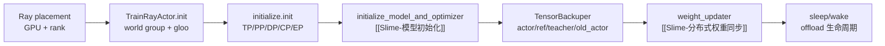

# Megatron-Actor初始化

## 你为什么要读

这一组回答：Ray 已经把 GPU 进程拉起来以后，一个普通 Ray actor 如何变成能跑 Megatron 训练、能加载 checkpoint、能切换 actor/ref/teacher/old_actor 权重、并能在需要时把权重推给 SGLang 的 train actor。

读完后应能处理三类问题：

- 首次阅读：知道 `RayTrainGroup.async_init` 到 `MegatronTrainRayActor.init` 的启动顺序。
- 排障：启动卡住、checkpoint 恢复步数不一致、offload sleep/wake 异常、colocate 推权配置错误时能定位源码入口。
- 改代码：接新训练后端、增加权重 tag、改 offload 生命周期、调整初始化 hook 时知道边界在哪里。

## 核心模型

Megatron Actor 初始化是训练侧的“点火钥匙”。Ray 只负责把进程、GPU、rank 环境变量准备好；本专题关注这个进程如何接通 PyTorch distributed、Megatron 并行拓扑、模型状态和权重同步桥。

它不负责一次训练 step 的 loss，也不负责真正执行 `update_weights()`；它决定后续训练循环拿到的 actor 状态是否完整。

## 阅读顺序

| 文档 | 读者问题 |
|------|----------|
| [[Slime-Megatron-Actor初始化-核心概念]] | Ray actor、Megatron rank、模型 tag、offload 生命周期各是什么 |
| [[Slime-Megatron-Actor初始化-源码走读]] | 一次 actor init 如何从 Ray 进程走到可训练状态 |
| [[Slime-Megatron-Actor初始化-数据流]] | driver、Ray、distributed、Megatron、rollout manager 之间传什么 |
| [[Slime-Megatron-Actor初始化-排障指南]] | debug、colocate、critic、start_rollout_id、offload 等排障入口 |
| [[Slime-Megatron-Actor初始化-学习检查]] | 可执行验收清单 |

## 源码范围

| 模块 | 本专题关注 |
|------|------------|
| `slime/ray/actor_group.py` | 创建 Ray actor、注入 runtime env、并发触发 `init.remote` |
| `slime/ray/train_actor.py` | 设置 `MASTER_ADDR`、`RANK`、`LOCAL_RANK`，初始化 PyTorch process group 与 gloo |
| `slime/backends/megatron_utils/initialize.py` | 初始化 Megatron parallel state、随机种子、microbatch calculator 与自定义 init hook |
| `slime/backends/megatron_utils/actor.py` | `MegatronTrainRayActor.init`、`sleep`、`wake_up`、`update_weights` 的初始化边界 |
| `slime/backends/megatron_utils/model.py` | `initialize_model_and_optimizer` 的调用边界，细节见 [[Slime-模型初始化]] |

## 与相邻专题的边界

| 边界 | 结论 |
|------|------|
| [[Slime-RayTrainGroup]] | Ray 编排与 placement group 的上游入口在 Ray 专题；本专题从 train actor 被创建后开始 |
| [[Slime-模型初始化]] | 模型 provider、DDP chunks、optimizer、scheduler、checkpoint load 的内部细节由该专题负责 |
| [[Slime-训练步骤]] | `train()` 如何消费 rollout data、算 logprob/advantage/loss 由训练步骤专题负责 |
| [[Slime-上下文并行与路由重放]] | CP/routing replay 依赖这里建好的 Megatron parallel state，但不是 init 主线 |
| [[Slime-分布式权重同步]] | 本专题只讲 updater 选型；真正推权和连接 rollout engines 见权重同步专题 |

## 首次阅读抓手

先记住五条：

- `debug_rollout_only` 是最早的短路：不会进入 Megatron 初始化，也不会加载训练模型。
- `TrainRayActor.init` 建 PyTorch world group；`initialize.init` 在 world group 之上切 TP/PP/DP/CP/EP 子组。
- `initialize_model_and_optimizer` 返回 `loaded_rollout_id`，actor init 转成 `start_rollout_id = loaded_rollout_id + 1`。
- actor 才有 `weights_backuper` 和 `weight_updater`；critic 提前返回，不向 SGLang 推权重。
- `offload_train` 下 init 末尾会 `sleep()`，下一次 `train()` 或某些保存/推权路径再 `wake_up()`。
- 上述 sleep/wake 是成功路径状态机；当前 init/train/save/update 缺少统一的失败回滚，异常后通常应销毁并重建 actor，而不是原地重试。

## 相关验证

- `node maintenance/audit_source_evidence.mjs --note slime_reading/训练后端/Megatron-Actor初始化/Slime-Megatron-Actor初始化-源码走读.md`：检查源码证据仍指向当前 upstream。
- `node maintenance/audit_wikilinks.mjs`：检查专题内双链是否断开。
- 完整 actor init 依赖 Ray、CUDA、Megatron checkpoint 和 distributed 环境；普通 Windows 本地只能做静态审计和参数级检查。
