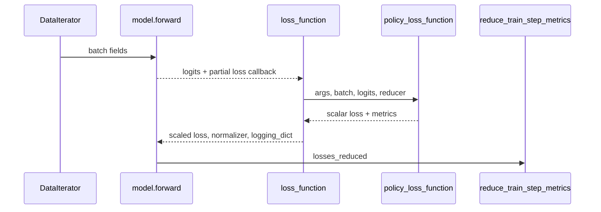
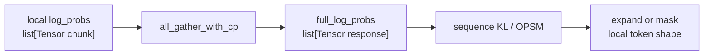

# Policy-Loss · 数据流

## 你为什么要读

本篇只看字段和边界：一次 training micro-batch 里，哪些字段进入 loss，哪些字段写入 metrics，哪些字段只在特定配置下出现。

## batch 字段

| 字段 | policy loss | value loss | SFT loss | 说明 |
|------|-------------|------------|----------|------|
| `tokens` / `unconcat_tokens` | 读 | 读 | 读 | logits 对齐 response token |
| `total_lengths` / `response_lengths` | 读 | 读 | 读 | 切 response 与 CP gather |
| `loss_masks` | 读 | 读 | 读 | reducer 与有效 token |
| `advantages` | 读 | 否 | 否 | [[Slime-Advantage计算]] 产物 |
| `returns` | 否 | 读 | 否 | value target |
| `log_probs` | old logprob 或 TIS train logprob | 否 | 否 | train/old actor 记录 |
| `rollout_log_probs` | old logprob 或 TIS 对照 | 否 | 否 | rollout engine 记录 |
| `ref_log_probs` | optional KL loss | 否 | 否 | reference policy |
| `values` | 否 | old values | 否 | critic old prediction |
| `rollout_mask_sums` | 读 | 读 | 读 | per-rollout mean reducer |
| `opd_reverse_kl` | metrics | 否 | 否 | OPD 诊断字段 |

源码入口：来源：slime/backends/megatron_utils/model.py L576-L600

## training step 交互



源码入口：

- 来源：slime/backends/megatron_utils/model.py L640-L696
- 来源：slime/backends/megatron_utils/loss.py L1220-L1320

## old logprob 来源

| 配置 | `old_log_probs` 来源 | 影响 |
|------|----------------------|------|
| 默认 | `batch.get("log_probs")` | advantage 阶段或 pre-forward 收集的 old actor logprob |
| `use_rollout_logprobs` | `batch["rollout_log_probs"]` | 直接用 rollout engine logprob |
| 没有 old logprob 且非 rollout | current `log_probs.detach()` | ratio 基线退化为当前策略 |

源码入口：来源：slime/backends/megatron_utils/loss.py L911-L932

这条 fallback 只解决 policy loss 的 old baseline。Advantage 阶段若需要一个零 KL shape template，仍必须先找到 `log_probs`、`rollout_log_probs` 或 critic `values`；两处快路不能互相替代。

## CP 与 sequence-level 功能

大多数 policy loss 在本地 response chunk 上就能算。两类功能需要完整 response：

- GSPO：sequence-level KL。
- OPSM：sequence-level KL 决定 mask。

源码入口：来源：slime/backends/megatron_utils/loss.py L934-L970

数据形态变化：



## metrics 数据流

`policy_loss_function` 返回的是 detached metrics dict，`loss_function` 把它转换成 Megatron 日志三元组：

```python
# 定位骨架（基于 slime/backends/megatron_utils/loss.py L1300-L1320；压缩 logging values 构造）
return (
    loss,
    (num_tokens if args.calculate_per_token_loss else torch.tensor(1, device=logits.device)),
    {
        "keys": list(log.keys()),
        "values": torch.tensor(
            [
                num_tokens if args.calculate_per_token_loss else 0,
            ]
            + list(log.values()),
            device=logits.device,
        ),
    },
)
```

随后 `train_one_step` 在 pipeline last stage 调 `reduce_train_step_metrics` 聚合：

源码入口：来源：slime/backends/megatron_utils/model.py L687-L696

`torch.tensor([num_tokens] + list(log.values()))` 会把 detached 日志值重新装入一个新 tensor；这是日志载体，不是反向传播通道。per-rollout-mean 模式把首位留为 `0` 占位，消费者改用常量 `step_global_batch_size`；per-token 模式才让首位携带当前 micro-batch 的 token normalizer。

## value/SFT 旁路

`loss_type` 决定进入哪条分支：

```python
# 来源：slime/backends/megatron_utils/loss.py L1264-L1272
match args.loss_type:
    case "policy_loss":
        func = policy_loss_function
    case "value_loss":
        func = value_loss_function
    case "sft_loss":
        func = sft_loss_function
    case "custom_loss":
        func = load_function(args.custom_loss_function_path)
```

这意味着：

- actor policy 训练消费 `advantages`。
- critic 训练消费 `returns`。
- SFT 不需要 `advantages`、`returns`、old logprob。
- custom loss 必须自己遵守 `(loss, metrics)` 契约，因为外层仍会做缩放和 logging_dict 包装。

## 不变量

- `advantages`、`log_probs`、`rollout_log_probs` 的 token 数必须能拼接到同一 response token 空间。
- `pg_loss` 是逐 token 张量，直到 reducer 之后才是 scalar。
- mismatch/TIS 指标默认用 pre-RS mask 聚合，防止被修改后的 mask 改变指标分母。
- allgather-CP 空 shard 也必须保持 autograd 连通，否则可能死锁。
- `zip(strict=False)` 不会校验样本列表覆盖集；full/current/old/mask/local 列表长度必须在进入 loss 前被证明一致。
- custom PG reducer 只改变 PG 标量；entropy、clip、`ppo_kl`、reference KL 和 mismatch 指标并不会自动切换到同一口径。

## 运行验证

这篇的核心是 policy loss 的输入字段、CP gather、loss 分支和 metrics 聚合。用下面命令核对这些入口仍在：

```powershell
rg -n 'policy_loss_function|loss_type|rollout_log_probs|advantages|all_gather_with_cp|reduce_train_step_metrics|custom_loss|value_loss_function|sft_loss_function' slime/slime/backends/megatron_utils/loss.py slime/slime/backends/megatron_utils/model.py
```

预期输出应同时命中 `policy_loss_function`、`args.loss_type` 的分发、`rollout_log_probs`/`advantages` 字段读取，以及 `reduce_train_step_metrics`。缺任一项，都说明本页的数据流不变量需要重新验证。
