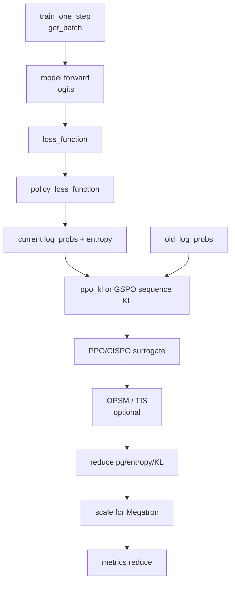

# Policy-Loss · 源码走读

## 读者任务

这篇沿一次 actor micro-batch 走：Megatron forward 得到 logits 后，Slime 如何取出当前 logprob，和 old logprob 形成 ratio/KL，乘上 `advantages`，经过可选 TIS/OPSM/KL loss，再缩放成 Megatron 期望的 loss。

读完后应能定位：

- `policy_loss_function` 为什么还要重新算一次 current logprob。
- PPO、GSPO、CISPO 在哪一步分叉。
- TIS/OPSM 为什么不是 advantage estimator。
- `loss_function` 为什么返回 `(loss, normalizer, logging_dict)`。
- CP 空 shard 为什么需要 `0 * logits.sum()`。

## 长文读法

这篇按 actor micro-batch 的 loss callback 读：Megatron `forward_step` 返回 logits 和 `loss_function`，`policy_loss_function` 重新从 logits 提取 current logprob / entropy，和 old、rollout、ref logprob 计算 ratio / KL，再按 PPO、GSPO、CISPO、TIS、OPSM 分支得到 `pg_loss`，最后 `loss_function` 缩放成 Megatron 期望返回。

| 你的任务 | 先读 | 抓住什么 |
|----------|------|----------|
| 先接住训练入口 | 1、8 | Megatron 要的是 forward output 加 loss callback，不是 Slime 自己直接 backward |
| 排查 current logprob | 3 | policy loss 不信任旧字段，会从当前 logits 重新取 response 段 logprob |
| 分清 PPO / GSPO / CISPO | 4 到 5 | 分支改变 ratio、KL 或 surrogate 形式，但都消费已经算好的 advantage |
| 排查 TIS / OPSM | 6 | 它们是 policy loss 侧的修正，不是 `advantages` estimator |
| 排查 value / SFT / custom loss | 2、9 | 同一个 `loss_function` callback 会按模式分派到不同 loss |
| 排查 CP 空 shard 和返回值 | 8 | `0 * logits.sum()` 保持计算图，返回 `(loss, normalizer, logging_dict)` 适配 Megatron |

## 主线地图



## 1. training forward step 把 batch 和 loss callback 交给 Megatron

系统压力：Megatron 的 pipeline engine 期望 forward step 返回模型输出和一个 loss callback。Slime 需要在这个 callback 里带上当前 micro-batch 的 `advantages`、`returns`、old logprob、mask 等字段。

设计选择：`model.py` 的 training `forward_step` 取出 policy/value/SFT 共享字段，然后返回 `partial(loss_function, args, batch, num_microbatches, step_global_batch_size)`。

```python
# 定位骨架（基于 slime/backends/megatron_utils/model.py L560-L638；省略 batch 辅助字段与 forward 参数）
batch = get_batch(
    data_iterator,
    _with_rollout_top_p_token_keys(
        args,
        [
            "tokens",
            "total_lengths",
            "response_lengths",
            "loss_masks",
            "log_probs",
            "ref_log_probs",
            "values",
            "advantages",
            "returns",
            "rollout_log_probs",
            "teacher_log_probs",
            "rollout_mask_sums",
        ],
    ),
    args.data_pad_size_multiplier,
    args.allgather_cp,
)
...
output_tensor = model(**forward_kwargs)
return output_tensor, partial(loss_function, args, batch, num_microbatches, step_global_batch_size)
```

执行逻辑：

- policy loss 使用 `advantages`、old logprob、`ref_log_probs`、`rollout_log_probs`。
- value loss 使用 `values` 和 `returns`。
- SFT loss 主要使用 token、length、mask。

不变量：如果 batch 中没有 `advantages`，policy loss 不会重新计算它，应回到 [[Slime-Advantage计算]] 排查。

## 2. loss_function 先构造 reducer，再分发具体 loss

系统压力：同一个 loss 张量可能按 per-token 或 per-rollout mean 规约，还要兼容 custom loss、checkpoint 重算和 Megatron 梯度缩放。

设计选择：`loss_function` 是统一适配层；它不关心 PPO 细节，只构造 reducer、按 `loss_type` dispatch、处理 CP 空 shard 和缩放。

```python
# 定位骨架（基于 slime/backends/megatron_utils/loss.py L1220-L1279；省略函数签名、dispatch 默认分支与 checkpoint 参数）
num_tokens = sum([torch.clamp_min(loss_mask.sum(), 1) for loss_mask in batch["loss_masks"]])
sum_of_sample_mean = get_sum_of_sample_mean(
    batch["total_lengths"],
    batch["response_lengths"],
    batch["loss_masks"],
    batch["rollout_mask_sums"],
    args.calculate_per_token_loss,
)

match args.loss_type:
    case "policy_loss":
        func = policy_loss_function
    case "value_loss":
        func = value_loss_function
    case "sft_loss":
        func = sft_loss_function
    case "custom_loss":
        func = load_function(args.custom_loss_function_path)
...
loss, log = func(args, batch, logits, sum_of_sample_mean)
```

读者抓手：想改 PPO 公式，不要改 `loss_function`；想改规约口径或 Megatron 对接，才看这里。

## 3. policy_loss_function 重新计算 current logprob

系统压力：当前 actor 的 logits 是反向传播入口，policy loss 必须用这次 forward 的 `log_probs`，而不能只用前面 advantage 阶段无梯度收集的 old logprob。

设计选择：函数开头拼接 `advantages`，选择 old logprob 来源，然后用当前 logits 调 `get_log_probs_and_entropy`。

```python
# 来源：slime/backends/megatron_utils/loss.py L911-L932
    advantages = torch.cat(batch["advantages"], dim=0)
    old_log_probs = batch["rollout_log_probs"] if args.use_rollout_logprobs else batch.get("log_probs")

    response_lengths = batch["response_lengths"]
    total_lengths = batch["total_lengths"]

    _, log_probs_and_entropy = get_log_probs_and_entropy(
        logits,
        args=args,
        unconcat_tokens=batch["unconcat_tokens"],
        total_lengths=total_lengths,
        response_lengths=response_lengths,
        with_entropy=True,
        **get_rollout_top_p_logprob_kwargs(args, batch),
    )

    log_probs = log_probs_and_entropy["log_probs"]
    if not args.use_rollout_logprobs and not old_log_probs:
        old_log_probs = [log_prob.detach() for log_prob in log_probs]
    train_log_probs_for_tis = batch.get("log_probs")
    if not train_log_probs_for_tis:
        train_log_probs_for_tis = [log_prob.detach() for log_prob in log_probs]
```

执行逻辑：

- `log_probs` 是 current policy，带梯度。
- `old_log_probs` 可来自 rollout，也可来自 train batch。
- 如果没有 old logprob 且不使用 rollout logprob，就用当前 logprob detach 作为 old baseline。
- `train_log_probs_for_tis` 单独保留给 TIS/mismatch 对比。

失败模式：如果 `use_rollout_logprobs` 开了但 batch 没有 `rollout_log_probs`，后面的 TIS 或 ratio 路径会直接暴露字段缺失。

三个 old baseline 路径要分账：

1. `use_rollout_logprobs=True`：rollout logprob 直接成为 PPO old policy；参数层禁止同时开 TIS。
2. 默认且 batch 有 `log_probs`：aux train forward 的 logprob 成为 old policy；TIS 也把它作为 train 侧对照。
3. 两者都没有：用本次 current `log_probs.detach()`。此时 `ppo_kl=0`、ratio 从 1 起步，但 surrogate 仍通过未 detach 的 current logprob 反传；这条 fallback 不会替 Advantage 阶段补出零 KL 的 shape template。

## 4. 只有 GSPO 和 OPSM 需要 full response logprob

系统压力：大多数 policy loss 可以在 CP 本地 response chunk 上完成；GSPO 和 OPSM 需要整条 response 的平均 KL，必须 all-gather。

设计选择：先判断 `need_full_log_probs = args.use_opsm or args.advantage_estimator == "gspo"`，避免重复 gather。

```python
# 定位骨架（基于 slime/backends/megatron_utils/loss.py L934-L970；省略 OPSM 调用与 gather 参数换行）
need_full_log_probs = args.use_opsm or args.advantage_estimator == "gspo"
...
if need_full_log_probs:
    full_log_probs = [
        all_gather_with_cp(log_prob, total_length, response_length)
        for log_prob, total_length, response_length in zip(log_probs, total_lengths, response_lengths, strict=False)
    ]
    full_old_log_probs = [
        all_gather_with_cp(old_log_prob, total_length, response_length)
        for old_log_prob, total_length, response_length in zip(old_log_probs, total_lengths, response_lengths, strict=False)
    ]
...
if args.advantage_estimator == "gspo":
    ppo_kl = compute_gspo_kl(...)
```

这段是理解 GSPO 的关键：算法语义是 sequence-level，工程接口仍然输出 token-level `ppo_kl`。

但它不是自证完备的接口。gather、`compute_opsm_mask` 和 `compute_gspo_kl` 都使用 `zip(..., strict=False)`；如果 current/old/length/mask/local 列表少一项，循环可静默截短。调用方必须在进入这里前证明列表等长，并逐样本核对 full mask 与 full logprob、local expansion shape 与 local logprob 一致。

## 5. surrogate 分支生成逐 token pg_loss

系统压力：policy loss 必须输出每个 token 的 loss，后续 TIS/OPSM/reducer 才能统一处理。

设计选择：除 CISPO 外都走 PPO-style clipped surrogate；CISPO 走 stop-gradient ratio 公式。

```python
# 定位骨架（基于 slime/utils/ppo_utils.py L124-L171；拼接 PPO 与 CISPO 核心公式，省略 dual-clip 分支）
def compute_policy_loss(ppo_kl, advantages, eps_clip, eps_clip_high, eps_clip_c=None):
    ratio = (-ppo_kl).exp()
    pg_losses1 = -ratio * advantages
    pg_losses2 = -ratio.clamp(1 - eps_clip, 1 + eps_clip_high) * advantages
    ...
    return pg_losses, clipfrac

def compute_cispo_loss(ppo_kl, log_probs, advantages, eps_clip, eps_clip_high):
    ratio = (-ppo_kl).exp()
    ratio_truncated = torch.clamp(ratio, min=1.0 - eps_clip, max=1.0 + eps_clip_high)
    pg_losses = -ratio_truncated.detach() * advantages * log_probs
    clipfrac = (ratio_truncated != ratio).float()
    return pg_losses, clipfrac
```

CISPO 的测试直接锁住这两个性质：

```python
# 定位骨架（基于 tests/test_cispo_loss.py L22-L48；摘取前向与梯度断言）
pg_losses, clipfrac = compute_cispo_loss(ppo_kl, LOG_PROBS, ADVANTAGES, eps_clip, eps_clip_high)
expected_losses = -torch.tensor(clamped) * ADVANTAGES * LOG_PROBS
torch.testing.assert_close(pg_losses, expected_losses, rtol=1e-6, atol=1e-6)
...
pg_losses.sum().backward()
torch.testing.assert_close(log_probs.grad, -torch.tensor(clamped) * ADVANTAGES, rtol=1e-6, atol=1e-6)
assert log_ratios.grad is None or torch.all(log_ratios.grad == 0)
```

运行抓手：

```powershell
Set-Location slime
python -m pytest tests/test_cispo_loss.py
```

预期现象：CISPO 前向值匹配闭式 surrogate，梯度只流向 `log_probs`。

## 6. TIS、OPSM 和自定义 reducer 改的是 pg_loss 之后

系统压力：off-policy correction 和 rejection/mask 会改变 loss 贡献或分母口径，但不应该混入 advantage 计算，也不应该改变 entropy/KL metrics 的默认规约。

设计选择：先有 `pg_loss`，再按需乘 OPSM mask、TIS weight，最后可只替换 `pg_loss` 的 reducer。

```python
# 定位骨架（基于 slime/backends/megatron_utils/loss.py L983-L1043；省略 kwargs 组装与注释）
if args.use_opsm:
    pg_loss = pg_loss * opsm_mask

if args.get_mismatch_metrics or args.use_tis:
    sum_of_sample_mean_for_mismatch_metrics = sum_of_sample_mean
    assert "rollout_log_probs" in batch, "rollout_log_probs must be provided for TIS"
    ...
    pg_loss, modified_response_masks, tis_metrics = tis_func(**tis_kwargs)
    sum_of_sample_mean = get_sum_of_sample_mean(..., modified_response_masks, ...)

if getattr(args, "custom_pg_loss_reducer_function_path", None) is not None:
    custom_pg_loss_reducer_func = load_function(args.custom_pg_loss_reducer_function_path)
    pg_loss_reducer = custom_pg_loss_reducer_func(...)
else:
    pg_loss_reducer = sum_of_sample_mean

pg_loss = pg_loss_reducer(pg_loss)
```

注意 metrics 口径：mismatch/TIS 指标用 pre-RS reducer 聚合，避免 rejected token 从分母里消失后把指标压低。

还要继续向下看 denominator：custom hook 即使返回 `modified_response_masks`，外层重建 reducer 时仍复用原始 `rollout_mask_sums`。这意味着 rejected token 可从 numerator 消失，但 per-rollout denominator 保持原 rollout 总有效 token 数。默认 vanilla TIS 和内置 ICEPOP 本身都不改 mask，只分别 clamp importance weight 或把越界 weight 置零。

custom PG reducer 的边界也比名字窄：它只接管 `pg_loss`，且工厂签名没有自动传入 `rollout_mask_sums`。clipfrac、`ppo_kl`、entropy、reference KL 仍由当前默认 reducer 规约；插件若要保持跨指标同口径，必须自己明确设计，而不能假设外层联动。

## 7. 最终 loss 由 PG、entropy、可选 reference KL 组成

系统压力：policy gradient 是主项，entropy 是探索正则，reference KL loss 是额外 penalty。每一项使用哪个 reducer 必须明确，metrics 要 detach。

设计选择：先 reduce `pg_loss`、`pg_clipfrac`、`ppo_kl`、entropy，再组装 scalar。

```python
# 定位骨架（基于 slime/backends/megatron_utils/loss.py L1042-L1110；省略 mismatch、OPSM 与 OPD 指标分支）
pg_loss = pg_loss_reducer(pg_loss)
pg_clipfrac = sum_of_sample_mean(pg_clipfrac)
ppo_kl = sum_of_sample_mean(ppo_kl)
entropy = torch.cat(log_probs_and_entropy["entropy"], dim=0)
entropy_loss = sum_of_sample_mean(entropy)

loss = pg_loss - args.entropy_coef * entropy_loss

if args.use_kl_loss:
    ref_log_probs = torch.cat(batch["ref_log_probs"], dim=0)
    ...
    kl_loss = sum_of_sample_mean(kl)
    loss = loss + args.kl_loss_coef * kl_loss
...
reported_loss = {
    "loss": loss.clone().detach(),
    "pg_loss": pg_loss.clone().detach(),
    "entropy_loss": entropy_loss.clone().detach(),
    "pg_clipfrac": pg_clipfrac.clone().detach(),
    "ppo_kl": ppo_kl.clone().detach(),
}
```

失败模式：`kl_coef` 和 `kl_loss_coef` 不能同时非零。前者在 [[Slime-Advantage计算]] 的 reward shaping 阶段使用，后者在这里作为 policy loss penalty 使用。

entropy 路径有意把“记录”和“求导”分开：调用总是请求 entropy，但底层只有在 `entropy_coef != 0` 时才保存 backward 状态。rollout top-p replay 约束的是被选 token 的 logprob，entropy 仍基于未做同样 top-p mask 的分布。reference KL 若开启 `use_unbiased_kl`，还会用 `exp(current-old)` 作 importance ratio；`low_var_kl` 的 `[-10, 10]` clamp 属于 KL 数值稳定，不是 PPO clip。

## 8. loss_function 把结果缩放给 Megatron

系统压力：Slime 的 reducer 语义和 Megatron 的梯度累积/DP/CP 缩放不完全相同。返回给 Megatron 前必须做一次适配，并处理 allgather-CP 空 shard 的反向图。

设计选择：allgather-CP 下加 `0 * logits.sum()` 保持 autograd 连通；然后按 per-rollout mean 或 per-token loss 两种模式缩放。

```python
# 定位骨架（基于 slime/backends/megatron_utils/loss.py L1281-L1320；省略长注释并压缩 logging tensor 构造）
if args.allgather_cp and mpu.get_context_parallel_world_size() > 1:
    loss = loss + 0 * logits.sum()

if not args.calculate_per_token_loss:
    loss = (
        loss
        * num_microbatches
        / step_global_batch_size
        * mpu.get_data_parallel_world_size(with_context_parallel=True)
    )
else:
    loss = loss * mpu.get_context_parallel_world_size()

return (
    loss,
    (num_tokens if args.calculate_per_token_loss else torch.tensor(1, device=logits.device)),
    {
        "keys": list(log.keys()),
        "values": torch.tensor([num_tokens if args.calculate_per_token_loss else 0] + list(log.values()), device=logits.device),
    },
)
```

这就是为什么本专题不能只讲 PPO 公式：真实系统还要把 loss 标量放回 Megatron 的训练协议里。

三元组中第三项的 `values` 是新建日志 tensor，`log` 中的值此前已 detach；它不承担梯度。per-token 模式把 `num_tokens` 放在首位供跨 micro-batch/DP 汇总，per-rollout-mean 模式首位是 `0` 占位，后续消费者直接使用常量 `step_global_batch_size`。`0 * logits.sum()` 则解决另一个维度的问题：numerator 可以为 0，但所有 CP rank 都必须保留同构 autograd/collective backward 路径。

## 9. value loss 与 SFT loss 是同一个适配层的旁路

value loss 消费上游的 `returns`，使用 PPO-style value clipping：

```python
# 定位骨架（基于 slime/backends/megatron_utils/loss.py L1113-L1167；省略 values 提取参数与空张量保护）
old_values = torch.cat(batch["values"], dim=0)
_, values = get_values(...)
values = torch.cat([value.flatten() for value in values["values"]], dim=0)
returns = torch.cat(batch["returns"], dim=0)
values_clipped = old_values + (values - old_values).clamp(-args.value_clip, args.value_clip)
surr1 = (values_clipped - returns) ** 2
surr2 = (values - returns) ** 2
loss = torch.max(surr1, surr2)
loss = sum_of_sample_mean(loss)
```

SFT loss 则是 response token 的负 log-likelihood，不看 old policy、advantage 或 ratio：

```python
# 定位骨架（基于 slime/backends/megatron_utils/loss.py L1170-L1217；省略调用参数与空张量保护）
_, log_probs_and_entropy = get_log_probs_and_entropy(..., with_entropy=False)
log_probs = torch.cat(log_probs_and_entropy["log_probs"], dim=0)
loss = -sum_of_sample_mean(log_probs)
```

这两条旁路帮助确认 `loss_function` 的定位：它是适配层，不是只为 policy loss 服务。

## 运行验证

从知识库根目录一次进入 `slime/`，运行三组 CPU 验证：

```powershell
Set-Location slime
python -m pytest tests/test_cispo_loss.py
python -m pytest tests/test_ppo_logprob_entropy.py
python -m pytest tests/test_loss_cp_invariance.py
```

如果本地没有 GPU，GPU 专用测试可能无法跑；这里列出的三组当前均可在 CPU 上收集。Windows 原生环境若在 import 时被 `torch.compile` 阻断，应记录平台限制，不能把 `0 tests collected` 当成通过。

## 复盘

- `advantages` 是上游输入，policy loss 不重新分配 reward。
- `ppo_kl` 在代码里是 old-current logprob 差，不等同于 reference KL penalty。
- GSPO 是 sequence-level KL 与 token-level loss 接口之间的适配。
- TIS/OPSM 是 `pg_loss` 后修正，不是 advantage estimator。
- TIS 的 modified numerator、原 rollout denominator、pre-RS metrics 是三套不能混写的口径。
- custom PG reducer 只替换 PG 项；entropy、clip、KL 指标仍有自己的默认规约路径。
- `zip(strict=False)` 把列表完整性责任留给调用边界，不能把“未报错”当作样本全覆盖。
- `loss_function` 的三元组返回值是 Megatron 集成契约，改 loss 时必须保留。
