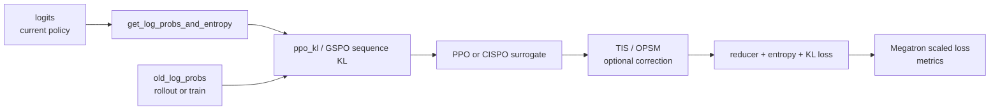

# Policy-Loss

## 你为什么要读

这一组回答：[[Slime-Advantage计算]] 已经把 reward 变成 `advantages`，训练后端如何把当前 logits、old logprob、advantage、mask 装配成真正参与反向传播的 loss。

读完后应能处理三类问题：

- 首次阅读：知道一次 micro-batch 从 logits 到 policy loss 标量的路径。
- 排障：看到 `pg_clipfrac`、`ppo_kl`、TIS、OPSM、CISPO 梯度或 CP 空 shard 问题时能定位。
- 改代码：新增 policy loss、TIS hook、PG reducer 或 metrics 时，不破坏 Megatron 的 loss 三元组契约。

## 核心模型

Policy Loss 专题是 policy backward 的装配线：

它不再决定 reward 如何落到 token 上；它只消费 `batch["advantages"]`。如果你还在这里找 GRPO 的 group baseline，应回到 [[Slime-Advantage计算]]。

## 阅读顺序

| 文档 | 读者问题 |
|------|----------|
| [[Slime-Policy-Loss-核心概念]] | ratio、KL、clip、TIS、reducer 各自是什么 |
| [[Slime-Policy-Loss-源码走读]] | 一次 micro-batch 如何从 logits 走到 scaled loss |
| [[Slime-Policy-Loss-数据流]] | batch 字段、loss 三元组、日志聚合如何跨 Megatron |
| [[Slime-Policy-Loss-排障指南]] | 常见算法分支和配置排障 |
| [[Slime-Policy-Loss-学习检查]] | 可执行验收 |

## 源码范围

| 模块 | 本专题关注 |
|------|------------|
| `slime/backends/megatron_utils/model.py` | training forward step 如何把 batch 和 `loss_function` 交给 Megatron |
| `slime/backends/megatron_utils/loss.py` | policy/value/SFT dispatch、TIS、metrics、loss scaling |
| `slime/utils/ppo_utils.py` | PPO surrogate、CISPO、GSPO sequence KL、OPSM |
| `slime/utils/arguments.py` | loss、TIS、OPSM、CISPO 配置与互斥 |
| `tests/test_cispo_loss.py` | CISPO 前向公式和 stop-gradient 回归测试 |

## 与上下游的边界

| 边界 | 结论 |
|------|------|
| 上游 [[Slime-Advantage计算]] | `advantages`、`returns`、`kl` 已写入 batch |
| 本专题 | 计算 current policy logprob，构造 surrogate loss 和 metrics |
| 下游 [[Slime-上下文并行与路由重放]] | CP gather、routing replay 的更细节边界放到下游专题 |
| [[Slime-分布式权重同步]] | optimizer step 成功后才进入权重同步 |

## 首次阅读抓手

先记住五条：

- `policy_loss_function` 重新用当前 logits 算 `log_probs`，这是带梯度的路径。
- `old_log_probs` 来自 rollout 或 train batch，用来形成 ratio/KL 对照。
- 如果两者都没有，源码会用本次 current logprob 的 `detach()` 副本作 old baseline；此时 ratio 从 1 起步，但 current logprob 仍是带梯度的训练路径。
- GSPO 在 policy loss 阶段把 sequence-level KL 扩展回 token 形状。
- `loss_function` 返回的是 Megatron 需要的三元组，不只是一个 scalar。

还要额外记住：算法修正和统计口径不是同一层。TIS/ICEPOP/OPSM 可以改变 `pg_loss` 的逐 token 贡献，custom reducer 只接管 PG 项；entropy、clipfrac、`ppo_kl` 和 mismatch 指标各自仍有明确的默认 reducer。

## 相关验证

- `tests/test_cispo_loss.py`：CISPO 闭式 surrogate 与 stop-gradient。
- `tests/test_ppo_logprob_entropy.py`、`tests/test_ppo_logprob_entropy_gpu.py`：logprob/entropy 路径。
- `tests/test_loss_cp_invariance.py`：CP 下 loss 相关不变性。
