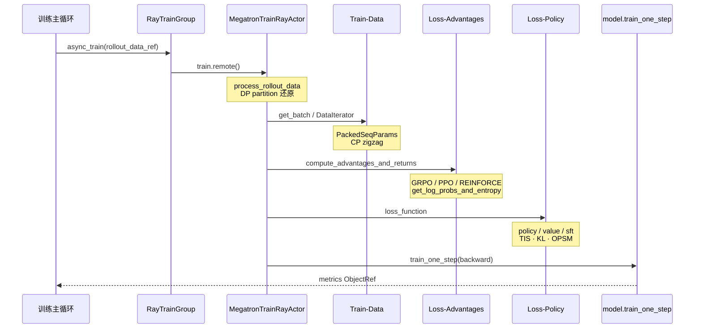

# 训练后端

> **你只需阅读本目录，不必打开 `slime/` 源码。**
> 内嵌代码对应 slime Git commit `22cdc6e1`。

---

## 本目录解决什么问题

Rollout 生成部分讲清了如何产出 `Sample` / `rollout_data_ref`。本目录回答：**Megatron Actor 如何反序列化 rollout 数据、重算 log-prob、计算 advantage，并完成 PPO/GRPO 等 policy backward？**

七个专题覆盖训练后端全链路：

| 模块 | 角色 | 一句话 |
|------|------|--------|
| [[Slime-Megatron-Actor初始化]] | Actor 启动 | `MegatronTrainRayActor.init`、dist + mpu + sleep/wake |
| [[Slime-模型初始化]] | 模型构建 | GPTModel、optimizer、checkpoint 恢复 |
| [[Slime-训练步骤]] | 训练步 | `train()` → `train_actor` / `train_critic` → backward |
| [[Slime-训练数据]] | 数据管线 | RolloutBatch → DP 分区 → CP-ready micro-batch |
| [[Slime-Advantage计算]] | 优势计算 | GRPO/PPO/REINFORCE 估计器、logprob 重算 |
| [[Slime-Policy-Loss]] | 策略损失 | PPO clip、GSPO、CISPO、value/SFT loss |
| [[Slime-上下文并行与路由重放]] | CP 与 MoE | zigzag 切分、routing replay 四阶段 |

---

## 端到端时序

这张图用于检查是否能复述 `async_train(rollout_id, rollout_data_ref)` 从数据反序列化到 backward 的调用栈。

这张图的核心是：训练步在 **每个 GPU rank 内** 完成数据还原、advantage、loss、backward；driver 侧只通过 `ray.get` 聚合结果。Critic 启用时先跑 value forward/backward，再把 CPU values 传给 actor。

---

## 零基础一句话

**像「加工厂」：** 训练数据把 rollout 原料切配成 micro-batch，Advantage 计算判断“这批货值多少钱”，Policy Loss 决定“怎么调价”，训练步骤是流水线总控，Actor 与模型初始化负责开机和装模具。

---

## 推荐阅读顺序

建议先理解 Actor 与模型初始化，再沿训练步骤进入训练数据、Advantage、Policy Loss 和上下文并行。时间紧时至少走通训练步骤 → Advantage → Policy Loss。

| 顺序 | 文档 | 必读理由 |
|------|------|----------|
| 1 | [[Slime-Megatron-Actor初始化-源码走读]] | Actor init 与 offload sleep/wake |
| 2 | [[Slime-训练步骤-源码走读]] | `train()` 主路径与 critic 分支 |
| 3 | [[Slime-训练数据-排障指南]] | dynamic batch vs static mbs |
| 4 | [[Slime-Advantage计算-源码走读]] | 四条 advantage_estimator 分支 |
| 5 | [[Slime-Policy-Loss-源码走读]] | PPO/GSPO/CISPO policy 分支 |
| 6 | [[Slime-上下文并行与路由重放-核心概念]] | CP 布局与 routing replay 状态机 |

---

## 阶段衔接

| 方向 | 模块 | 衔接点 |
|------|------|--------|
| ← Rollout 生成 | [[Slime-RolloutManager]] | `rollout_data_ref` → `async_train` |
| → 权重同步 | [[Slime-分布式权重同步]] · [[Slime-磁盘权重同步]] | train 完成 → `update_weights` |
| → Ray 层 | [[Slime-RayTrainGroup]] | `async_train` / `update_weights` API |
| → 启动 | [[Slime-训练主循环]] | sync/async 主循环调用 train |
| → Megatron 对照 | [[SGLang-ModelRunner]] | forward/backward 内核（SGLang 侧） |

---

## 验证建议（零基础可试）

1. **loss 分支：** 对照 [[Slime-Advantage计算-核心概念]]，说明 `--advantage-estimator grpo` 与 `ppo` 的数据依赖差异。
2. **train 栈：** 在 [[Slime-训练步骤-数据流]] 时序图上，口述 critic-only step 的分支。
3. **CP 路径：** 若启用 `--context-parallel-size > 1`，阅读 [[Slime-上下文并行与路由重放-排障指南]] 确认 logprob 如何 `all_gather_with_cp`。

---

## 模块导航

| 目录 | 状态 |
| ------ | ------ |
| [[Slime-Megatron-Actor初始化|Megatron-Actor-Init]] | ✅ |
| [[Slime-模型初始化|Model-Init]] | ✅ |
| [[Slime-训练步骤|Train-Step]] | ✅ |
| [[Slime-训练数据|Train-Data]] | ✅ |
| [[Slime-Advantage计算|Loss-Advantages]] | ✅ |
| [[Slime-Policy-Loss|Loss-Policy]] | ✅ |
| [[Slime-上下文并行与路由重放|CP-RoutingReplay]] | ✅ |

← [[Slime-Rollout生成]] · → [[Slime-权重同步]]
