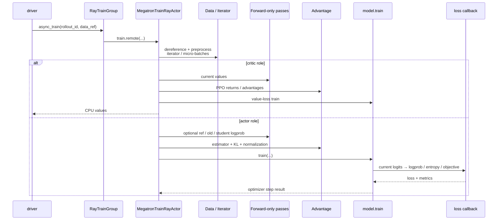

# 训练后端

> **读者任务：** 从一个 DP 分片的 `rollout_data_ref` 追到 optimizer step，区分数据整形、old/reference/value forward、advantage、policy loss 和分布式归约各自的所有者。

## 你为什么要读

“PPO backward”不是一个函数。训练 actor 先从 Ray ObjectRef 取回数据，再构建 iterator/micro-batch；根据算法和配置，它可能先跑 critic value、reference logprob、old-policy logprob 或 routing replay，随后才计算 advantage，并在模型 forward 的 loss callback 中用 current logits 构造 policy loss。PP、CP、DP 又让不同 rank 持有不同片段和职责。

如果不分层，最常见的误判是：把 rollout logprob 当 old policy、把 advantage 生成当 policy loss、把只有 pipeline last stage 执行的逻辑说成“每个 rank 都算一遍”。

## 一次 actor train 的分层时序



来源：`slime/backends/megatron_utils/actor.py` L377-L535；`slime/backends/megatron_utils/loss.py` L661-L790、L881-L1100；`slime/backends/megatron_utils/model.py` L716-L850。

## 六层对象模型

| 层 | 主要对象 | 所有者 | 常见错误 |
|----|----------|--------|----------|
| Ray 交接 | `Box(ObjectRef)` / DP shard | driver、RayTrainGroup、actor | 等待、错 DP、外部 value 未对齐 |
| 训练数据 | lists/tensors、iterator、micro-batch | `data.py`、actor | total/response/mask 长度不一致 |
| forward-only | value、ref/old/student logprob | actor + model | 权重 tag 切错、routing replay 阶段错 |
| 信用分配 | reward、KL、advantage、return | `compute_advantages_and_returns` | estimator 与 mask/normalization 口径错 |
| 训练目标 | current logprob、entropy、surrogate、KL loss | loss callback | current/old/rollout/reference 混淆 |
| 分布式归约 | PP last stage、CP full sequence、DP reducer | Megatron + cp utilities | 指标正确但梯度错，或反之 |

## 本目录怎样分工

| 专题 | 读者任务 |
|------|----------|
| [[Slime-Megatron-Actor初始化]] | 建立 distributed/mpu、模型角色、profiler、sleep/wake 与 updater |
| [[Slime-模型初始化]] | 理解 model provider、optimizer、checkpoint 与参数冻结/备份 |
| [[Slime-训练数据]] | 跟踪 DP shard 到 packed/CP-ready micro-batch |
| [[Slime-训练步骤]] | 串联 actor/critic 分支、forward-only passes 与 `model.train` |
| [[Slime-Advantage计算]] | 分清 GRPO/GSPO/CISPO、PPO、REINFORCE++ 和 custom estimator |
| [[Slime-Policy-Loss]] | 分清 current/old/rollout/ref logprob、clip、TIS、KL 与 reducer |
| [[Slime-上下文并行与路由重放]] | 解释 zigzag token 布局、full-sequence gather 与 MoE route 复放 |

## 三个关键边界

### 1. Critic value 是 actor 的外部数据

PPO 下 critic 先训练并返回 CPU values；过了 critic-only 阈值后，driver 把这些 refs 作为 `external_data` 交给 actor。critic-only 期间 actor 被故意跳过，但 rollout 与 critic 仍运行。来源：`train.py` L70-L82、`slime/backends/megatron_utils/actor.py` L401-L430。

### 2. Advantage 与 policy objective 是两层

CISPO、GSPO 和 GRPO 在 advantage 层可共享 group-relative returns，但 policy objective 的 clipping/sequence ratio 并不相同。PPO advantage 还依赖 critic values 和 GAE。不要用 `--advantage-estimator` 的名字推断整个 loss 公式。

### 3. Rank-local 不等于每个 rank 做同一件事

数据和模型调用发生在各 Ray actor 内，但 advantage 的核心逻辑只在 pipeline last stage 执行；CP rank 又只持有 response token 的切片，某些 ratio/指标必须 gather 到完整序列后计算。来源：`slime/backends/megatron_utils/loss.py` L681-L790。

## 推荐阅读顺序

| 顺序 | 文档 | 读者任务 |
|------|------|----------|
| 1 | [[Slime-训练步骤-核心概念]] | 先看 actor/critic 总控与 forward-only passes |
| 2 | [[Slime-训练数据-源码走读]] | 明确 iterator、micro-batch、mask 与 CP 布局 |
| 3 | [[Slime-Advantage计算-源码走读]] | 跟踪 reward/value/KL 到 advantage/return |
| 4 | [[Slime-Policy-Loss-源码走读]] | 跟踪 current logits 到 surrogate/reducer |
| 5 | [[Slime-上下文并行与路由重放-源码走读]] | 补 CP 与 MoE 的跨 rank 状态 |
| 6 | [[Slime-Megatron-Actor初始化-源码走读]]、[[Slime-模型初始化-源码走读]] | 回看启动、权重 tag 和 optimizer 所有权 |

## 可执行最小验证

```powershell
rg -n "def train\(|def train_critic|def train_actor|compute_advantages_and_returns|forward_only" `
  slime/slime/backends/megatron_utils/actor.py

rg -n "def compute_advantages_and_returns|def policy_loss_function|is_pipeline_last_stage|context_parallel" `
  slime/slime/backends/megatron_utils/loss.py

rg -n "def train_one_step|def train\(" `
  slime/slime/backends/megatron_utils/model.py
```

预期：actor.py 负责阶段编排，loss.py 分开 advantage 与 policy objective，model.py 负责 micro-batch train/optimizer。静态命中不证明 GPU 数值或 collective 已通过，应继续运行对应 CPU invariance 与 GPU precision/e2e。

## 阶段衔接

| 方向 | 模块 | 交接对象 |
|------|------|----------|
| ← Rollout | [[Slime-Rollout生成]] | DP shard `rollout_data_ref` |
| ← Ray | [[Slime-RayTrainGroup]] | rank actor handles 与 ObjectRef |
| → 权重 | [[Slime-权重同步]] | optimizer 后 actor parameters / version |
| → 推理对照 | [[SGLang-ModelRunner]] | 同一模型族的推理 forward；SGLang 不负责训练 backward |
| → Kernel 对照 | [[FlashAttention-Backward]] | attention backward 的更底层算子语义 |

← [[Slime-Rollout生成]] · → [[Slime-权重同步]]
