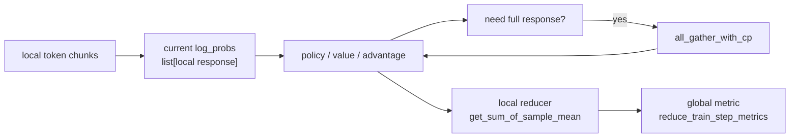
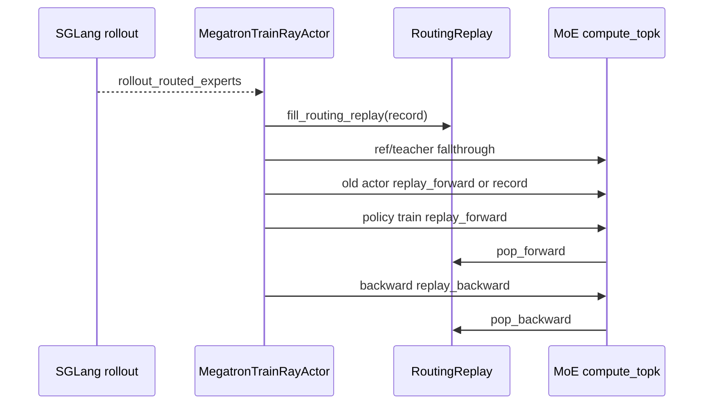

# 上下文并行与路由重放 · 数据流

## 你为什么要读

本篇只看跨模块数据：CP 字段如何从 Train Data 进入 loss，routing experts 如何从 rollout engine 进入 Megatron MoE。

## CP 字段流

| 字段 | 来源 | CP 中的用途 |
|------|------|-------------|
| `tokens` | [[Slime-训练数据]] | 被 `slice_with_cp` 或 allgather-CP chunk 成模型输入 |
| `unconcat_tokens` | `get_batch` 保存 | logprob/value 提取时恢复样本边界 |
| `total_lengths` | Train Data | 计算 prompt/response 和 CP offset |
| `response_lengths` | Train Data | full response gather、reducer split |
| `loss_masks` | Train Data | reducer 的 full mask 输入 |
| `full_loss_masks` | `get_batch` | 模型 forward 的 token-space loss mask |
| `rollout_mask_sums` | Train Data | per-rollout mean 的 full denominator |

源码入口：来源：slime/backends/megatron_utils/data.py L28-L148

## CP 在 loss 中的流动



需要 full response 的典型路径：

- GSPO sequence KL。
- OPSM sequence KL。
- PPO GAE / REINFORCE++ returns。
- allgather-CP 重分布。

局部即可完成的路径：

- 普通 PPO/GRPO/CISPO token surrogate。
- entropy、pg loss 的本地分子。

## RoutingReplay 数据流



rollout engine 开关：

```python
# 来源：slime/backends/sglang_utils/sglang_engine.py L625-L626
if args.use_rollout_routing_replay:
    kwargs["enable_return_routed_experts"] = True
```

rollout payload：

```python
# 定位骨架（据 `slime/rollout/sglang_rollout.py` L174-L182 删节）：
payload = {
    "sampling_params": sampling_params,
    "return_logprob": True,
}
if args.use_rollout_routing_replay:
    payload["return_routed_experts"] = True
```

## Ray actor 环境变量

RoutingReplay 只应注入 actor，不应注入 critic。`RayTrainGroup` 创建 actor 时设置环境变量：

```python
# 来源：slime/ray/actor_group.py L87-L88
if self.args.use_routing_replay and self.role == "actor":
    env_vars["ENABLE_ROUTING_REPLAY"] = "1"
```

`use_rollout_routing_replay` 会自动打开基础 `use_routing_replay`：

源码入口：来源：slime/utils/arguments.py L1950-L1952

## stage 生命周期

| 阶段 | 谁设置 | 目的 |
|------|--------|------|
| `fallthrough` | actor | ref/teacher forward 正常 routing |
| `record` | actor | 无 rollout experts 时记录 old actor routing |
| `replay_forward` | actor 或 model training forward | forward 用 buffer expert ids |
| `replay_backward` | actor | backward 用另一游标重放同一序列 |

源码入口：

- 来源：slime/backends/megatron_utils/actor.py L436-L539
- 来源：slime/backends/megatron_utils/model.py L602-L638
- 来源：slime/utils/routing_replay.py L57-L82

## allgather-CP 与 zigzag CP

| 模式 | 输入布局 | 后续影响 |
|------|----------|----------|
| zigzag CP | 每条样本先 `slice_with_cp`，rank 拿两段镜像 chunk | offset 由 `get_logits_and_tokens_offset_with_cp` 统一管理 |
| allgather-CP | 所有样本先 cat 成全局 stream，再按 CP rank chunk | logprob/value 后续需要 `_allgather_cp_redistribute` 回到 downstream 形态 |

源码入口：

- 来源：slime/backends/megatron_utils/data.py L69-L148
- 来源：slime/backends/megatron_utils/loss.py L151-L227

`_allgather_cp_redistribute` 的“downstream 形态”具体是每样本 zigzag-local response list，不是继续保持 contiguous global-stream chunk。也因此，任何旁路字段若只照搬模型输入的 contiguous 切法，都不能直接与这些 response tensor 对齐。

## 不变量

- 同一 sample 的 `total_length`、`response_length`、`loss_mask` 必须始终按同一顺序出现。
- CP 本地 `log_probs[i]` 长度必须等于本 rank 的 response chunk 长度。
- `rollout_mask_sums` 是 full denominator，不随 CP rank 改变。
- `RoutingReplay.all_routing_replays` 的数量必须等于本 rank 上 MoE layer 数。
- `fallthrough` 不写 replay buffer；`record` 和 `replay_*` 才改变或消费 buffer。
- `fill_routing_replay` 当前只实现 zigzag CP/SP expert-id 切分；allgather-CP 与 rollout replay 的组合没有参数互斥，也没有同布局实现。
- `ROUTING_REPLAY_STAGE`、全局 `ROUTING_REPLAY` 指针、两个游标和 `top_indices_list` 是一组进程内状态；异常退出时必须一起审计。
- `get_sum_of_sample_mean`、`_allgather_cp_redistribute` 等多处 `strict=False` 不会证明字段覆盖集完整。
