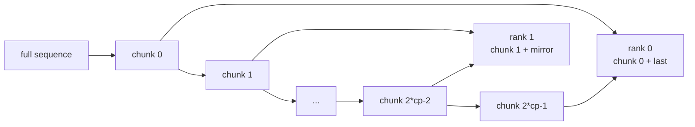

# 上下文并行与路由重放 · 核心概念

## 你为什么要读

本篇先建立两个模型：CP 是把一条序列切给多个 rank 后仍要保持 token 语义一致；RoutingReplay 是让 MoE 的 expert 选择在多个 forward/backward 阶段保持一致。

## CP 是坐标系统，不只是切 tensor

Slime 的 zigzag CP 会把完整序列切成 `2 * cp_size` 个块，rank `r` 拿第 `r` 块和镜像块。这样能让序列两端同时分布到不同 rank，减少 attention 负载不均。



源码入口：来源：slime/backends/megatron_utils/cp_utils.py L287-L317

## logprob 坐标比 token 坐标少一位

response token `[prompt_length, total_length)` 对应 logits 行 `[prompt_length - 1, total_length - 1)`。CP 下本 rank 拿到的两段 chunk 还要和这个 logits 区间求交。

```python
# 定位骨架（基于 slime/backends/megatron_utils/cp_utils.py L9-L44；省略空区间归零与返回值）
prompt_length = total_length - response_length
chunk_size = (total_length + 2 * cp_size - 1) // (2 * cp_size)
chunk_0 = (cp_rank * chunk_size, (cp_rank + 1) * chunk_size)
chunk_1 = ((2 * cp_size - cp_rank - 1) * chunk_size, (2 * cp_size - cp_rank) * chunk_size)
logits_0 = (max(chunk_0[0], prompt_length - 1), min(chunk_0[1], total_length - 1))
logits_1 = (max(chunk_1[0], prompt_length - 1), min(chunk_1[1], total_length - 1))
```

这段是 CP 下 logprob、value、advantage、mask 对齐的坐标原点。

## all_gather_with_cp 是“填零 + all_reduce”

当 GSPO、OPSM、GAE 或 REINFORCE++ 需要完整 response 时，本地 CP chunk 要还原成 `[response_length]`。各 rank 负责的有效区间互不重叠，所以每个 rank 把自己负责的位置填进去，其余位置填零，再做 `all_reduce(sum)`。

```python
# 定位骨架（基于 slime/backends/megatron_utils/cp_utils.py L235-L284；压缩四种空/非空 chunk 分支）
def all_gather_with_cp(tensor, total_length, response_length):
    ...
    full_tensor = torch.cat([left, chunk_0, mid, chunk_1, right], dim=0)
    assert full_tensor.shape[0] == response_length
    full_tensor = dist.nn.all_reduce(full_tensor, group=cp_group)
    return full_tensor
```

这里的零 tensor 带 `requires_grad=True`，是为了让空贡献 rank 仍进入可微 all-reduce，不是为了参与数值贡献。它保证 collective backward 可达，但不会替调用方校验本地 tensor 长度是否与两段 offset 之和一致；源码只显式断言了第二段长度和最终 full shape。

## reducer 用 full denominator，local numerator

CP rank 只看到 response 的一部分，但 per-rollout mean 的分母必须是完整 rollout 的 mask 总量。`get_sum_of_sample_mean` 在 CP 分支中把 full `loss_mask` 切成本 rank local mask，分母仍使用传入的 `sample_denoms`。

```python
# 定位骨架（基于 slime/backends/megatron_utils/cp_utils.py L47-L124；摘取 CP mask 切片与 reducer 返回）
for total_length, response_length, loss_mask in zip(total_lengths, response_lengths, loss_masks, strict=False):
    prompt_length = total_length - response_length
    _, _, _, tokens_offset = get_logits_and_tokens_offset_with_cp(total_length, response_length)
    loss_mask_0 = loss_mask[tokens_offset[0][0] - prompt_length : tokens_offset[0][1] - prompt_length]
    loss_mask_1 = loss_mask[tokens_offset[1][0] - prompt_length : tokens_offset[1][1] - prompt_length]
    chunked_loss_mask = torch.cat([loss_mask_0, loss_mask_1], dim=0)
...
return sum_of_sample_mean if not calculate_per_token_loss else sum_of_token
```

这个设计解释了为什么 `rollout_mask_sums` 要在上游按完整 rollout 预计算，而不能在每个 micro-batch 临时算。

reducer 内部的 sample、mask、denominator 与 split 仍由 `zip(strict=False)` 对齐；它不会证明四组长度相等。`clamp_min(denom, 1)` 只处理零分母数值，不会提示 rollout id 或 mask 分组错误。

## allgather-CP 是另一种输入布局

`args.allgather_cp` 下，`get_batch` 先把所有序列拼成一条全局 token stream，再按 CP rank 切 contiguous chunk。它不同于 zigzag CP，但后续 logprob/value 仍要回到 response 对齐形态。

源码入口：来源：slime/backends/megatron_utils/data.py L69-L148

在 allgather-CP 中，某些 rank 可能没有有效 loss token，所以 [[Slime-Policy-Loss]] 中的 `0 * logits.sum()` 是必要的反向图保护。

allgather-CP 的 loss 输出还会经过 `_allgather_cp_redistribute`：先按全局 contiguous chunk 恢复每条 full response，再重新切成下游 reducer 预期的 zigzag response chunk。因此“模型输入 layout”和“下游 response list layout”不是同一个对象。

## RoutingReplay 是 MoE routing 的状态机

MoE routing replay 有四个 stage：

| stage | 行为 |
|-------|------|
| `fallthrough` | 正常调用原始 `compute_topk`，不记录、不 replay |
| `record` | 正常算 top-k，并把 expert indices 记录到 buffer |
| `replay_forward` | 从 buffer 取 forward 游标对应的 expert indices |
| `replay_backward` | 从 buffer 取 backward 游标对应的 expert indices |

```python
# 定位骨架（基于 slime/utils/routing_replay.py L57-L82；省略 shape 断言与禁用分支）
if routing_replay_stage == "fallthrough":
    return old_compute_topk(...)
if routing_replay_stage == "record":
    probs, top_indices = old_compute_topk(...)
    ROUTING_REPLAY.record(top_indices)
elif routing_replay_stage == "replay_forward":
    top_indices = ROUTING_REPLAY.pop_forward()
    probs = scores.gather(1, top_indices)
elif routing_replay_stage == "replay_backward":
    top_indices = ROUTING_REPLAY.pop_backward()
    probs = scores.gather(1, top_indices)
```

replay 不是复用旧概率，而是复用旧 expert ids，再从当前 `scores` 中 gather 当前概率。因此梯度仍然来自当前 forward。

状态机本身很薄：stage 来自进程环境变量，当前 layer 的 buffer 来自进程级全局指针，forward/backward 游标直接索引 list。未知 stage、空 buffer、游标越界或 hook 重入都没有统一恢复层。

## 两者的关系

CP 和 RoutingReplay 会在 `fill_routing_replay` 交汇：rollout 返回的是 full sequence 的 expert ids，训练时要按 `get_batch` 相同的 CP/SP 切分后，预填到每个 MoE layer 的 replay buffer。

源码入口：来源：slime/backends/megatron_utils/actor.py L284-L360

这里还存在一个未被参数校验封口的组合边界：`fill_routing_replay` 总是用 zigzag `slice_with_cp` 处理 expert ids，没有按 `args.allgather_cp` 切换到全局 contiguous layout。若同时开启 allgather-CP 与 rollout routing replay，训练 token 与 expert-id 局部坐标可能不同；当前文档不能把该组合作为已验证能力。

可以把设计目标记成一句话：CP 负责维持 token 空间一致，RoutingReplay 负责维持 expert 路径一致；具体配置组合仍要用同布局证据验证。
