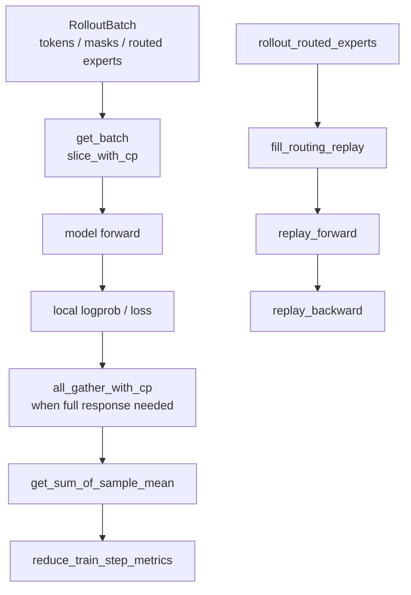

# 上下文并行与路由重放 · 源码走读

## 读者任务

这篇走两条相邻主线：

- 一条 response 如何在 CP 下被切片、算 logprob/loss、必要时还原为 full response，再聚合成全局指标。
- 一条 MoE 样本如何把 rollout 阶段的 expert ids 带到 old actor logprob 和 policy backward。

读完后应能定位：

- `log_probs` 与 `loss_masks` 长度不一致时看哪段 offset。
- GSPO/OPSM 为什么触发 `all_gather_with_cp`。
- per-rollout mean 为什么要用 full rollout denom。
- `ROUTING_REPLAY_STAGE` 的切换顺序。
- `use_rollout_routing_replay` 为什么必须先 `fill_routing_replay`。

## 长文读法

这篇按两条并行主线读：CP 主线从 `get_batch` 的 packed token / mask 切片开始，经 offset 函数、必要时 all-gather 还原 full response，再用 reducer 保持 CP / DP 指标等价；Routing Replay 主线从 rollout 返回 routed experts 开始，actor 先填 replay buffer，再按 `record`、`replay_forward`、`replay_backward` 阶段固定 MoE expert ids。

| 你的任务 | 先读 | 抓住什么 |
|----------|------|----------|
| 排查 CP batch 形状 | 1 到 2 | token、loss mask 和 response offset 必须用同一套 CP 切片规则 |
| 排查 full response 依赖 | 3 | GSPO / OPSM 等需要 full response 时，通过 `all_gather_with_cp` 还原 |
| 排查指标不等价 | 4 | per-token 与 per-rollout mean 的分母不同，CP factor 也不同 |
| 排查 rollout expert ids | 5 | SGLang payload 需要显式请求 `return_routed_experts` |
| 排查 replay buffer | 6 | `use_rollout_routing_replay` 必须先 `fill_routing_replay`，并按 layer / token 对齐 |
| 排查阶段切换 | 7 到 8 | ref / teacher fallthrough，old actor record 或 replay forward，policy backward replay backward |

## 主线地图



## 1. get_batch 先把 tokens 变成 CP-ready packed batch

系统压力：Megatron 需要 packed THD batch；CP rank 只能持有本 rank 的 token chunk，但 loss/logprob 还要能回到原始 response 边界。

设计选择：`get_batch` 保留 `unconcat_tokens`，然后根据 `allgather_cp` 选择 contiguous global chunk 或 zigzag `slice_with_cp`。同时把 `loss_masks` pad 到 token 流坐标，再按相同 CP 方式切分。

```python
# 定位骨架（基于 slime/backends/megatron_utils/data.py L63-L148；拼接两种 CP layout 与 mask 对齐主干）
batch["unconcat_tokens"] = tokens
cp_size = mpu.get_context_parallel_world_size()
cp_rank = mpu.get_context_parallel_rank()

if allgather_cp:
    tokens = torch.cat(tokens, dim=0)
    ...
    tokens = tokens.chunk(cp_size, dim=0)[cp_rank]
else:
    tokens = [slice_with_cp(t, pad_token_id) for t in tokens]
    ...
    cu_seqlens = torch.tensor(cu_seqlens, dtype=torch.int).cuda() * cp_size
...
for loss_mask, total_length, response_length in zip(...):
    prompt_length = total_length - response_length
    loss_mask = F.pad(loss_mask, (prompt_length - 1, 1), value=0)
    if not allgather_cp:
        loss_mask = slice_with_cp(loss_mask, 0)
```

执行逻辑：

- `unconcat_tokens` 保留完整样本，供 logprob/value 提取找 response 边界。
- zigzag CP 的 `cu_seqlens` 乘 `cp_size`，因为 THD packed API 需要逻辑序列长度。
- allgather-CP 是全局拼接后再 chunk，`cu_seqlens` 保持全局坐标。

这里的 `cu_seqlens` 描述全局拼接流，而当前 rank 的 `tokens` 已是 contiguous local chunk；不要把 metadata 坐标和 tensor 所有权混成一个空间。logprob/value 产出后还会经 `_allgather_cp_redistribute` 转成每样本 zigzag-local response list。

失败模式：如果 `full_loss_masks.shape != tokens.shape`，先看这段 pad 和 slice 是否与 `tokens` 同步。

## 2. offset 函数定义 CP 下的 response 位置

系统压力：response logprob 不是 token 原位，而是前一行 logits 对当前 token 的概率。CP 切片必须同时处理 token 坐标、logits 坐标和 response-local 坐标。

设计选择：`get_logits_and_tokens_offset_with_cp` 以完整 prompt+response 为原点，先算 rank 的两段 chunk，再与 logits response 区间求交。

```python
# 定位骨架（基于 slime/backends/megatron_utils/cp_utils.py L9-L44；省略空区间归零）
prompt_length = total_length - response_length
chunk_size = (total_length + 2 * cp_size - 1) // (2 * cp_size)
chunk_0 = (cp_rank * chunk_size, (cp_rank + 1) * chunk_size)
chunk_1 = ((2 * cp_size - cp_rank - 1) * chunk_size, (2 * cp_size - cp_rank) * chunk_size)
logits_0 = (max(chunk_0[0], prompt_length - 1), min(chunk_0[1], total_length - 1))
logits_1 = (max(chunk_1[0], prompt_length - 1), min(chunk_1[1], total_length - 1))
...
return chunk_size, (chunk_0, chunk_1), (logits_0, logits_1), (token_0, token_1)
```

`slice_log_prob_with_cp` 用同一套 offset 把 full response logprob 切成本地两段。

```python
# 定位骨架（据 `slime/backends/megatron_utils/cp_utils.py` L320-L344 删节）：
prompt_length = total_length - response_length
_, _, logits_offset, _ = get_logits_and_tokens_offset_with_cp(total_length, response_length)
chunk_1 = log_prob[logits_offset[0][0] - (prompt_length - 1) : logits_offset[0][1] - (prompt_length - 1)]
chunk_2 = log_prob[logits_offset[1][0] - (prompt_length - 1) : logits_offset[1][1] - (prompt_length - 1)]
```

读者抓手：看到 response span off-by-one，优先看 `prompt_length - 1` 和 `+1` token offset，而不是先怀疑 PPO 公式。

## 3. full response 通过 all_reduce 还原

系统压力：GSPO、OPSM、PPO GAE、REINFORCE++ 都可能需要完整 response 视角。CP 本地 chunk 不够，需要恢复成 `[response_length]`。

设计选择：`all_gather_with_cp` 根据本 rank 的两段 logits offset，把本地 tensor pad 到 full response 形状；由于 rank 间有效区间不重叠，`dist.nn.all_reduce(sum)` 等价于 gather。

```python
# 定位骨架（基于 slime/backends/megatron_utils/cp_utils.py L235-L284；压缩四种 chunk 分支）
chunk_0 = tensor[: logits_offset[0][1] - logits_offset[0][0]]
chunk_1 = tensor[logits_offset[0][1] - logits_offset[0][0] :]
...
if chunk_0.shape[0] == 0 and chunk_1.shape[0] == 0:
    full_tensor = zero(response_length)
elif chunk_0.shape[0] != 0 and chunk_1.shape[0] == 0:
    full_tensor = torch.cat([left, chunk_0, right], dim=0)
...
full_tensor = dist.nn.all_reduce(full_tensor, group=cp_group)
return full_tensor
```

这不是普通 `all_gather` API，因为它要保留 autograd 路径，并把不连续 CP chunk 放回正确 response 位置。

调用契约仍需外部证明：函数只显式检查第二段长度和最终 full 长度，没有验证传入 tensor 第一维恰好等于两段 offset 长度之和；空 rank 的零叶子保证 collective backward 可达，但不证明字段语义正确。

## 4. loss reducer 保持 CP/DP 数值等价

系统压力：每个 CP rank 只贡献局部分子，但日志和梯度应等价于没有 CP 时的完整样本。尤其 compact/subagent 场景下，一个 rollout 的 sibling samples 可能跨 micro-batch。

设计选择：`get_sum_of_sample_mean` 在 CP 分支用本地 mask 切片算局部分子，分母使用上游传入的完整 `sample_denoms`；`reduce_train_step_metrics` 再跨 DP*CP all-reduce。

```python
# 定位骨架（基于 slime/backends/megatron_utils/cp_utils.py L47-L124；摘取 denominator 与 CP reducer 主干）
if sample_denoms is None:
    sample_denoms = [m.sum() for m in loss_masks]
...
chunked_loss_mask = torch.cat([loss_mask_0, loss_mask_1], dim=0)
...
def sum_of_sample_mean(x):
    return sum(
        [
            (x_i * chunked_loss_mask).sum() / torch.clamp_min(denom, 1)
            for x_i, chunked_loss_mask, denom in zip(
                x.split(cp_chunk_lengths, dim=0), chunked_loss_masks, sample_denoms, strict=False
            )
        ]
    )
```

```python
# 定位骨架（基于 slime/backends/megatron_utils/cp_utils.py L127-L168；省略 docstring 与局部累加细节）
for x in losses_reduced:
    values = x["values"] if values is None else values + x["values"]
dist.all_reduce(values, group=dp_with_cp_group)
...
if calculate_per_token_loss:
    num_samples_or_tokens = values[0]
    cp_factor = cp_size
else:
    num_samples_or_tokens = step_global_batch_size
    cp_factor = 1
return {key: value * cp_factor / num_samples_or_tokens for key, value in zip(keys, values[1:], strict=False)}
```

验证入口：`tests/test_cp_utils.py` 用 sibling samples 跨 micro-batch 的例子证明 denom 必须来自 whole step。

这些 reducer 仍大量使用 `zip(strict=False)`。测试证明了给定正确、等长输入时的数值不变量；它没有把列表覆盖集校验内建进生产函数。

源码入口：来源：tests/test_cp_utils.py L64-L176

## 5. rollout engine 把 routed experts 带回来

系统压力：MoE rollout 产生的 token 如果训练时重新走不同 expert，old logprob、policy gradient 和 rollout 行为会偏离。要 replay rollout routing，首先要让 rollout server 返回 routed experts。

设计选择：SGLang server args 和 rollout payload 都在 `use_rollout_routing_replay` 时开启 routed expert 返回。

```python
# 来源：slime/backends/sglang_utils/sglang_engine.py L625-L626
if args.use_rollout_routing_replay:
    kwargs["enable_return_routed_experts"] = True
```

```python
# 定位骨架（据 `slime/rollout/sglang_rollout.py` L174-L182 删节）：
payload = {
    "sampling_params": sampling_params,
    "return_logprob": True,
}
if args.use_rollout_routing_replay:
    payload["return_routed_experts"] = True
```

参数层还会把 `use_rollout_routing_replay` 自动提升为 `use_routing_replay`。

源码入口：来源：slime/utils/arguments.py L1950-L1952

## 6. actor 预填 RoutingReplay buffer

系统压力：rollout 返回的是 full token 序列上的 expert ids；训练 forward 使用 CP/SP/TP 后的局部 token 流。预填 replay buffer 必须复用训练 batch 的切片规则。

设计选择：`fill_routing_replay` 读取 `rollout_routed_experts`，先补最后一个 token，再 `slice_with_cp`，再按 sequence parallel 切 TP 局部段，最后按 MoE layer 顺序写入每个 `RoutingReplay`。

```python
# 定位骨架（基于 slime/backends/megatron_utils/actor.py L284-L360；省略 iterator reset、layer offset 与 dense-layer 过滤）
if "rollout_routed_experts" not in rollout_data:
    raise ValueError("rollout_routed_experts is required in rollout_data when use_rollout_routing_replay is set.")
...
rollout_routed_experts = [pad_func(r, 1) for r in rollout_routed_experts]
rollout_routed_experts = [slice_with_cp(r, pad_func) for r in rollout_routed_experts]
rollout_routed_experts = torch.cat(rollout_routed_experts, dim=0)
...
if self.args.sequence_parallel:
    start, end = seqlen // tp_size * tp_rank, seqlen // tp_size * (tp_rank + 1)
    rollout_routed_experts = rollout_routed_experts[start:end]
...
RoutingReplay.all_routing_replays[routing_replay_offset].record(layer_routed_experts)
```

不变量：这里的 CP 切片必须和 `get_batch` 一致，否则 replay shape 可能过关，但 token 与 expert 路径已经错位。

当前实现恰好暴露一个未封口组合：这里无条件调用 zigzag `slice_with_cp`，而 `get_batch(allgather_cp=True)` 使用全局 contiguous chunk；参数校验没有禁止两者同开。因此 allgather-CP + rollout routing replay 目前只能视为未证明兼容。

## 7. stage 编排由 actor 和 model 共同完成

系统压力：ref/teacher forward 应该正常 routing；actor old logprob 和 policy backward 才需要 record/replay。Megatron training forward 内部还会临时设置 `replay_forward`，以配合后续 backward 游标。

设计选择：actor 负责高层 stage，model training forward 负责在 forward body 内临时切换。

```python
# 定位骨架（基于 slime/backends/megatron_utils/actor.py L436-L539；拼接 ref/teacher、old actor、train 与清理阶段）
if self.args.use_rollout_routing_replay:
    self.fill_routing_replay(...)
...
if "ref" in self.weights_backuper.backup_tags:
    if self.args.use_routing_replay:
        os.environ["ROUTING_REPLAY_STAGE"] = "fallthrough"
...
if self.args.use_routing_replay:
    if self.args.use_rollout_routing_replay:
        os.environ["ROUTING_REPLAY_STAGE"] = "replay_forward"
    else:
        os.environ["ROUTING_REPLAY_STAGE"] = "record"
...
if self.args.use_routing_replay:
    os.environ["ROUTING_REPLAY_STAGE"] = "replay_backward"
...
if self.args.use_routing_replay:
    RoutingReplay.clear_all()
```

```python
# 定位骨架（基于 slime/backends/megatron_utils/model.py L602-L638；省略 forward kwargs 与 schedule-plan 分支）
if os.environ.get("ENABLE_ROUTING_REPLAY", "0") == "1":
    old_stage = os.environ["ROUTING_REPLAY_STAGE"]
    os.environ["ROUTING_REPLAY_STAGE"] = "replay_forward"
...
output_tensor = model(**forward_kwargs)
...
if os.environ.get("ENABLE_ROUTING_REPLAY", "0") == "1":
    os.environ["ROUTING_REPLAY_STAGE"] = old_stage
return output_tensor, partial(loss_function, args, batch, num_microbatches, step_global_batch_size)
```

读者抓手：`forward_only` 自身不设置 stage；actor 在调用前设置。training forward 会临时切 `replay_forward`，然后恢复原 stage，让 backward 使用 `replay_backward`。

这套恢复不是事务性的：model 的 stage 恢复、actor step 末尾的 `clear_all()` 都没有统一 `try/finally`。forward、loss 或 backward 抛异常时，环境变量、两个游标和 buffer 可能留在中间态，下一 step 不能直接复用该 worker 而不审计/重建状态。

## 8. compute_topk wrapper 固定 expert ids，但保留当前梯度

系统压力：replay 必须固定 expert 路径，但不能冻结当前 router scores 的梯度。

设计选择：`replay_forward` / `replay_backward` 从 buffer 取 `top_indices`，然后用当前 `scores.gather(1, top_indices)` 取概率。

```python
# 定位骨架（基于 slime/utils/routing_replay.py L13-L92；拼接 buffer、wrapper 与 pre-hook 主干）
class RoutingReplay:
    def record(self, top_indices):
        buf = torch.empty_like(top_indices, device="cpu", pin_memory=True)
        buf.copy_(top_indices)
        self.top_indices_list.append(buf)
...
elif routing_replay_stage == "replay_forward":
    top_indices = ROUTING_REPLAY.pop_forward()
    assert top_indices.shape[0] == scores.shape[0] and top_indices.shape[1] == topk
    probs = scores.gather(1, top_indices)
elif routing_replay_stage == "replay_backward":
    top_indices = ROUTING_REPLAY.pop_backward()
    probs = scores.gather(1, top_indices)
```

`register_routing_replay` 通过 forward pre-hook 把当前 module 的 replay buffer 放到全局指针上，供 patched `compute_topk` 使用。

这个指针是进程级全局变量，不是线程局部或 context-local；正确性依赖 module pre-hook 后紧接该 module 的 `compute_topk`。未知 stage 没有显式 `else` 抛错，空 buffer/游标越界则以底层索引错误暴露。

源码入口：来源：slime/utils/routing_replay.py L85-L92

## 运行验证

**操作：** 在 Slime 依赖完整的环境中依次运行下面三组测试，分别隔离 reducer、response span 与 loss/grad 等价性。

**预期：** 三组测试均通过；若某一组失败，先在它负责的坐标空间内排查，不要同时改 CP 切分、mask 和 reducer。

CP reducer CPU 验证：

```powershell
Set-Location slime
python -m pytest tests/test_cp_utils.py
```

top-p mask 与 CP response row 对齐：

```powershell
python -m pytest tests/test_logprob_response_spans.py
```

CP loss/grad 等价：

```powershell
python -m pytest tests/test_loss_cp_invariance.py
```

如果当前 Windows 环境在导入 `torch.compile` 时失败，可以先把这些命令作为 Linux/GPU CI 验证入口；文档审计仍应本地通过。

## 复盘

- CP 相关问题先画坐标：token、logits、response-local 三个空间不能混。
- full response 需求只在算法语义要求时触发，平时尽量 local。
- reducer 的分子可以 local，分母必须来自完整 rollout。
- RoutingReplay 固定 expert ids，不固定 router scores。
- actor 是 replay stage 生命周期的编排者，`routing_replay.py` 只是底层状态机。
- allgather-CP 与 rollout replay 目前缺少同布局实现和组合门禁，不能由“单项都存在”推导出组合受支持。
- replay stage、全局指针、双游标和 buffer 没有统一回滚，异常后必须显式检查。
