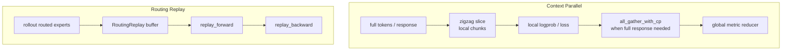

# 上下文并行与路由重放

## 你为什么要读

这一组解决两个容易混在一起的问题：

- Context Parallel 下，同一条 response 被切到多个 rank，logprob、mask、advantage、metrics 如何仍然对齐。
- MoE 场景下，rollout、old actor logprob、policy backward 如何复用同一条 expert routing 路径，避免训练信号和采样路径漂移。

读完后应能排查：

- CP 下 `log_probs`、`loss_masks`、`advantages` 长度不一致。
- GSPO/OPSM/GAE 需要 full response 时如何 gather。
- per-rollout mean 在 CP/DP 下为什么不随 rank 数改变。
- `use_rollout_routing_replay` 缺 `rollout_routed_experts` 或 replay 游标错位。
- ref/teacher forward 为什么必须走 `fallthrough`。
- `allgather_cp` 与 rollout routing replay 为什么不能仅凭两个开关都能解析就认定兼容。
- 训练异常后 replay stage、游标和 buffer 为什么必须作为一组状态检查。

## 两条主线

CP 是坐标和规约问题；RoutingReplay 是 MoE expert 路径一致性问题。两者都会影响 [[Slime-Advantage计算]] 和 [[Slime-Policy-Loss]]，但它们不是同一个机制。

源码目前也没有替这两条主线完成所有组合证明：CP/reducer 多处使用 `zip(strict=False)`；rollout replay 预填固定复用 zigzag `slice_with_cp`，而 allgather-CP 的训练输入是全局 contiguous chunk。读者必须把“功能分别存在”和“组合已经验证”分开。

## 阅读顺序

| 文档 | 读者问题 |
|------|----------|
| [[Slime-上下文并行与路由重放-核心概念]] | zigzag CP、allgather-CP、routing replay state 各是什么 |
| [[Slime-上下文并行与路由重放-源码走读]] | 一条样本如何被 CP 切片、规约，并在 MoE 中 replay |
| [[Slime-上下文并行与路由重放-数据流]] | actor、model、rollout engine、Ray env 如何串起来 |
| [[Slime-上下文并行与路由重放-排障指南]] | 常见 CP shape、reducer、routing replay stage 问题 |
| [[Slime-上下文并行与路由重放-学习检查]] | 可执行验收 |

## 源码范围

| 模块 | 本专题关注 |
|------|------------|
| `slime/backends/megatron_utils/cp_utils.py` | CP offset、slice、gather、loss/metric reducer |
| `slime/backends/megatron_utils/data.py` | `get_batch` 如何构造 CP-ready packed batch |
| `slime/backends/megatron_utils/loss.py` | logprob/value 与 allgather-CP 的交界 |
| `slime/backends/megatron_utils/actor.py` | routing replay 预填与 stage 编排 |
| `slime/backends/megatron_utils/model.py` | training forward 中的 replay stage 临时切换 |
| `slime/utils/routing_replay.py` | replay buffer、compute_topk wrapper、forward hook |
| `slime/backends/sglang_utils/sglang_engine.py` | rollout engine 请求 routed experts |
| `slime/rollout/sglang_rollout.py` | rollout 请求 payload 写入 `return_routed_experts` |

## 与相邻专题的边界

| 边界 | 结论 |
|------|------|
| [[Slime-训练数据]] | 上游提供 `total_lengths`、`response_lengths`、`loss_masks`、`rollout_mask_sums` |
| [[Slime-Advantage计算]] | advantage/return 计算复用 CP slice/gather 语义 |
| [[Slime-Policy-Loss]] | policy loss 的 GSPO/OPSM/reducer 依赖本专题的 full response 和 metric 聚合 |
| [[Slime-分布式权重同步]] | routing replay 发生在一次训练 step 内，权重同步发生在 step 之后 |

## 相关验证

- `tests/test_cp_utils.py`：CP reducer 与 per-rollout denom。
- `tests/test_loss_cp_invariance.py`：不同 CP/DP 切分下 loss/grad 等价。
- `tests/test_logprob_response_spans.py`：top-p mask 与 CP response row 对齐。
- `tests/test_megatron_argument_validation.py`：allgather-CP 的模型架构校验；当前没有 allgather-CP × rollout replay 组合门禁测试。
