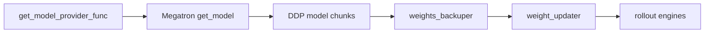
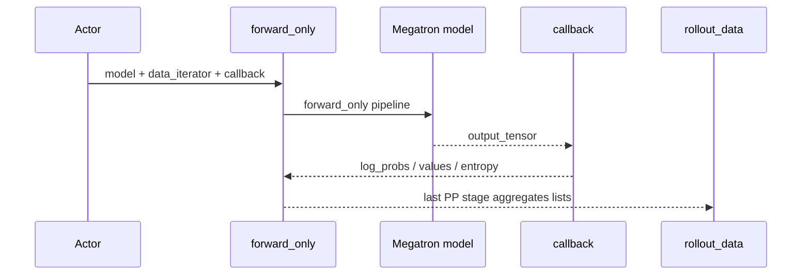

# 模型初始化 · 数据流

## 你为什么要读

本篇只看跨模块数据：初始化函数返回什么，谁消费这些对象，哪些字段会影响后续训练和权重同步。

## 初始化返回值

`initialize_model_and_optimizer` 返回四个对象：

| 返回值 | 消费方 | 作用 |
|--------|--------|------|
| `model` | actor、forward-only、train、weight updater | DDP-wrapped model chunks |
| `optimizer` | train/save | Megatron optimizer |
| `opt_param_scheduler` | train/save | LR/WD scheduler |
| `iteration` | actor init / driver | loader 返回的 checkpoint iteration；actor 候选起点为 `iteration+1`，但显式 `args.start_rollout_id` 优先 |

源码入口：来源：slime/backends/megatron_utils/model.py L968-L1007

actor 接收这些对象后立即构建备份和权重同步器：

源码入口：来源：slime/backends/megatron_utils/actor.py L83-L168

## provider 到 weight sync 的链路



这条链路说明：provider 决定的参数名和 shape 会直接影响 [[Slime-分布式权重同步]]。如果自定义 provider 改了层名，权重同步映射也必须能理解。

## actor / critic 分流

| role | 初始化差异 | 后续用途 |
|------|------------|----------|
| `actor` | 保留 LM output layer | policy train、logprob、weight sync |
| `critic` | post-process stage 换成 `LinearForLastLayer(hidden, 1)` | `forward_only(get_values)`、value loss |

critic 训练路径会在 [[Slime-Advantage计算]] 中提供 PPO 需要的 `values`；actor 训练路径会用同一模型收集 old/ref/teacher `log_probs`。

源码入口：

- 来源：slime/backends/megatron_utils/model_provider.py L25-L58
- 来源：slime/backends/megatron_utils/model_provider.py L237-L239

## checkpoint 与 start_rollout_id

Bridge/legacy load 规则在参数校验阶段会调整 `args.load`、`args.start_rollout_id`、`no_load_optim`、`finetune` 等字段。

```python
# 定位骨架（非逐行摘录）：slime/utils/arguments.py L1763-L1785
if args.megatron_to_hf_mode == "bridge":
    if args.load is not None and os.path.exists(args.load) and os.path.exists(os.path.join(args.load, "latest_checkpointed_iteration.txt")):
        pass
    else:
        if args.load is None:
            args.load = args.ref_load or args.hf_checkpoint
        args.start_rollout_id = 0
else:
    if args.load is None or not os.path.exists(args.load) or not os.path.exists(os.path.join(args.load, "latest_checkpointed_iteration.txt")):
        args.no_load_optim = True
        args.no_load_rng = True
        args.finetune = True
        args.load = args.ref_load
```

Megatron loader 返回 checkpoint iteration；HF Bridge loader固定返回 0，并只加载模型权重。actor init 计算候选起点 `iteration+1`，placement 层仅在 `args.start_rollout_id is None` 时采用；参数阶段显式写入的起点优先。

最终 load 数据源只有 `args.load`：仓库 loader 要求它存在且非空，再按 tracker/`iter_XXXXXXX` 判断 Megatron checkpoint，否则只允许 Bridge HF 加载。`pretrained_checkpoint` 不会在这层替代 `args.load`。

## forward_only 数据流



`forward_only` 的 callback 由调用方决定：

| callback | 输出 | 消费 |
|----------|------|------|
| `get_log_probs_and_entropy` | `log_probs` / `entropy` | advantage、policy metrics |
| `get_values` | `values` | PPO GAE、value loss |

源码入口：来源：slime/backends/megatron_utils/model.py L344-L506

## 动态 batch 顺序恢复

`forward_only` 在 last PP stage 聚合结果时，如果 `use_dynamic_batch_size` 为真，会用 `data_iterator[0].micro_batch_indices` 还原原始样本顺序。

源码入口：来源：slime/backends/megatron_utils/model.py L487-L505

这点会影响后续 `rollout_data["log_probs"][i]` 与 `rewards[i]` 是否对齐。但恢复使用 `zip(strict=False)`，没有验证 index permutation 的长度、唯一性与范围；输入索引契约不成立时，结果可能含 `None`、覆盖旧值或静默丢尾项。

## 不变量

- provider 必须接受 Megatron `pre_process/post_process` 调用协议。
- critic custom provider 必须能暴露 `config.hidden_size`。
- freeze/only-train 规则必须在 optimizer 创建前完成。
- `forward_only` 输出只在 pipeline last stage 聚合。
- 初始化后的 `model[0].role` 会影响日志前缀和部分路径判断。
- forward-only 只有成功路径才把所有 chunk 切回 train mode；异常路径没有 finally 恢复。
- checkpoint “成功返回”不等于 shard metadata 被完整交叉验证：仓库为性能 monkey-patch 了部分 ShardedTensor 校验。
