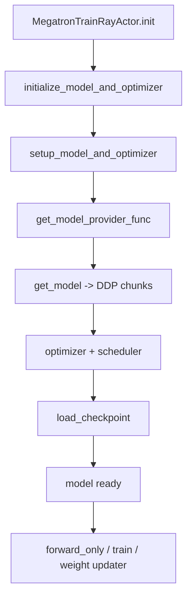

# 模型初始化 · 源码走读

## 读者任务

这篇沿一次 `MegatronTrainRayActor.init` 的模型装配路径走：从 args 决定 provider，构建 actor/critic 模型，挂 optimizer/scheduler，加载 checkpoint，再把模型交给后续 forward-only、train 和 weight sync。

读完后应能定位：

- custom / Bridge / legacy provider 分别在哪里选。
- critic value head 如何替换 LM head。
- freeze 参数发生在什么时机。
- `setup_model_and_optimizer` 和 `initialize_model_and_optimizer` 的边界。
- `forward_only` 如何用同一模型收集 logprob/value。

## 长文读法

这篇按 actor 初始化到可训练模型的装配链读：`MegatronTrainRayActor.init` 进入 `initialize_model_and_optimizer`，再由 provider 决定模型图纸，Megatron `setup_model_and_optimizer` 包装 DDP、optimizer 和 scheduler，checkpoint 加载后模型被交给 forward-only、train 和 weight sync。

| 你的任务 | 先读 | 抓住什么 |
|----------|------|----------|
| 建立初始化主线 | 1 到 2 | actor init 只发起装配，provider 决定具体模型构造路径 |
| 排查 provider 选择 | 2 到 3 | custom / Bridge / legacy provider 的边界在模型图纸阶段 |
| 排查 critic head | 3、7 | critic value head 替换 LM head，不是训练 loss 临时改输出 |
| 排查 freeze | 4 | freeze 包在 provider 外层，早于 Megatron optimizer 装配 |
| 排查 optimizer / scheduler | 5 到 6 | `setup_model_and_optimizer` 接管 DDP、optimizer 和训练步数估算 |
| 排查 checkpoint / forward-only | 7 到 8 | checkpoint 后模型才进入 forward-only、train、weight sync 的共享使用阶段 |

## 主线地图



## 1. actor init 调用模型装配，并把结果接入权重同步

系统压力：每个 Ray train actor 都要在本 rank 上构建 Megatron 模型、恢复 checkpoint，并把参数暴露给后续权重同步器。

设计选择：actor 的 `init` 调 `initialize_model_and_optimizer`，随后备份 actor 权重、按需加载 ref/teacher/old_actor，再根据 colocate/delta/full 选择 weight updater。

```python
# 定位骨架（非逐行摘录）：slime/backends/megatron_utils/actor.py L83-L168
self.model, self.optimizer, self.opt_param_scheduler, loaded_rollout_id = initialize_model_and_optimizer(
    args,
    role=self.role,
)
...
self._active_model_tag = "actor"
self.weights_backuper.backup("actor")

if with_ref:
    self.load_other_checkpoint("ref", args.ref_load)
if with_opd_teacher:
    self.load_other_checkpoint("teacher", args.opd_teacher_load)
...
self.weight_updater = update_weight_cls(
    self.args,
    self.model,
    weights_getter=lambda: self.weights_backuper.get("actor"),
    ...
)
```

执行逻辑：

- `loaded_rollout_id` 来自 checkpoint iteration，外层会用它对齐恢复训练。
- actor 返回的是 `loaded_rollout_id + 1`；只有 `args.start_rollout_id` 仍为 `None` 时，placement 层才采用这个返回值。Bridge/HF 参数校验通常已显式写成 0，因此不能把 actor 返回值无条件等同于最终起点。
- `weights_backuper` 和 `weight_updater` 都依赖同一个初始化后的 model。
- ref/teacher/old_actor 是在 actor 模型装配完成后加载到同一个备份系统里。

## 2. provider 先决定模型图纸

系统压力：Slime 要同时支持自定义模型、HF Bridge 自动建模、以及常规 Megatron GPTModel。后续 `get_model` 只接受 provider，因此分支必须在 provider 层收束。

设计选择：`_get_model_provider_func` 按优先级返回 provider：custom path 优先，其次 Bridge，最后 legacy/MCore GPTModel。

```python
# 定位骨架（非逐行摘录）：slime/backends/megatron_utils/model_provider.py L61-L123
if getattr(args, "custom_model_provider_path", None):
    def wrapped_model_provider(...):
        custom_model_provider = load_function(args.custom_model_provider_path)
        ...
        if post_process and role == "critic":
            model.output_layer = LinearForLastLayer(...)
        return model
    return wrapped_model_provider

if args.megatron_to_hf_mode == "bridge":
    bridge = patch_auto_bridge_hf_config(AutoBridge.from_hf_pretrained(args.hf_checkpoint, trust_remote_code=True))
    provider = bridge.to_megatron_provider(load_weights=False)
    ...
    provider.finalize()
    ...
    return provider.provide
```

不变量：custom provider 如果用于 critic，必须能提供 `model.config.hidden_size`，否则无法替换 value head。当前 wrapper 只向用户 provider 传 `pre_process/post_process` 和可选 `vp_stage`；即使底层函数声明 `config` 或 `pg_collection`，外层包装签名也不会把它们透传，接新版 Megatron provider 协议时要实测。

## 3. legacy provider 构建 GPTModel，并按 role 替换 output layer

系统压力：默认路径需要把 Megatron args 转成 `TransformerConfig`，选择 layer spec，再构造 `GPTModel`。

设计选择：有 `args.spec` 时加载自定义 spec；有 MoE 时用 decoder block spec；否则按 TransformerEngine/local spec 构造。critic 只在 post-process stage 替换 output layer。

```python
# 定位骨架（非逐行摘录）：slime/backends/megatron_utils/model_provider.py L125-L240
config = core_transformer_config_from_args(args)
...
if args.spec is not None:
    transformer_layer_spec = import_module(args.spec)
    ...
else:
    if args.num_experts:
        transformer_layer_spec = get_gpt_decoder_block_spec(config, **kwargs)
    else:
        transformer_layer_spec = get_gpt_layer_with_transformer_engine_spec(...) if use_te else get_gpt_layer_local_spec(...)
...
model = GPTModel(**kwargs)

if post_process and role == "critic":
    model.output_layer = LinearForLastLayer(input_size=config.hidden_size, output_size=1, config=config)
```

`LinearForLastLayer` 输出 float value，并在 sequence parallel 时 gather：

```python
# 定位骨架（非逐行摘录）：slime/backends/megatron_utils/model_provider.py L25-L58
logits = super().forward(input_)
logits = logits.float()
if self.sequence_parallel:
    logits = tensor_parallel.gather_from_sequence_parallel_region(logits, tensor_parallel_output_grad=False)
return logits, None
```

## 4. freeze 包在 provider 外层

系统压力：部分训练或 LoRA 风格训练要在模型构建后立即设置 `requires_grad`，否则 optimizer param group 会纳入错误参数。

设计选择：`get_model_provider_func` 总是把真实 provider 包进 `wrap_model_provider_with_freeze`。

```python
# 定位骨架（非逐行摘录）：slime/backends/megatron_utils/model_provider.py L245-L286
def get_model_provider_func(args, role="actor"):
    return wrap_model_provider_with_freeze(_get_model_provider_func(args, role), args)

def freeze_model_params(model, args):
    if getattr(args, "only_train_params_name_list", None):
        for name, param in model.named_parameters():
            param.requires_grad = False
            for pattern in args.only_train_params_name_list:
                if re.search(pattern, name):
                    param.requires_grad = True
                    break
    if getattr(args, "freeze_params_name_list", None):
        ...
```

参数层禁止同时设置 allowlist 和 blocklist：

源码入口：来源：slime/utils/arguments.py L1977-L1978

失败边界：正则不在参数阶段编译，非法表达式会延迟到模型构造；allowlist 零命中会冻结所有参数，blocklist 零命中会静默 no-op。初始化日志至少应记录 trainable parameter count，并抽样参数名。

## 5. setup_model_and_optimizer 把 provider 交给 Megatron

系统压力：Slime 不直接 new DDP chunks，而是交给 Megatron `get_model`，这样 PP/VPP/TP/EP 的切分仍由 Megatron 管理。

设计选择：`setup_model_and_optimizer` 调 `get_model(provider)`，再按 args 生成 `OptimizerConfig`、Megatron optimizer 和 scheduler。

```python
# 定位骨架（非逐行摘录）：slime/backends/megatron_utils/model.py L270-L318
assert not args.moe_use_upcycling
assert args.load is not None or args.pretrained_checkpoint is not None

model = get_model(get_model_provider_func(args, role), ModelType.encoder_or_decoder)
...
if args.use_stateless_adam:
    assert config.optimizer == "adam", "Stateless Adam only supports --optimizer adam."
    assert args.no_save_optim, "Stateless Adam does not save Adam moment states. Please set --no-save-optim."

optimizer_context = _patch_megatron_adam(StatelessAdam) if args.use_stateless_adam else nullcontext()
with optimizer_context:
    optimizer = get_megatron_optimizer(...)
if args.use_stateless_adam:
    _disable_distributed_optimizer_state_initialization(optimizer)
opt_param_scheduler = get_optimizer_param_scheduler(args, optimizer)
```

读者抓手：如果 optimizer 包含了不该训练的参数，回到 provider freeze；如果模型 chunk 数不对，回到 Megatron parallel args 和 provider。

还要核对 load 的真实门禁：setup 虽接受 `pretrained_checkpoint` 非空，但 initialize 后续的 Slime loader 无条件读取 `args.load` 并要求目录存在且非空。生产配置必须审计解析后的 `args.load`，不能只凭 setup 断言判断可加载。

## 6. scheduler 的步数来自估算，训练时按实际 step 推进

系统压力：LR schedule 需要初始化时知道衰减步数，但 RL 训练中真实样本数可能被过滤、动态 batch 或自定义采样改变。

设计选择：初始化时估算 `train_iters` 和 decay steps；训练时 `opt_param_scheduler.step(increment=step_global_batch_size)` 按实际 step 推进。

```python
# 定位骨架（非逐行摘录）：slime/backends/megatron_utils/model.py L182-L235
args.train_iters = args.num_rollout * args.rollout_batch_size * args.n_samples_per_prompt // args.global_batch_size
if args.lr_decay_iters is None:
    args.lr_decay_iters = args.train_iters
lr_decay_steps = args.lr_decay_iters * args.global_batch_size
...
opt_param_scheduler = OptimizerParamScheduler(
    optimizer,
    init_lr=args.lr_warmup_init,
    max_lr=args.lr,
    min_lr=args.min_lr,
    ...
)
```

这意味着 schedule 终点可能略早或略晚；需要精确控制时应显式设 `--lr-decay-iters`。

## 7. initialize_model_and_optimizer 加载 checkpoint 并处理 critic head

系统压力：actor 从 LM checkpoint 恢复很自然，但 critic output head 可能不存在或 shape 不同。不能静默使用错误 head。

设计选择：对带 `.metadata` 的分布式 checkpoint，load 前检查 critic output layer metadata，load 后必要时重置 critic head，并在 fp16/bf16 下 reload optimizer model params。

```python
# 定位骨架（非逐行摘录）：slime/backends/megatron_utils/model.py L125-L180
if role != "critic" or args.load is None:
    return False
...
checkpoint_metadata = load_tensors_metadata(str(checkpoint_path))
...
if checkpoint_shape == expected_shape:
    continue
logger.warning(
    "Will reinitialize critic %s after checkpoint load because it is %s",
    param_name,
    reason,
)
return True
```

```python
# 定位骨架（非逐行摘录）：slime/backends/megatron_utils/model.py L968-L1007
model, optimizer, opt_param_scheduler = setup_model_and_optimizer(args, role)
model[0].role = role
reinit_critic_output_layer = _critic_output_layer_needs_reinit(args, model, role)
clear_memory()
iteration, _ = load_checkpoint(...)
if reinit_critic_output_layer:
    _reinitialize_critic_output_layer(args, model)
    if (args.fp16 or args.bf16) and optimizer is not None:
        optimizer.reload_model_params()
clear_memory()
return model, optimizer, opt_param_scheduler, iteration
```

这条补救有严格边界：没有 `.metadata` 就直接判定“不需要重置”；真正重置又发生在 load 成功之后。若 loader 对 LM head→value head 的 shape mismatch 先行报错，控制流到不了 reinit。HF Bridge 则只加载 HF 权重并返回 iteration 0，不恢复 optimizer/scheduler/RNG；Megatron checkpoint 才委托上游完整恢复。

`checkpoint.py` 还在 import 时全局替换 `EnumerableShardingSpec.__post_init__` 与 `ShardedTensor._init_from_local_shards_and_global_metadata`，跳过部分跨 rank metadata 验证以降低大模型加载开销。这是性能—完整性取舍，不应被“checkpoint load 成功”一句话掩盖。

## 8. forward_only 复用模型但不进入 backward

系统压力：advantage 阶段需要 old/ref/teacher logprob 和 critic values，但这些 forward 不应更新参数，也不应保存训练梯度。

设计选择：`forward_only` 加 `torch.no_grad()`，切 eval，运行 Megatron pipeline `forward_only=True`，用 callback 生成结果，只在 last PP stage 聚合。

```python
# 定位骨架（非逐行摘录）：slime/backends/megatron_utils/model.py L344-L506
for iterator in data_iterator:
    iterator.reset()
...
def forward_step(...):
    batch = get_batch(...)
    output_tensor = model(**forward_kwargs)
    output_kwargs = {
        "args": args,
        "unconcat_tokens": unconcat_tokens,
        "total_lengths": total_lengths,
        "response_lengths": response_lengths,
        "with_entropy": args.use_rollout_entropy,
    }
    return output_tensor, partial(f, **output_kwargs)
...
forward_data_store += forward_backward_func(..., forward_only=True)
...
if mpu.is_pipeline_last_stage():
    ...
    rollout_data[f"{store_prefix}{key}"] = values
return rollout_data
```

`store_prefix` 决定输出键名，例如 `ref_log_probs`、`teacher_log_probs` 或普通 `log_probs`。

异常安全边界：模型先统一 `eval()`，成功结束才统一 `train()`，中间没有 `try/finally`。hook、forward 或聚合异常会留下 mode 漂移。动态 batch 重排也使用 `zip(strict=False)`，仅在 `micro_batch_indices` 是数量相等、无重复且范围合法的 permutation 时才保证顺序恢复；空 `forward_data_store` 会在 `[0]` 处直接失败。

## 运行验证

**操作：** 先运行参数校验与 server argument 单测；具备 Megatron、CUDA、checkpoint 和分布式环境后，再验证完整初始化。

**预期：** 轻量测试应通过；完整环境中还应确认 provider 选择、freeze 时机、checkpoint 恢复与 actor/critic 输出层符合当前配置。

轻量检查：

```powershell
python -m pytest slime/tests/test_megatron_argument_validation.py
python -m pytest slime/tests/utils/test_megatron_server_arguments.py
```

完整初始化依赖 Megatron、CUDA、checkpoint 和分布式环境；本地 Windows 环境通常只能跑参数/单元检查，不能证明 GPU 初始化路径。

## 复盘

- provider 选择决定模型结构，freeze 必须发生在 optimizer 创建前。
- critic 与 actor 共用主体结构，但输出层语义不同。
- setup 负责模型、optimizer、scheduler；initialize 负责 checkpoint 与 critic reinit。
- forward-only 是后续 logprob/value 的无梯度采集通道。
- weight sync 使用的是初始化后的参数名和 shape，模型初始化错会传导到同步阶段。
