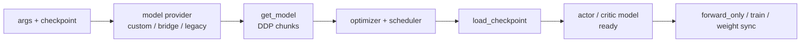

# 模型初始化

## 你为什么要读

这一组回答：一个 Megatron train actor 启动后，如何从配置与 checkpoint 变成可训练的 actor/critic 模型，并给后续 `forward_only`、policy train、weight sync 提供稳定对象。

读完后应能处理三类问题：

- 首次阅读：知道 provider、DDP model、optimizer、scheduler、checkpoint load 的顺序。
- 排障：启动失败、critic value head shape mismatch、stateless Adam、Bridge/legacy load、forward-only 没结果时能定位。
- 改代码：接自定义模型、冻结参数、critic 头、logprob hook 时知道边界在哪里。

## 核心模型

模型初始化专题是训练后端的“装配台”：

它不直接训练样本，也不直接同步权重；它决定后续所有训练路径拿到的模型对象、参数名、output head 和 optimizer 状态。

## 阅读顺序

| 文档 | 读者问题 |
|------|----------|
| [[Slime-模型初始化-核心概念]] | provider、critic 头、freeze、optimizer/scheduler、forward-only 各是什么 |
| [[Slime-模型初始化-源码走读]] | 一次 actor/critic 初始化如何走完 |
| [[Slime-模型初始化-数据流]] | 与 actor init、checkpoint、forward-only、weight sync 的接口 |
| [[Slime-模型初始化-排障指南]] | Bridge/legacy、critic reinit、stateless Adam、last PP stage 等排障 |
| [[Slime-模型初始化-学习检查]] | 可执行验收 |

## 源码范围

| 模块 | 本专题关注 |
|------|------------|
| `slime/backends/megatron_utils/model_provider.py` | provider 选择、Bridge、legacy GPTModel、critic value head、freeze |
| `slime/backends/megatron_utils/model.py` | `setup_model_and_optimizer`、scheduler、checkpoint load、`forward_only` |
| `slime/backends/megatron_utils/checkpoint.py` | Megatron/HF 分流、`args.load` 硬门禁与 shard validation monkey patch |
| `slime/backends/megatron_utils/actor.py` | actor init 如何调用本模块，并构建 weight updater |
| `slime/utils/arguments.py` | Bridge/legacy load、freeze 配置互斥 |

## 与相邻专题的边界

| 边界 | 结论 |
|------|------|
| [[Slime-Megatron-Actor初始化]] | Ray actor、进程组、tokenizer 等外层初始化由该专题负责；本专题从模型装配开始 |
| [[Slime-训练步骤]] | 训练 step 消费这里返回的 `model/optimizer/scheduler` |
| [[Slime-Advantage计算]] | `forward_only(get_log_probs_and_entropy/get_values)` 使用这里初始化好的模型 |
| [[Slime-上下文并行与路由重放]] | CP/routing replay 依赖 `get_batch` 与 model forward，但不是本专题主线 |
| [[Slime-分布式权重同步]] | 权重同步使用初始化后的参数名和模型结构 |

## 首次阅读抓手

先记住四条：

- provider 是模型图纸，`get_model` 才把图纸变成 Megatron DDP chunks。
- actor 输出是 LM logits，critic 输出层被替换成 hidden-to-1 value head。
- `initialize_model_and_optimizer` 总是先 setup，再 `load_checkpoint`，必要时重置 critic output layer。
- 当前 initialize 路径最终硬依赖一个存在且非空的 `args.load`；`pretrained_checkpoint` 只通过 setup 断言，并不能替代后续仓库级 loader 的 `args.load` 门禁。
- `forward_only` 是无梯度收集 logprob/value 的通道，不是训练 backward。

## 相关验证

- `tests/test_megatron_argument_validation.py`：Bridge/allgather/freeze 等参数校验。
- `tests/utils/test_megatron_server_arguments.py`：server 侧只读模型参数配置。
- 依赖完整 Megatron/GPU 的模型初始化通常由集成测试覆盖；本地 Windows 环境可能不能直接跑完整初始化。
