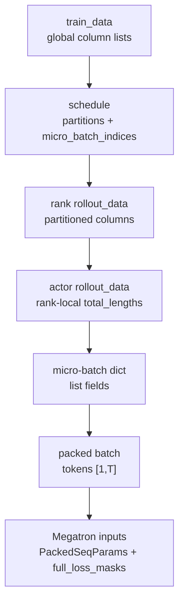
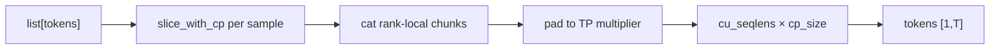
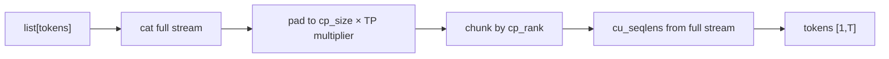

# 训练数据 · 数据流

## 你为什么要读

本页沿 Train Data 的对象生命周期读：全局列式 `train_data` 如何进入 schedule，如何变成 rank-local 列表，再如何由 DataIterator 变成 Megatron packed batch。读完后应能检查字段在哪个边界被切片、迁移到 GPU 或 padding。

## 形态总览

Train Data 的数据流本质是下标空间逐步收缩：从全局 rollout batch，到 DP rank-local 列表，再到一个 micro-batch，最后到一个 packed token stream。



每一步解决一个具体问题：

- `train_data` 保留 rollout 语义和全局 sample 顺序。
- `schedule` 把 rollout step、micro-batch、DP rank 三件事定下来。
- `rank rollout_data` 减少 Ray Object Store 搬运量。
- `DataIterator` 把 schedule 变成可重复播放的 micro-batch 流。
- `get_batch` 把可变长样本变成 Megatron packed THD 输入。

## 字段生命周期

| 字段 | RolloutManager split 前 | rank rollout_data | actor 处理后 | get_batch 后 |
|------|-------------------------|-------------------|--------------|--------------|
| `tokens` | 全局 list | 按 partition 切片 | GPU tensor list | `[1, T_padded]` |
| `loss_masks` | response mask list | 按 partition 切片 | GPU tensor list | `full_loss_masks` |
| `total_lengths` | 全局 list | 仍是全局 list | 按 partition 变 rank-local | 用于 mask 对齐和 cu_seqlens |
| `partition` | 无 | 全局 sample 下标 | 被 pop | 无 |
| `micro_batch_indices` | schedule 输出 | rank-local mbs 表 | 原样保留 | DataIterator offset 消费 |
| `rollout_mask_sums` | 按 rollout 聚合 | 按 partition 切片 | GPU tensor | 传给 loss |
| `global_batch_sizes` | schedule 输出 | 每 step rollout 数 | 原样保留 | loss 缩放和日志 |
| `raw_reward` | 全局 list | 仍是全局 list | 仍是全局 list | passrate/correct-only 日志；不能直接与 rank-local 列同下标遍历 |
| `metadata` | 可由 rollout 转换生成 | **未进入当前分片白名单** | 不可见 | 自定义 hook 若依赖它会缺字段 |

源码入口：来源：slime/ray/rollout.py L853-L895

## 三种下标不要混

```text
global sample index
  ↓ partition[r]
rank-local sample index
  ↓ micro_batch_indices[r][k]
micro-batch local list position
  ↓ get_batch concat / CP slice
packed token offset
```

源码入口：来源：slime/utils/dp_schedule.py L200-L209

```python
# 定位骨架（基于 `slime/utils/dp_schedule.py` L200-L209；省略外层上下文）
# 4. Build per-rank partitions (global sample indices) and micro_batch_indices
# (local indices into partitions[r]).
for r in range(dp_size):
    for mbs_idx in rank_mbs_idx[r]:
        mbs_locals = step_mbs[mbs_idx]  # local indices into sample_indices
        local_start = len(partitions[r])
        partitions[r].extend(sample_indices[i] for i in mbs_locals)
        micro_batch_indices[r].append(list(range(local_start, local_start + len(mbs_locals))))

return partitions, micro_batch_indices, num_microbatches, global_batch_sizes
```

判断一段代码用的是哪种下标，先看它能索引什么：

- 能索引全局 `data[key]` 的是 `partition`。
- 能索引本 rank `rollout_data[key]` 的是 `micro_batch_indices`。
- 能索引 packed `tokens` 的是 `cu_seqlens` 或 token offset。

## schedule 的输出如何进入 Ray ObjectRef

`build_dp_schedule` 返回四个对象：

| 输出 | 类型 | 语义 |
|------|------|------|
| `partitions` | `list[list[int]]` | 每个 DP rank 拥有的全局 sample 下标 |
| `micro_batch_indices` | `list[list[list[int]]]` | 每个 DP rank 的 rank-local micro-batch 表 |
| `num_microbatches` | `list[int]` | 每个训练 step 每 rank 的 mbs 数 |
| `global_batch_sizes` | `list[int]` | 每个训练 step 的 rollout 数 |

源码入口：来源：slime/ray/rollout.py L845-L887

```python
# 定位骨架（基于 `slime/ray/rollout.py` L845-L887；省略注释与收尾分支）
partitions, micro_batch_indices, num_microbatches, global_batch_sizes = build_dp_schedule(
    self.args,
    self.train_parallel_config,
    total_lengths,
    global_batch_size=self.args.global_batch_size,
    rollout_indices=data["rollout_ids"],
)

rollout_data_refs = []
for r in range(dp_size):
    partition = partitions[r]
    rollout_data = {"partition": partition}
    for key in [
        "tokens",
        "multimodal_train_inputs",
        "response_lengths",
        "rewards",
        "truncated",
        "loss_masks",
        "round_number",
        "sample_indices",
        "rollout_ids",
        "rollout_mask_sums",
        "rollout_log_probs",
        "rollout_top_p_token_ids",
        "rollout_top_p_token_offsets",
        "rollout_routed_experts",
        "prompt",
        "teacher_log_probs",
    ]:
        if key not in data:
            continue
        rollout_data[key] = [data[key][j] for j in partition]
```

注意 `raw_reward/total_lengths` 是例外：它们在 Ray 对象里先保留全局列，但 actor 侧只有 `total_lengths` 会按 `partition` 收缩；`raw_reward` 继续是全局列。二者不能合并成一句“随后都变 rank-local”。另外，这段复制是字段白名单，不是 `data.items()` 透明传输；未列出的 `metadata` 和插件字段会在这里消失。

## Actor 侧恢复 rank-local 视图

源码入口：来源：slime/utils/data.py L292-L303

```python
# 来源：slime/utils/data.py L292-L303
def process_rollout_data(args, rollout_data_ref, dp_rank, dp_size):
    assert len(rollout_data_ref) == dp_size
    rollout_data = ray.get(rollout_data_ref[dp_rank].inner)

    partition = rollout_data.pop("partition")
    total_lengths = rollout_data["total_lengths"]

    # save the seqlen of the whole rollout batch
    Timer().seq_lens = total_lengths
    rollout_data["total_lengths"] = [total_lengths[i] for i in partition]

    return rollout_data
```

这里的两个动作含义不同：

- `Timer().seq_lens = total_lengths` 保存全局长度，供性能统计使用。
- `rollout_data["total_lengths"] = ...` 改成本 rank 列表，供 `get_batch` 和 loss 字段对齐使用。

## DataIterator 与 VPP

源码入口：来源：slime/backends/megatron_utils/data.py L201-L245

```python
# 定位骨架（基于 `slime/backends/megatron_utils/data.py` L201-L245；省略 docstring 与方法）
class DataIterator:
    """Iterator over a rollout dict following an explicit micro-batch index schedule."""

    def __init__(
        self,
        rollout_data: RolloutBatch,
        micro_batch_indices: list[list[int]],
    ) -> None:
        self.rollout_data = rollout_data
        self.micro_batch_indices = micro_batch_indices
        self.offset = 0

    def get_next(self, keys: Sequence[str]) -> dict[str, list[object] | None]:
        batch = {}
        indices = self.micro_batch_indices[self.offset]
        for key in keys:
            vals = self.rollout_data.get(key, None)
            if vals is None:
                batch[key] = None
            else:
                batch[key] = [vals[i] for i in indices]
        self.offset += 1
        return batch

    def reset(self) -> "DataIterator":
        self.offset = 0
        return self
```

VPP 场景下 `get_data_iterator` 返回多个 iterator。它们共享同一 `rollout_data` 和 `micro_batch_indices`，但 offset 独立，这让 virtual pipeline stages 能各自播放同一 schedule。

## token 和 mask 的 CP 数据流

默认 CP：



allgather-CP：



源码入口：来源：slime/backends/megatron_utils/data.py L69-L104

`loss_masks` 必须跟 token 流做同样的切片和 padding。最终断言是本层最重要的形状检查：

源码入口：来源：slime/backends/megatron_utils/data.py L120-L148

## PackedSeqParams 的语义

源码入口：来源：slime/backends/megatron_utils/data.py L106-L118

```python
# 来源：slime/backends/megatron_utils/data.py L106-L118
max_seqlen = (cu_seqlens[1:] - cu_seqlens[:-1]).max().item()
packed_seq_params = PackedSeqParams(
    cu_seqlens_q=cu_seqlens,
    cu_seqlens_kv=cu_seqlens,
    max_seqlen_q=max_seqlen,
    max_seqlen_kv=max_seqlen,
    qkv_format="thd",
)

tokens = tokens.unsqueeze(0)

batch["tokens"] = tokens
batch["packed_seq_params"] = packed_seq_params
```

`tokens` 是一个 `[1, T]` 的 packed stream；样本边界不再体现在 batch 维，而体现在 `cu_seqlens`。

这句话只可作为总体模型，不能忽略 CP 分支差异：

- 默认 CP：每条样本经过首尾对称的 `slice_with_cp`，局部片段拼接后，`cu_seqlens` 再乘 `cp_size` 回到原始长度坐标。
- allgather-CP：`cu_seqlens` 在切 chunk 前由全局拼接流构造，`tokens` 随后才取当前 CP rank 的连续 chunk。因此 `cu_seqlens` 是全局边界元数据，不要求末值等于本 rank 的 `T`。

## 日志数据流

Train Data 还负责把 rollout 字段聚合成日志。它不改变训练主线，但解释了为什么 `rollout_mask_sums` 要保留到训练侧。

源码入口：来源：slime/backends/megatron_utils/data.py L248-L330

```python
# 定位骨架（基于 `slime/backends/megatron_utils/data.py` L262-L328；省略注释与非目标分支）
if mpu.get_tensor_model_parallel_rank() == 0 and mpu.is_pipeline_last_stage():
    cp_size = mpu.get_context_parallel_world_size()
    log_dict = {}
    response_lengths = rollout_data["response_lengths"]
    loss_masks = rollout_data["loss_masks"]
    total_lengths = rollout_data["total_lengths"]
    rollout_mask_sums = rollout_data.get("rollout_mask_sums", None)
    dp_world = mpu.get_data_parallel_world_size(with_context_parallel=False)
    num_rollouts_in_rollout = sum(rollout_data["global_batch_sizes"])

    for key, val in rollout_data.items():
        ...
        if isinstance(val[0], torch.Tensor):
            if key in [
                "log_probs",
                "ref_log_probs",
                "rollout_log_probs",
                "returns",
                "advantages",
                "values",
                "teacher_log_probs",
                "opd_reverse_kl",
            ]:
                tensor = torch.cat(val).clone().detach()
                sum_of_sample_mean = get_sum_of_sample_mean(
                    total_lengths,
                    response_lengths,
                    loss_masks,
                    rollout_mask_sums,
                )
                sum_value, count = rollout_log_metric_contribution(
                    sum_of_sample_mean(tensor).item(),
                    cp_size=cp_size,
                    num_rollouts_in_rollout=num_rollouts_in_rollout,
                    dp_size=dp_world,
                )
                log_dict[key] = (sum_value, count)
```

日志和 loss 使用同一类 per-rollout mean 语义，避免“日志看起来正常，但梯度分母是另一套口径”。

这里必须限定到上面列出的 token-level 指标主路径。`log_correct_samples` 是另一条过滤后日志路径：它枚举仍为全局长度的 `raw_reward`，却索引 rank-local 的 `response_lengths/total_lengths/loss_masks`。DP>1 时这两种下标空间并未对齐，可能越界或错配；不能用主路径的 per-rollout reducer 正确性替它背书。

## 数据流检查

- `partition` 是全局 sample 下标，`micro_batch_indices` 是 rank-local 下标。
- `len(rollout_data_ref) == dp_size`。
- 每个 rank 的 `micro_batch_indices` 展平后覆盖 `range(len(partition))`。
- `len(num_microbatches) == len(global_batch_sizes)`。
- `full_loss_masks.shape == tokens.shape`。
- 默认 CP 下，`PackedSeqParams.cu_seqlens_q` 表示还原到原始长度坐标的样本边界；allgather-CP 下表示切分前全局拼接流边界。
- 输入 sample 集减去 partitions 并集，恰好是被尾部 trimming 丢弃的样本；差集非空时必须显式记录。
- 进入 actor 的 per-sample 字段长度应与本 rank `tokens` 样本数一致；`raw_reward` 是当前明确的全局例外。
- `rollout_mask_sums` 进入日志和 loss，保持 per-rollout mean 口径。

## 运行验证

这篇的轻量验证要覆盖三段：rollout manager 生成 DP 分片，`process_rollout_data` 取本 rank 数据，Megatron data helper 把样本 pack 成 `tokens + PackedSeqParams` 并保留日志分母。

```powershell
rg -n 'build_dp_schedule|rollout_data_refs|process_rollout_data|PackedSeqParams|def log_rollout_data|rollout_mask_sums|global_batch_sizes|num_microbatches|micro_batch_indices' slime/slime/ray/rollout.py slime/slime/utils/dp_schedule.py slime/slime/utils/data.py slime/slime/backends/megatron_utils/data.py
```

读输出时确认 `global_batch_sizes` 和 `num_microbatches` 仍然由 DP schedule 产生，`rollout_mask_sums` 没有只停在 rollout 侧，而是进入训练侧日志与 loss 口径。否则 compact rollout 的平均值解释会失真。
