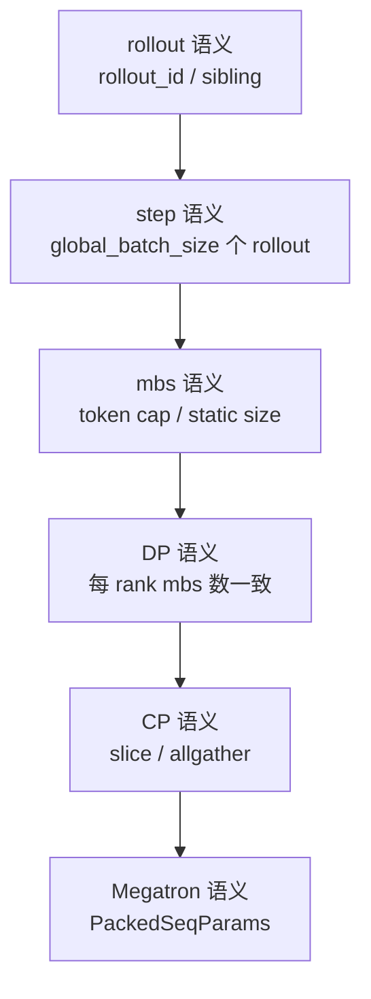

# 训练数据 · 核心概念

本页先建立 Train Data 的下标模型。读完后，你应该能区分 global sample index、rollout id、step-local index、rank-local index 和 packed token offset，避免把 DP schedule、micro-batch 和 Megatron packed sequence 混在一起。

## 先建立模型

Train Data 不是数据集加载器，也不是 loss 算法。它只负责把 RolloutManager 产出的列式样本整形成 Megatron 可执行的 micro-batch。



读源码时要一直分清四种下标：

| 下标 | 例子 | 作用 |
|------|------|------|
| 全局 sample 下标 | `partition=[0, 3, 5]` | 指向 rollout batch 中的原始 sample |
| rollout id | `rollout_indices` | 把 compact sibling 留在同一训练 step |
| step-local 下标 | `step_mbs` 里的数字 | 指向当前 step 的 `sample_indices` |
| rank-local 下标 | `micro_batch_indices[r]` | 指向当前 DP rank 的 `rollout_data` 列表 |

## 核心对象

| 对象 | 写入方 | 消费方 | 关键不变量 |
|------|--------|--------|------------|
| `total_lengths` | RolloutManager | schedule、CP、日志 | split 前全局，actor 侧按 partition 变 rank-local |
| `partitions[r]` | `build_dp_schedule` | `_split_train_data_by_dp` | 每个值是全局 sample 下标 |
| `micro_batch_indices[r]` | `build_dp_schedule` | `DataIterator` | rank-local 下标，展平后覆盖 `range(len(partition))` |
| `num_microbatches` | `build_dp_schedule` | `model.train` | 每 step 每 rank 的 mbs 数 |
| `global_batch_sizes` | `build_dp_schedule` | loss 缩放、日志 | 每 step 的 rollout 数，不是 sample 数 |
| `PackedSeqParams` | `get_batch` | Megatron model | THD packed sequence 边界 |
| `full_loss_masks` | `get_batch` | model forward/loss | shape 必须等于 `tokens.shape` |

还要单独记住两个“非局部字段”：`total_lengths` 和 `raw_reward` 在 Ray 分片中仍保存全局列表。Actor 侧只把 `total_lengths` 按 `partition` 收缩；`raw_reward` 保持全局。这不是普通样本列的行为，日志代码若把它与 rank-local 列按同一个下标遍历，就会产生错配。

## pack-first-distribute-second

Train Data 的调度哲学是：先在全局 step 内打包 micro-batch，再分发给 DP rank。这样做的目的不是追求最优装箱，而是保证 pipeline 能同步。

源码入口：来源：slime/utils/dp_schedule.py L1-L38

```python
# 定位骨架（基于 `slime/utils/dp_schedule.py` L8-L23；把模块 docstring 转写为注释）
# The scheduling philosophy is **pack first, distribute second**:
#
#   1. Group samples by rollout id (``rollout_indices[i]`` =
#      ``samples[i].index``) and split rollouts into steps of
#      ``global_batch_size`` rollouts each.
#   2. For each step, pack its samples into ``K`` micro-batches with a
#      single first-fit pass (dynamic batch) or fixed-size chunking
#      (static batch).
#   3. Adjust ``K`` to a multiple of ``dp_size * (mb_group if vpp>1 else 1)``
#      by splitting the largest multi-sample bins (dynamic only).
#   4. Distribute the ``K`` mbs across ``dp_size`` ranks, ``K / dp_size``
#      each, with either a strided round-robin or a Karmarkar-Karp pass on
#      estimated mbs FLOPs.
```

这个顺序解决三个压力：

- compact/subagent 输出的一组 sibling 不被拆出同一 step。
- 每个 DP rank 在每个 step 执行相同数量的 micro-batch。
- VPP 下每 rank micro-batch 数还能对齐 `microbatch_group_size_per_vp_stage`。

## dynamic batch 与 static batch

| 模式 | 打包方式 | 失败边界 |
|------|----------|----------|
| static | 按 `micro_batch_size` 固定切 chunk | mbs 数不能对齐 DP/VPP 时直接断言 |
| dynamic | `first_fit_pack` 按 token cap 装箱 | 样本太少无法 split 到对齐数量时断言 |
| balance_by_flops | 按 FLOPs 估计做分区 | 不严格 enforce token cap，可能超大 mbs |
| balance_data | 把已成形 mbs 按 workload 分给 DP rank | 要求每 rank mbs 数一致 |

源码入口：来源：slime/utils/dp_schedule.py L55-L79

源码入口：来源：slime/utils/dp_schedule.py L167-L209

## DataIterator 是播放器，不是调度器

调度策略已经在 `build_dp_schedule` 里确定。Actor 侧的 `DataIterator` 只是按 rank-local `micro_batch_indices` 播放字段。

源码入口：来源：slime/backends/megatron_utils/data.py L201-L245

```python
# 定位骨架（基于 `slime/backends/megatron_utils/data.py` L219-L245；省略类缩进与 docstring）
def get_next(self, keys: Sequence[str]) -> dict[str, list[object] | None]:
    batch = {}
    indices = self.micro_batch_indices[self.offset]
    for key in keys:
        vals = self.rollout_data.get(key, None)
        if vals is None:
            batch[key] = None
        else:
            batch[key] = [vals[i] for i in indices]
    self.offset += 1
    return batch

def reset(self) -> "DataIterator":
    self.offset = 0
    return self

def get_data_iterator(rollout_data: RolloutBatch) -> list[DataIterator]:
    vpp_size = mpu.get_virtual_pipeline_model_parallel_world_size() or 1
    micro_batch_indices = rollout_data["micro_batch_indices"]
    return [DataIterator(rollout_data, micro_batch_indices) for _ in range(vpp_size)]
```

VPP 会创建多个 iterator，每个 iterator 有独立 offset，避免 virtual stage 互相抢游标。

## get_batch 做 CP 和 packed THD

`get_batch` 是从 list-of-samples 到 Megatron batch 的最后一层转换：

1. 从 `DataIterator` 取当前 micro-batch 的字段。
2. 保存 `unconcat_tokens`，供 log-prob/value 提取 response 对齐结果。
3. 按 CP 模式切 token。
4. padding 到 TP × pad multiplier。
5. 构造 `PackedSeqParams`。
6. 把 response-level `loss_masks` 对齐到 full token stream。

源码入口：来源：slime/backends/megatron_utils/data.py L28-L163

```python
# 定位骨架（基于 `slime/backends/megatron_utils/data.py` L106-L148；省略 token 写回与 mask 中段）
max_seqlen = (cu_seqlens[1:] - cu_seqlens[:-1]).max().item()
packed_seq_params = PackedSeqParams(
    cu_seqlens_q=cu_seqlens,
    cu_seqlens_kv=cu_seqlens,
    max_seqlen_q=max_seqlen,
    max_seqlen_kv=max_seqlen,
    qkv_format="thd",
)

tokens = tokens.unsqueeze(0)

batch["tokens"] = tokens
batch["packed_seq_params"] = packed_seq_params
...
assert loss_masks.shape == tokens.shape, f"loss_masks.shape: {loss_masks.shape}, tokens.shape: {tokens.shape}"
batch["full_loss_masks"] = loss_masks
```

`loss_masks` 和 `full_loss_masks` 不同：前者在 response 空间，后者对齐到模型 token stream。

## 与 loss 归一化的边界

Train Data 不计算 policy loss，但它保留 loss 需要的分母语义：

- `build_dp_schedule` 按 rollout id 分 step。
- RolloutManager 预计算 `rollout_mask_sums`。
- `get_batch` 把 `rollout_mask_sums` 随其他字段传给 loss。
- `loss_function` 才真正用它做 per-rollout mean。

所以调度不能随意按 sample 打散 rollout sibling；否则 loss 分母和 step 语义都会变。

## 三个不会替你兜底的边界

1. `build_dp_schedule` 不校验 `len(total_lengths) == len(rollout_indices)`，也不校验 `global_batch_size > 0`。调用方必须保证长度、正数和并行配置合法；否则可能是显式异常，也可能是尾部长度从未参与调度。
2. 尾部不足 `global_batch_size` 个 rollout 时，源码用整除计算 `num_steps`，剩余 rollout 不进入任何 `partition`，且该函数不记录 warning。恢复训练样本数时应比较输入 sample 集与 partitions 并集。
3. RolloutManager 不是把 `train_data` 的所有键透明传给 actor，而是按硬编码列表复制。当前 `metadata` 虽在 `_convert_samples_to_train_data` 中写入，却不在 `_split_train_data_by_dp` 白名单内；扩展字段必须同时改生产、传输和消费三处。

这三点分别对应“参数契约、样本覆盖、字段可达性”，不能用 `full_loss_masks.shape == tokens.shape` 这一条末端断言替代。

## 运行验证

Train Data 的验证重点是三段：DP schedule、DataIterator 播放、`get_batch` 组装 packed THD。

```powershell
rg -n 'build_dp_schedule|pack first|class DataIterator|def get_batch|PackedSeqParams|cu_seqlens|full_loss_masks|rollout_mask_sums|num_microbatches|global_batch_sizes|dynamic' slime/slime/utils/dp_schedule.py slime/slime/backends/megatron_utils/data.py slime/slime/ray/rollout.py slime/slime/backends/megatron_utils/model.py
```

读输出时先看 `build_dp_schedule` 返回的 `partitions/micro_batch_indices/num_microbatches/global_batch_sizes`，确认 step 与 DP 对齐并核对是否裁掉尾部 rollout；再看 RolloutManager 的字段白名单和 `DataIterator` 如何播放；最后看 `get_batch`。默认 CP 下 `cu_seqlens` 是还原到原始长度坐标的 packed 边界；allgather-CP 下它描述全局拼接流，而 `tokens` 已是当前 CP rank 的局部 chunk，二者不能按普通局部 tensor 边界理解。
