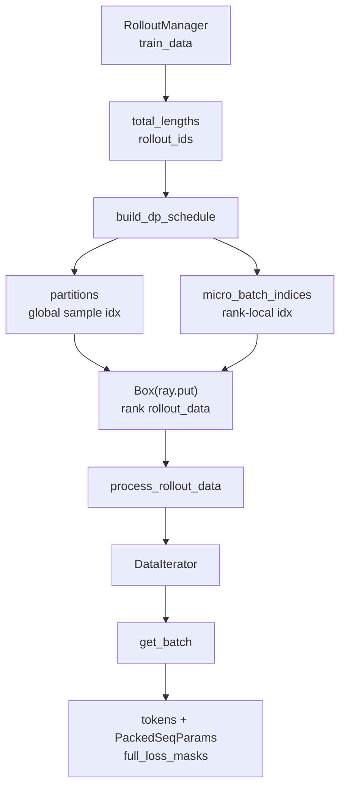

# 训练数据 · 源码走读

## 读者任务

这篇沿一个 rollout batch 走：RolloutManager 已经把 `Sample` 变成列式 `train_data`，Train Data 如何按 rollout id 分 step、按 token/FLOPs 打 micro-batch、按 DP rank 分配样本，最后在 actor 侧把样本整形成 Megatron 的 packed THD batch。

读完后应能定位：

- `build_dp_schedule` 为什么按 rollout id 分 step，而不是按 sample 数硬切。
- dynamic batch 为什么可能 split bin，static batch 为什么不能自动 split。
- `partition` 和 `micro_batch_indices` 分别处在哪个下标空间。
- `get_batch` 中默认 CP 与 allgather-CP 的 token/mask 差异。
- `full_loss_masks.shape != tokens.shape` 时应看哪段代码。
- 尾部 rollout 在哪一层被裁掉、为什么调用方收不到被裁列表。
- rollout 自定义字段为何可能在 DP 分片白名单处消失。

## 长文读法

这篇按“rollout 样本如何变成 Megatron 可吃的 packed batch”读：RolloutManager 先按 rollout id 和 token 长度算 DP schedule，每个 rank 拿到自己的 ObjectRef；actor 侧 `process_rollout_data` 把全局下标收缩成本 rank 数据；`DataIterator` 按 micro-batch 下标取样；`get_batch` 再做 CP 切分、padding、THD packed 参数和 loss mask 对齐。

| 读者任务 | 先读 | 要抓住的判断 |
|----------|------|--------------|
| 第一次建立数据主线 | 读者任务、主线地图、1 到 2 | step 边界按 rollout id 切，不按 sample 数硬切 |
| 排查 dynamic/static batch | 3 到 5 | dynamic 可以通过 split bin 对齐 micro-batch 数，static 不能自动拆固定大小 mbs |
| 排查下标空间 | 1、6、7 | `partition` 是全局 sample 下标，`micro_batch_indices` 是 rank-local 下标 |
| 排查 actor 侧字段缺失 | 8 到 9 | `process_rollout_data` 和 `DataIterator` 决定 actor 实际看到哪些字段 |
| 排查 CP/allgather-CP | 10 到 11 | 默认 CP 逐样本 slice 后拼接，allgather-CP 先全局拼接再按 CP rank 切 |
| 排查 loss mask shape | 11 | `full_loss_masks` 按 prompt/response 长度补齐，并最终要求 shape 与 tokens 一致 |

读的时候把 rollout 侧 schedule 和 actor 侧 batch 组装分开。前者决定“哪些样本给哪个 rank”，后者决定“这些样本如何变成 Megatron THD 输入”。

## 主线地图



## 1. RolloutManager 在 split 前补 total_lengths

系统压力：调度需要知道每条 sample 的 token 总长度，也要知道每条 sample 属于哪个 rollout。前者决定 micro-batch 大小，后者决定 step 边界。

设计选择：`_split_train_data_by_dp` 在 rollout 侧调用 `build_dp_schedule`，得到 partitions、micro-batch 表和每 step 的训练规模，再为每个 DP rank 打包一个 Ray `Box`。

源码入口：来源：slime/ray/rollout.py L829-L895

```python
# 来源：slime/ray/rollout.py L841-L851
dp_size = self.train_parallel_config["dp_size"]
total_lengths = [len(t) for t in data["tokens"]]
data["total_lengths"] = total_lengths

partitions, micro_batch_indices, num_microbatches, global_batch_sizes = build_dp_schedule(
    self.args,
    self.train_parallel_config,
    total_lengths,
    global_batch_size=self.args.global_batch_size,
    rollout_indices=data["rollout_ids"],
)
```

这里的 `rollout_indices` 来自 `rollout_ids`，不是 `sample_indices`。compact/subagent 场景下一次 rollout 可以产出多条训练 sample，这些 sibling 必须留在同一训练 step。

## 2. build_dp_schedule 先按 rollout id 切 step

系统压力：`global_batch_size` 在训练侧表示每个 step 包含多少 rollout，而不是多少 sample。若直接按 sample 切，会把同一 rollout 的 sibling 拆到不同 step，破坏 per-rollout mean 和 reward 语义。

设计选择：先构造 `rollout_id_to_samples`，保留 rollout id 首次出现顺序；每 `global_batch_size` 个 rollout 构成一个 step；尾部不满 step 的 rollout 被丢弃。这里没有 warning、返回值或回灌机制，调用方只看到已经裁剪后的 partitions。

源码入口：来源：slime/utils/dp_schedule.py L82-L150

```python
# 定位骨架（基于 `slime/utils/dp_schedule.py` L127-L150；省略注释与中间初始化）
rollout_id_to_samples: dict[int, list[int]] = {}
for sample_pos, rid in enumerate(rollout_indices):
    rollout_id_to_samples.setdefault(rid, []).append(sample_pos)
rollout_ids = list(rollout_id_to_samples.keys())

num_steps = len(rollout_ids) // global_batch_size
assert num_steps >= 1, (
    f"num_rollouts ({len(rollout_ids)}) < global_batch_size ({global_batch_size}); "
    f"need at least one rollout per step."
)
...
for step_i in range(num_steps):
    step_rollouts = rollout_ids[step_i * global_batch_size : (step_i + 1) * global_batch_size]
    sample_indices = [pos for rid in step_rollouts for pos in rollout_id_to_samples[rid]]
    step_lengths = [total_lengths[i] for i in sample_indices]
    global_batch_sizes.append(global_batch_size)
```

运行抓手：`tests/test_dp_schedule.py` 有 compact sibling 留在同一 step 和尾部 rollout 丢弃的测试。

调用契约还存在两个未显式校验的前提：`total_lengths` 与 `rollout_indices` 必须等长，`global_batch_size` 必须为正。若 rollout id 列更短，多出来的 `total_lengths` 不会进入分组；若更长，则后续按位置取长度可能越界。单测覆盖调度不变量，但没有替调用方验证这两项输入契约。

源码入口：来源：tests/test_dp_schedule.py L252-L322

## 3. 每个 step 先 pack micro-batch

系统压力：动态 batch 要降低 padding 和 OOM 风险；static batch 要保持固定 `micro_batch_size`。这两种模式都必须在 DP 分配前形成 step 内的 micro-batch 列表。

设计选择：`_pack_step_into_mbs` 返回 `step_mbs`，其中每个 mbs 存的是 step-local 下标。dynamic 走 first-fit；`balance_by_flops` 走 FLOPs 分区；static 走固定 chunk。

源码入口：来源：slime/utils/dp_schedule.py L55-L79

```python
# 定位骨架（基于 `slime/utils/dp_schedule.py` L55-L79；省略函数 docstring）
def _pack_step_into_mbs(
    step_lengths: list[int],
    *,
    args: Any,
    use_dynamic_batch_size: bool,
    max_per_bin: int | None,
    micro_batch_size: int | None,
    balance_by_flops: bool = False,
) -> list[list[int]]:
    if use_dynamic_batch_size:
        assert max_per_bin is not None
        if balance_by_flops:
            total_tokens = sum(step_lengths)
            num_mbs = max(1, (total_tokens + max_per_bin - 1) // max_per_bin)
            if num_mbs >= len(step_lengths):
                return [[i] for i in range(len(step_lengths))]
            workloads = _calculate_workloads(step_lengths, args)
            return get_seqlen_balanced_partitions(workloads, num_mbs, equal_size=False)
        return first_fit_pack(step_lengths, max_per_bin)
    assert micro_batch_size is not None
    n = len(step_lengths)
    return [list(range(i, min(i + micro_batch_size, n))) for i in range(0, n, micro_batch_size)]
```

关键边界：`balance_by_flops` 的注释明确说它不 enforce token cap；如果 OOM，不能只看 `max_tokens_per_gpu`。

## 4. dynamic first-fit 和 split 只改变 mbs，不复制样本

系统压力：PP/VPP 要求 micro-batch 数对齐到 `dp_size * mb_group`，但 first-fit 得到的 K 未必正好对齐。

设计选择：dynamic path 可通过拆最大的多样本 bin 增加 K；static path 不拆，因为拆了会破坏固定 `micro_batch_size` 语义。

源码入口：来源：slime/utils/seqlen_balancing.py L180-L229

```python
# 定位骨架（基于 `slime/utils/seqlen_balancing.py` L180-L229；拼接两个目标函数并省略中间 helper）
def first_fit_pack(total_lengths, max_tokens_per_bin):
    bins: list[list[int]] = []
    bin_sums: list[int] = []
    for idx, length in enumerate(total_lengths):
        for j in range(len(bins)):
            if bin_sums[j] + length <= max_tokens_per_bin:
                bins[j].append(idx)
                bin_sums[j] += length
                break
        else:
            bins.append([idx])
            bin_sums.append(length)
    return bins

def expand_bins_by_splitting(bins: list[list[int]], target_count: int, lengths) -> None:
    while len(bins) < target_count:
        candidates = [(sum(lengths[i] for i in b), idx) for idx, b in enumerate(bins) if len(b) > 1]
        if not candidates:
            break
        _, idx = max(candidates)
        left, right = _split_bin_by_tokens(bins[idx], lengths)
        bins[idx] = left
        bins.append(right)
```

运行抓手：oversized sample 会独占一个 mbs；如果它单条就超过 cap，调度不会凭空拆 token。

源码入口：来源：tests/test_dp_schedule.py L193-L224

## 5. mbs 数量必须对齐 DP 和 VPP

系统压力：每个 DP rank 必须执行同样数量的 micro-batch，否则 PP forward/backward 无法同步；VPP 还要求 per-rank mbs 数是 group size 的倍数。

设计选择：`align_to = dp_size * (mb_group if vpp_size > 1 else 1)`。若 K 不对齐，dynamic 尝试 split，static 直接报错。

源码入口：来源：slime/utils/dp_schedule.py L112-L125

源码入口：来源：slime/utils/dp_schedule.py L167-L189

```python
# 定位骨架（基于 `slime/utils/dp_schedule.py` L167-L189；省略段首注释与收尾计数）
target_K = max(((len(step_mbs) + align_to - 1) // align_to) * align_to, align_to)
if target_K != len(step_mbs):
    if args.use_dynamic_batch_size:
        expand_bins_by_splitting(step_mbs, target_K, step_lengths)
        assert len(step_mbs) == target_K, (
            f"dynamic path: could only produce {len(step_mbs)} mbs after maximal splitting; "
            f"need {target_K}. step {step_i} has {len(sample_indices)} samples, below the "
            f"alignment threshold ({align_to})."
        )
    else:
        raise AssertionError(
            f"static path: num_mbs ({len(step_mbs)}) is not a multiple of "
            f"dp_size * mb_group ({align_to}); got "
            f"step_size={len(sample_indices)}, micro_batch_size={args.micro_batch_size}, "
            f"dp_size={dp_size}, mb_group={mb_group if vpp_size > 1 else 1}. "
            f"Splitting static mbs would break the fixed-size invariant; adjust the config "
            f"so step_size % (dp_size * micro_batch_size * mb_group) == 0."
        )
```

运行抓手：`tests/test_dp_schedule.py` 里 VPP 测试会检查每个 step 的 `num_microbatches` 能被 group size 整除。

源码入口：来源：tests/test_dp_schedule.py L227-L249

## 6. 分发给 DP rank 后，micro_batch_indices 变成 rank-local

系统压力：RolloutManager 最终要给每个 DP rank 一个只含本 rank 样本的 `rollout_data`；因此 schedule 输出既要保存全局 sample 下标，又要保存 rank-local micro-batch 切片。

设计选择：`partitions[r]` 保存全局 sample 下标；`micro_batch_indices[r]` 保存相对于 `partitions[r]` 的连续 local 下标。

源码入口：来源：slime/utils/dp_schedule.py L191-L209

```python
# 定位骨架（基于 `slime/utils/dp_schedule.py` L191-L209；省略段首注释）
if args.balance_data:
    step_workloads = _calculate_workloads(step_lengths, args)
    mbs_weights = [sum(step_workloads[i] for i in bin_) for bin_ in step_mbs]
    rank_mbs_idx = get_seqlen_balanced_partitions(mbs_weights, dp_size, equal_size=True)
else:
    rank_mbs_idx = [list(range(r, K, dp_size)) for r in range(dp_size)]

for r in range(dp_size):
    for mbs_idx in rank_mbs_idx[r]:
        mbs_locals = step_mbs[mbs_idx]
        local_start = len(partitions[r])
        partitions[r].extend(sample_indices[i] for i in mbs_locals)
        micro_batch_indices[r].append(list(range(local_start, local_start + len(mbs_locals))))

return partitions, micro_batch_indices, num_microbatches, global_batch_sizes
```

不要把 `micro_batch_indices` 当全局 sample 下标。它只能索引当前 rank 的 `rollout_data` 列表。

## 7. RolloutManager 打包 rank rollout_data

系统压力：训练 actor 不应该拿全量 `train_data` 再自行切片；这会重复搬运大对象，也容易让 DP rank 不一致。

设计选择：RolloutManager 对每个 rank 按 `partition` 取样本级字段；`raw_reward/total_lengths` 保留全局列；再写入 schedule metadata 并 `ray.put`。

源码入口：来源：slime/ray/rollout.py L853-L895

```python
# 定位骨架（基于 `slime/ray/rollout.py` L853-L895；省略注释与 transport 分支）
rollout_data_refs = []
for r in range(dp_size):
    partition = partitions[r]
    rollout_data = {"partition": partition}
    for key in [
        "tokens",
        "multimodal_train_inputs",
        "response_lengths",
        "rewards",
        "truncated",
        "loss_masks",
        "round_number",
        "sample_indices",
        "rollout_ids",
        "rollout_mask_sums",
        "rollout_log_probs",
        "rollout_top_p_token_ids",
        "rollout_top_p_token_offsets",
        "rollout_routed_experts",
        "prompt",
        "teacher_log_probs",
    ]:
        if key not in data:
            continue
        rollout_data[key] = [data[key][j] for j in partition]
    for key in ["raw_reward", "total_lengths"]:
        if key not in data:
            continue
        rollout_data[key] = data[key]
    rollout_data["global_batch_sizes"] = global_batch_sizes
    rollout_data["num_microbatches"] = num_microbatches
    rollout_data["micro_batch_indices"] = micro_batch_indices[r]
    _tensorize_rollout_data_for_training(rollout_data)
    ...
return rollout_data_refs
```

`total_lengths` 仍保留全局列，是因为 actor 侧还要用 `partition` 把它变成本 rank 列表，同时 `Timer().seq_lens` 保留完整 batch 长度用于性能统计。

这里还有一个容易漏掉的扩展边界：字段复制使用硬编码白名单。上游 `_convert_samples_to_train_data` 会写入 `metadata`，但本段没有复制它；任意新插件字段若只加在生产端，也会在进入 Ray Object Store 前静默消失。读者排查“rollout 侧有、actor 侧无”时，第一站应是这张白名单，而不是 `DataIterator`。

## 8. process_rollout_data 恢复 rank-local total_lengths

系统压力：Actor 侧只知道自己的 DP rank，必须从 `list[Box]` 中取对应对象；进入训练后，字段应尽量是 rank-local。

设计选择：`process_rollout_data` 根据 `dp_rank` 取 `Box`，弹出 `partition`，把全局 `total_lengths` 重排成本 rank 列表。

源码入口：来源：slime/utils/data.py L292-L303

```python
# 来源：slime/utils/data.py L292-L303
def process_rollout_data(args, rollout_data_ref, dp_rank, dp_size):
    assert len(rollout_data_ref) == dp_size
    rollout_data = ray.get(rollout_data_ref[dp_rank].inner)

    partition = rollout_data.pop("partition")
    total_lengths = rollout_data["total_lengths"]

    # save the seqlen of the whole rollout batch
    Timer().seq_lens = total_lengths
    rollout_data["total_lengths"] = [total_lengths[i] for i in partition]

    return rollout_data
```

`tokens/loss_masks/rollout_log_probs` 等字段的 GPU 迁移发生在 `MegatronTrainRayActor._get_rollout_data`，属于 [[Slime-训练步骤]] 的入口。

## 9. DataIterator 按 rank-local mbs 播放字段

系统压力：Megatron forward、ref forward、critic value forward、actor train 都要复用同一 schedule；不能每次重新切样本。

设计选择：`DataIterator` 每次从 `micro_batch_indices[offset]` 取一组 rank-local indices，再按 keys 从 `rollout_data` 中取对应字段；reset 只是把 offset 归零。

源码入口：来源：slime/backends/megatron_utils/data.py L201-L245

```python
# 定位骨架（基于 `slime/backends/megatron_utils/data.py` L219-L245；省略类缩进与 docstring）
def get_next(self, keys: Sequence[str]) -> dict[str, list[object] | None]:
    batch = {}
    indices = self.micro_batch_indices[self.offset]
    for key in keys:
        vals = self.rollout_data.get(key, None)
        if vals is None:
            batch[key] = None
        else:
            batch[key] = [vals[i] for i in indices]
    self.offset += 1
    return batch

def reset(self) -> "DataIterator":
    self.offset = 0
    return self

def get_data_iterator(rollout_data: RolloutBatch) -> list[DataIterator]:
    vpp_size = mpu.get_virtual_pipeline_model_parallel_world_size() or 1
    micro_batch_indices = rollout_data["micro_batch_indices"]
    return [DataIterator(rollout_data, micro_batch_indices) for _ in range(vpp_size)]
```

VPP 下返回多个 iterator，是为了每个 virtual pipeline stage 独立维护 offset。

## 10. get_batch 生成 CP-ready packed batch

系统压力：Megatron 模型入口需要一个 packed token tensor 和 packed sequence metadata；原始 micro-batch 还是多条可变长 sample list。

设计选择：`get_batch` 取 raw fields，保留 `unconcat_tokens`，按 CP 模式处理 tokens 和 loss masks，构造 `PackedSeqParams`。

源码入口：来源：slime/backends/megatron_utils/data.py L28-L163

```python
# 定位骨架（基于 `slime/backends/megatron_utils/data.py` L55-L67；省略 pad-token 注释）
assert "tokens" in keys
batch = data_iterator.get_next(keys)

tokens = batch["tokens"]
pad_token_id = 0
pad_size = mpu.get_tensor_model_parallel_world_size() * pad_multiplier

# for cp, we need all tokens to calculate logprob
batch["unconcat_tokens"] = tokens

cp_size = mpu.get_context_parallel_world_size()
cp_rank = mpu.get_context_parallel_rank()
```

默认 CP：

```python
# 定位骨架（基于 `slime/backends/megatron_utils/data.py` L88-L104；省略空行与注释）
else:
    tokens = [slice_with_cp(t, pad_token_id) for t in tokens]

    cu_seqlens = [0]
    for t in tokens:
        cu_seqlens.append(cu_seqlens[-1] + t.size(0))

    tokens = torch.cat(tokens)
    pad = (pad_size - tokens.size(0) % pad_size) % pad_size
    if pad != 0:
        tokens = F.pad(tokens, (0, pad), value=pad_token_id)
        cu_seqlens.append(cu_seqlens[-1] + pad)

    # thd requires the cu_seqlens to be of the origin length
    cu_seqlens = torch.tensor(cu_seqlens, dtype=torch.int).cuda() * cp_size
```

allgather-CP：

```python
# 定位骨架（基于 `slime/backends/megatron_utils/data.py` L69-L87；省略 DSA 与 padding 注释）
if allgather_cp:
    cu_seqlens_list: list[int] = [0]
    for t in tokens:
        cu_seqlens_list.append(cu_seqlens_list[-1] + t.size(0))

    tokens = torch.cat(tokens, dim=0)
    global_pad_size = cp_size * pad_size
    pad = (global_pad_size - tokens.size(0) % global_pad_size) % global_pad_size
    if pad != 0:
        tokens = F.pad(tokens, (0, pad), value=pad_token_id)
        cu_seqlens_list.append(cu_seqlens_list[-1] + pad)

    cu_seqlens = torch.tensor(cu_seqlens_list, dtype=torch.int, device=torch.cuda.current_device())
    tokens = tokens.chunk(cp_size, dim=0)[cp_rank]
```

差异：默认 CP 先对每条样本做首尾对称切片再 concat；allgather-CP 先 concat 全局 token stream，再按 CP rank 取连续 chunk。后者的 `cu_seqlens` 在 chunk 之前构造，因此描述全局流；它的末值通常不等于当前 rank 的 `tokens.numel()`，不能套用普通局部 packed tensor 的检查式。

## 11. loss_masks 从 response 空间对齐到 token stream

系统压力：rollout 侧的 `loss_mask` 长度等于 response length；模型 forward 的 token stream 包含 prompt、response 和 padding，且 next-token 训练末位没有 target。

设计选择：对每条 sample 的 response mask 左侧 pad `prompt_length - 1`，右侧 pad 1；再按 CP 模式切片或全局 chunk，最后断言形状等于 tokens。

源码入口：来源：slime/backends/megatron_utils/data.py L120-L148

```python
# 定位骨架（基于 `slime/backends/megatron_utils/data.py` L120-L148；省略段首注释）
loss_masks = []
for loss_mask, total_length, response_length in zip(
    batch["loss_masks"],
    batch["total_lengths"],
    batch["response_lengths"],
    strict=True,
):
    prompt_length = total_length - response_length
    # Align mask to token stream positions (prompt_length-1 left pad, 1 right pad)
    loss_mask = F.pad(loss_mask, (prompt_length - 1, 1), value=0)
    if allgather_cp:
        loss_masks.append(loss_mask)
        continue
    loss_mask = slice_with_cp(loss_mask, 0)
    loss_masks.append(loss_mask)

if allgather_cp:
    loss_masks = torch.cat(loss_masks, dim=0)
    if pad != 0:
        loss_masks = F.pad(loss_masks, (0, pad), value=0)
    loss_masks = loss_masks.chunk(cp_size, dim=0)[cp_rank].unsqueeze(0)
else:
    loss_masks = torch.cat(loss_masks)
    loss_masks = F.pad(loss_masks, (0, pad), value=0).unsqueeze(0)

assert loss_masks.shape == tokens.shape, f"loss_masks.shape: {loss_masks.shape}, tokens.shape: {tokens.shape}"
batch["full_loss_masks"] = loss_masks
```

失败模式：如果 `response_lengths/total_lengths/loss_masks` 不一致，通常会在这里暴露。

## 12. model.train_one_step 消费 get_batch 输出

系统压力：Train Data 的输出必须能同时支撑 policy loss、value loss、rollout log-prob、teacher log-prob 和 rollout-level mean。

设计选择：`train_one_step` 明确列出需要从 `get_batch` 取的字段，包括 `rollout_mask_sums`。

源码入口：来源：slime/backends/megatron_utils/model.py L576-L600

```python
# 定位骨架（基于 `slime/backends/megatron_utils/model.py` L576-L600；省略段首注释）
batch = get_batch(
    data_iterator,
    _with_rollout_top_p_token_keys(
        args,
        [
            "tokens",
            "multimodal_train_inputs",
            "packed_seq_params",
            "total_lengths",
            "response_lengths",
            "loss_masks",
            "log_probs",
            "ref_log_probs",
            "values",
            "advantages",
            "returns",
            "rollout_log_probs",
            "teacher_log_probs",
            "rollout_mask_sums",
        ],
    ),
    args.data_pad_size_multiplier,
    args.allgather_cp,
)
```

## 13. 日志路径暴露全局列与本地列的边界

系统压力：训练侧既要记录全局 rollout 指标，也要避免把每个 DP rank 的本地样本误当成完整 batch。

设计选择：`raw_reward` 在 DP 分片中保持全局列表，便于 passrate 一类全局统计；普通 token-level 日志则使用 rank-local 字段和带 `(sum, count)` 的聚合协议。问题是 `log_correct_samples` 同时使用了两种空间：它枚举全局 `raw_reward`，却用枚举位置访问本地 `response_lengths/total_lengths/loss_masks/log_probs`。

源码入口：来源：slime/backends/megatron_utils/data.py L370-L417

DP>1 时，本地样本数通常小于全局 reward 数。这条可选日志路径可能在正确样本索引处越界，也可能在索引尚未越界时把 reward 与另一条本地样本配对。它不影响默认训练 batch 的构造，但开启 `log_correct_samples` 时必须单独验证；修复需要统一下标空间，而不是屏蔽异常。

## 运行验证

**操作：** 先运行 DP schedule 单测，再按下列三个断点依次记录全局 sample 下标、rank-local 下标和最终 packed tensor 形状。

**预期：** 下标空间只在规定边界转换一次；同一条 sample 不会因 dynamic batching 被复制，loss mask 与 response token 位置保持对齐。

- `pytest slime/tests/test_dp_schedule.py`：验证 DP schedule 的核心不变量。
- 在 `_split_train_data_by_dp` 断点：检查 `partitions[r]` 是全局 sample 下标。
- 在 `DataIterator.get_next` 断点：检查 `micro_batch_indices` 是 rank-local 下标。
- 在 `get_batch` 断点：检查 `batch["unconcat_tokens"]`、`tokens.shape`、`full_loss_masks.shape`、`packed_seq_params.cu_seqlens_q`。
- 在 `_split_train_data_by_dp` 前后比较键集合，确认自定义字段确实进入白名单；比较输入 sample 集与 partitions 并集，记录尾部 trimming。
- DP>1 开启 `log_correct_samples` 前，比较全局 `raw_reward` 与 rank-local 长度列的长度和索引空间。

## 复盘迁移

- Train Data 的核心是下标空间转换，不是简单 tensorize。
- `global_batch_size` 的单位是 rollout，`micro_batch_size` 的单位是 sample。
- dynamic batch 能拆 micro-batch bin，不能拆单条超长 sample。
- `DataIterator` 只播放 schedule，不做策略。
- `get_batch` 是 CP 与 Megatron packed THD 的边界。
- schedule 会静默裁掉不完整尾 step；字段白名单也会静默裁掉未登记键，这两类“消失”必须分别核对样本覆盖和键集合。
