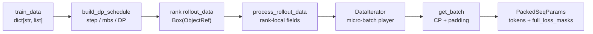
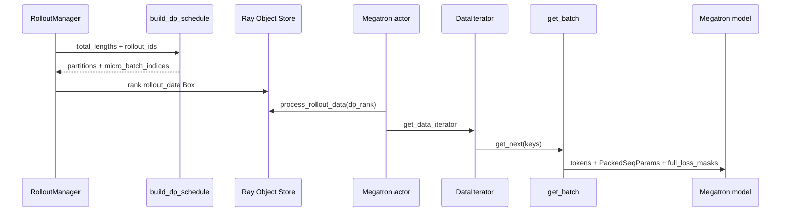

# 训练数据

> **Slime 训练后端**
> **源码范围：** `slime/ray/rollout.py`、`slime/utils/dp_schedule.py`、`slime/utils/data.py`、`slime/backends/megatron_utils/data.py`、`model.py`

## 读者为什么要读

RolloutManager 已经把 `Sample` 转成列式 `train_data`；Train Step 需要的是 Megatron pipeline 能吃的 packed micro-batch。Train Data 就是中间的适配层：它决定哪些样本进同一个训练 step、每个 DP rank 拿哪些样本、每个 micro-batch 如何被 CP 切片、padding、构造成 `PackedSeqParams`。

读完本专题，应该能排查：

- `global_batch_size`、`micro_batch_size`、dynamic batch 配置导致 schedule 断言。
- DP rank 的 `micro_batch_indices` 和全局 sample 下标混淆。
- CP/allgather-CP 下 token、`loss_masks`、`cu_seqlens` 形状对不上。
- compact/subagent rollout 的 sibling 被拆到不同 step，影响 rollout-level loss。
- 日志和 loss 使用的 per-rollout mean 分母不一致。
- 尾部 rollout 为什么没有进入训练，以及这是上游过滤还是 schedule trimming。
- 自定义 `metadata`/插件字段为什么在 rollout 侧存在、到 actor 侧却消失。

## 一句话模型

Train Data 是一个 **批次整形器兼边界检查站**：先按 rollout id 切训练 step，再把 step 内样本 pack 成 micro-batch，分给 DP ranks；分片时只有硬编码白名单字段能够过站，Actor 侧再按 schedule 播放样本，`get_batch` 把 list-of-samples 整形成 Megatron 的 packed THD 输入。

## 首次阅读路径

| 文件 | 读它解决什么 |
| ------ | -------------- |
| [[Slime-训练数据-核心概念]] | 建立“批次整形器”模型，分清 rollout、sample、micro-batch、DP local index |
| [[Slime-训练数据-源码走读]] | 沿一次 rollout batch 走到 Megatron `get_batch` |
| [[Slime-训练数据-数据流]] | 看字段形态、下标空间、CP token/mask 的生命周期 |
| [[Slime-训练数据-排障指南]] | 按症状定位 schedule、dynamic batch、VPP、CP、日志问题 |
| [[Slime-训练数据-学习检查]] | 用图、测试和审计命令验收是否读通 |

## 主线位置

源码入口：来源：slime/ray/rollout.py L829-L895

## 与上下游的关系

| 方向 | 模块 | 关系 |
|------|------|------|
| 上游 | [[Slime-RolloutManager]] | 生成 `train_data`，预计算 `rollout_mask_sums`，调用 `_split_train_data_by_dp` |
| 下游 | [[Slime-训练步骤]] | `train_actor/train_critic` 通过 `get_data_iterator` 和 `get_batch` 消费本专题输出 |
| 并行 | [[Slime-Advantage计算]] | advantage 使用 `total_lengths/response_lengths/loss_masks` |
| 并行 | [[Slime-Policy-Loss]] | loss 使用 `rollout_mask_sums` 与 batch 字段 |
| 并行 | [[Slime-上下文并行与路由重放]] | CP slicing、routing replay 和 log-prob 对齐 |

## 验证抓手

- 单测：`pytest slime/tests/test_dp_schedule.py` 验证 schedule 不变量。
- 断点：`build_dp_schedule`、`process_rollout_data`、`DataIterator.get_next`、`get_batch`。
- 日志：`train/*global_batch_size`、rollout log metrics、`Timer().seq_lens`。
- 形状：`full_loss_masks.shape == tokens.shape`，`len(micro_batch_indices[r]) == sum(num_microbatches)`。
- 覆盖集：所有 `partition` 的并集只应等于“完整 step 中保留的样本”；若 rollout 数不能整除 `global_batch_size`，尾部 rollout 会被静默裁掉。
- 字段契约：新增训练字段时同时检查 `_convert_samples_to_train_data` 的生产列表和 `_split_train_data_by_dp` 的传输白名单；当前 `metadata` 只在前者写入，未被后者传给 actor。
