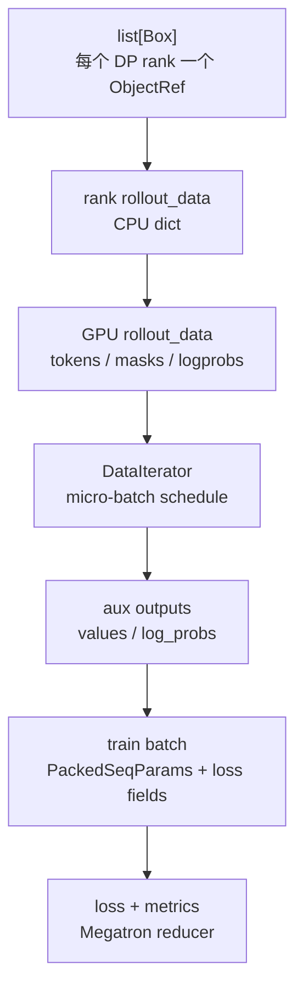
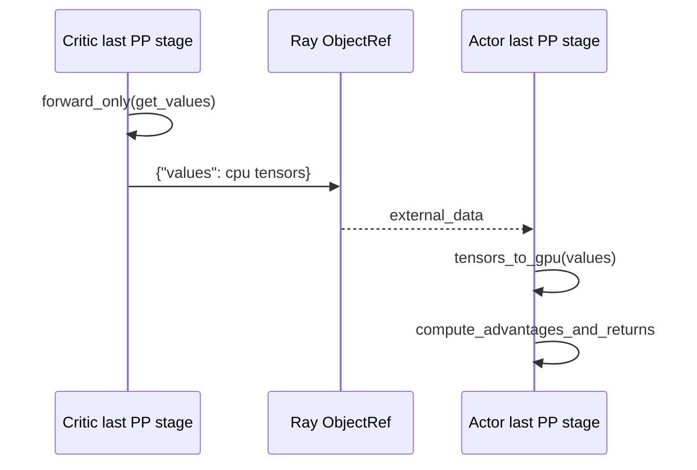
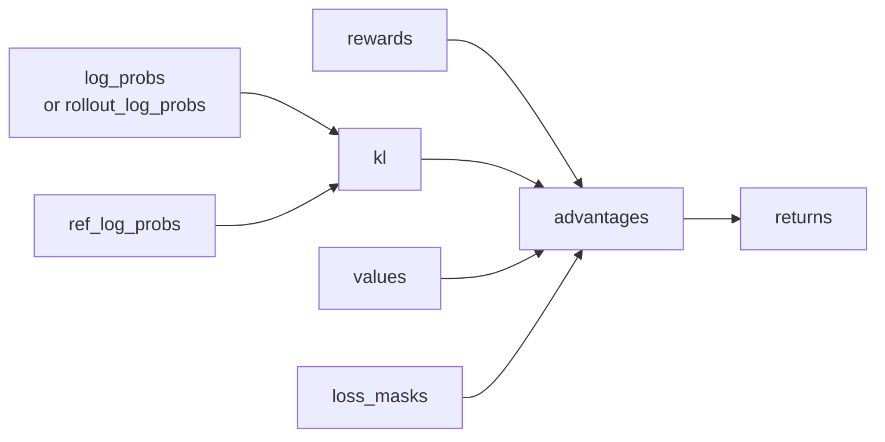

# 训练步骤 · 数据流

## 你为什么要读

本页沿训练 step 的数据形态变化读：每个 DP rank 的 ObjectRef 如何恢复成 rank-local rollout_data，如何进入 DataIterator、aux forward、Megatron batch 和 loss metrics。读完后应能定位数据搬运、micro-batch 顺序、CP slice 和 loss 字段错位发生在哪一步。

## 形态总览

Train Step 的数据不是一口气从 Sample 变成 loss。它经过六次变形，每次变形都跨一个系统边界。



## ObjectRef 到 rank-local rollout_data

RolloutManager 返回的是 `list[Box]`，不是一个全局 batch。每个 DP rank 根据自己的 rank 取一个 `Box`，再用其中的 `partition` 把全局 `total_lengths` 改成本 rank 的长度列表。

源码入口：来源：slime/utils/data.py L292-L303

```python
# 来源：slime/utils/data.py L292-L303
def process_rollout_data(args, rollout_data_ref, dp_rank, dp_size):
    assert len(rollout_data_ref) == dp_size
    rollout_data = ray.get(rollout_data_ref[dp_rank].inner)

    partition = rollout_data.pop("partition")
    total_lengths = rollout_data["total_lengths"]

    # save the seqlen of the whole rollout batch
    Timer().seq_lens = total_lengths
    rollout_data["total_lengths"] = [total_lengths[i] for i in partition]

    return rollout_data
```

数据形态：

| 字段 | 进入 Train Step 时 | `_get_rollout_data` 后 |
|------|--------------------|------------------------|
| `tokens` | CPU tensor list | 当前 CUDA device 上的 `long` tensor list |
| `loss_masks` | CPU tensor list | 当前 CUDA device 上的 `int` tensor list |
| `rollout_mask_sums` | CPU tensor | 当前 CUDA device 上的 `float32` tensor |
| `rollout_log_probs` | 可选 CPU tensor list | response-aligned CP slice 后的 GPU tensor list |
| `total_lengths` | 全局长度列表 | 本 rank partition 对应长度列表 |

不变量：`len(rollout_data_ref) == dp_size`。这个断言失败时，先回到 [[Slime-RolloutManager]] 看 DP schedule 和 `set_train_parallel_config`。

## DataIterator 保留的是 micro-batch 顺序

`DataIterator` 不负责 token padding、CP slicing 或 PackedSeqParams；它只按 `micro_batch_indices` 从 rank-local 列表里取子集。

源码入口：来源：slime/backends/megatron_utils/data.py L201-L245

```python
# 定位骨架（基于 `slime/backends/megatron_utils/data.py` L219-L245；省略类缩进与 docstring）
def get_next(self, keys: Sequence[str]) -> dict[str, list[object] | None]:
    batch = {}
    indices = self.micro_batch_indices[self.offset]
    for key in keys:
        vals = self.rollout_data.get(key, None)
        if vals is None:
            batch[key] = None
        else:
            batch[key] = [vals[i] for i in indices]
    self.offset += 1
    return batch

def reset(self) -> "DataIterator":
    self.offset = 0
    return self

def get_data_iterator(rollout_data: RolloutBatch) -> list[DataIterator]:
    vpp_size = mpu.get_virtual_pipeline_model_parallel_world_size() or 1
    micro_batch_indices = rollout_data["micro_batch_indices"]
    return [DataIterator(rollout_data, micro_batch_indices) for _ in range(vpp_size)]
```

关键点：

- `micro_batch_indices` 是 rank-local 下标，不是全局 sample 下标。
- VPP 会创建多个 iterator，但它们共享同一份 `rollout_data` 和同一份 schedule。
- `forward_only`、`fill_routing_replay`、`model.train` 都会 reset iterator，所以顺序必须稳定。

## get_batch 把样本列变成 Megatron 可执行 batch

Train Step 真正喂给模型的不是 `list[tokens]`，而是 concat、CP slice、pad 后的 `[1, T]` token tensor，以及 THD packed sequence 参数。

源码入口：来源：slime/backends/megatron_utils/data.py L28-L163

```python
# 定位骨架（基于 `slime/backends/megatron_utils/data.py` L55-L63；省略 pad-token 注释）
assert "tokens" in keys
batch = data_iterator.get_next(keys)

tokens = batch["tokens"]
pad_token_id = 0
pad_size = mpu.get_tensor_model_parallel_world_size() * pad_multiplier

# for cp, we need all tokens to calculate logprob
batch["unconcat_tokens"] = tokens
```

```python
# 定位骨架（基于 `slime/backends/megatron_utils/data.py` L106-L148；省略 token 写回与 mask 分支）
max_seqlen = (cu_seqlens[1:] - cu_seqlens[:-1]).max().item()
packed_seq_params = PackedSeqParams(
    cu_seqlens_q=cu_seqlens,
    cu_seqlens_kv=cu_seqlens,
    max_seqlen_q=max_seqlen,
    max_seqlen_kv=max_seqlen,
    qkv_format="thd",
)

tokens = tokens.unsqueeze(0)

batch["tokens"] = tokens
batch["packed_seq_params"] = packed_seq_params

loss_masks = []
for loss_mask, total_length, response_length in zip(
    batch["loss_masks"],
    batch["total_lengths"],
    batch["response_lengths"],
    strict=True,
):
    prompt_length = total_length - response_length
    loss_mask = F.pad(loss_mask, (prompt_length - 1, 1), value=0)
    if allgather_cp:
        loss_masks.append(loss_mask)
        continue
    loss_mask = slice_with_cp(loss_mask, 0)
    loss_masks.append(loss_mask)
...
assert loss_masks.shape == tokens.shape, f"loss_masks.shape: {loss_masks.shape}, tokens.shape: {tokens.shape}"
batch["full_loss_masks"] = loss_masks
```

这里有两个容易混淆的 mask：

| 字段 | 位置 | 用途 |
|------|------|------|
| `loss_masks` | response 空间，每个 sample 一个 tensor | loss reducer 按 response token 聚合 |
| `full_loss_masks` | concat 后 token 空间，形状等于模型输入 | 传给模型 forward，屏蔽 prompt/padding |

## Critic values 的跨 actor 传递

Critic train 的返回值不是训练日志，而是 actor 需要的 old values。这个值只在 critic last PP stage 存在，先转 CPU，再经 Ray 返回给 actor。



源码入口：来源：slime/backends/megatron_utils/actor.py L424-L428

源码入口：来源：slime/backends/megatron_utils/actor.py L497-L503

```python
# 来源：slime/backends/megatron_utils/actor.py L497-L503
if self.args.use_critic:
    if external_data is not None and mpu.is_pipeline_last_stage():
        values = external_data.get("values")
        if values is not None:
            from slime.backends.megatron_utils.data import tensors_to_gpu

            rollout_data["values"] = tensors_to_gpu(values)
```

不变量：actor 和 critic 必须消费同一份 `rollout_data_ref` 和同一套 micro-batch 顺序。否则 values 与样本会错位。

这个不变量当前靠配置约定而不是显式路由保证：

- `external_data` 按 Ray worker 列表位置一一配对，没有携带 DP/TP/PP 坐标。
- actor 和 critic GPU 总数被设为相同，但 role-specific YAML 可以覆盖 TP/PP/CP 等 Megatron 参数。
- actor、critic rank 0 依次向 RolloutManager 写 `train_parallel_config`，后写入的 critic 配置生效。

因此“总 worker 数相同”不等于“数据 partition、micro-batch schedule 和 PP-last-stage 输出位置相同”。PPO + Critic 的生产验证应比较两组完整 parallel config 与每个 global rank 的 `(dp,tp,pp,cp)` 坐标。

## Aux forward 结果如何回填 rollout_data

`forward_only` 的输出是一个 dict，key 由 `store_prefix` 决定：

| 调用 | `store_prefix` | 写入字段 |
|------|----------------|----------|
| critic value forward | 无 | `values` |
| actor ref forward | `ref_` | `ref_log_probs` |
| actor teacher forward | `teacher_` | `teacher_log_probs` |
| actor policy forward | 无 | `log_probs` |

源码入口：来源：slime/backends/megatron_utils/model.py L487-L506

```python
# 定位骨架（基于 `slime/backends/megatron_utils/model.py` L487-L506；省略注释与外层条件）
rollout_data = {}
# Store the results on the last stage
if mpu.is_pipeline_last_stage():
    keys = forward_data_store[0].keys()
    for key in keys:
        values = []
        for value in forward_data_store:
            assert isinstance(value[key], list)
            values += value[key]

        if args.use_dynamic_batch_size:
            origin_values = [None] * len(values)
            origin_indices = sum(data_iterator[0].micro_batch_indices, [])
            for value, origin_index in zip(values, origin_indices, strict=False):
                origin_values[origin_index] = value
            values = origin_values
        rollout_data[f"{store_prefix}{key}"] = values
return rollout_data
```

动态 batch 的重排是这里最关键的细节：forward 按 micro-batch 顺序产出，loss 和 advantage 需要回到 sample 原顺序。

当前重排用 `zip(values, origin_indices, strict=False)`，没有验证长度、唯一性或范围；若 pipeline 返回项数与 schedule 不一致，可能留下 `None` 或静默忽略多余项。验收不能只看最终 list 长度，应断言所有槽位非空且 origin indices 是完整 permutation。

## advantage 与 returns 的字段闭环

`compute_advantages_and_returns` 原地修改 `rollout_data`。它读取 rewards、log-prob、ref log-prob、values、mask 等字段，写入 `kl/advantages/returns`。



源码入口：来源：slime/backends/megatron_utils/loss.py L686-L738

补充关系：

- `args.use_rollout_logprobs=True` 时，advantage 使用 rollout 侧 log-prob。
- `kl_coef=0` 或缺少 log-prob 时，KL 被构造成零张量。
- PPO 分支需要 `values`；GRPO/GSPO/CISPO 不需要 critic values。
- 非 last PP stage 会直接 return，不写 advantage。

## train_one_step 的 batch 字段契约

真正进入 loss 的字段在 `train_one_step` 的 `get_batch` keys 中列明。读排障时，这个列表比散落的调用更可靠。

源码入口：来源：slime/backends/megatron_utils/model.py L576-L600

| 字段 | 来自哪里 | 缺失时常见影响 |
|------|----------|----------------|
| `tokens` | RolloutManager | 模型 forward 无输入 |
| `loss_masks` | RolloutManager | loss 归一化和 token mask 错 |
| `log_probs` | actor `compute_log_prob` | policy loss 或 mismatch metric 缺口 |
| `ref_log_probs` | ref forward | KL 分支缺口 |
| `values` | critic 或 value forward | PPO advantage/value loss 缺口 |
| `advantages` | `compute_advantages_and_returns` | policy loss 缺口 |
| `returns` | `compute_advantages_and_returns` | value loss 缺口 |
| `rollout_log_probs` | RolloutManager 可选字段 | rollout/train logprob 对照缺口 |
| `teacher_log_probs` | teacher forward 或 rollout 字段 | OPD/teacher 相关 loss 缺口 |
| `rollout_mask_sums` | RolloutManager | rollout-level mean 分母错 |

## 日志数据流

Actor train 前会调用 `log_rollout_data`，训练 step 结束后 `model.train` 记录 loss、grad norm、LR、global batch size 和 CI 检查指标。

源码入口：来源：slime/backends/megatron_utils/data.py L248-L330

源码入口：来源：slime/backends/megatron_utils/model.py L880-L907

关键日志：

- `train/step`：全局训练 step。
- `train/*global_batch_size`：当前 train step 的 rollout 数。
- `train/ppo_kl`：PPO 初始一致性检查。
- `train/kl_loss`：actor/ref 初始 KL 检查。
- `train/train_rollout_logprob_abs_diff`：rollout log-prob 与 train log-prob 差异。

## 数据流检查

- `rollout_data_ref` 数量等于 DP size。
- 每个 rank 的 `micro_batch_indices` 是本地下标，且 reset 后可重复迭代。
- `full_loss_masks.shape == tokens.shape`。
- actor 使用 critic 时，last PP stage 的 `external_data` 含 `values`。
- aux forward 写入的 `log_probs/values` 与样本原顺序对齐。
- `advantages/returns` 只要求在 last PP stage 存在。
- `rollout_mask_sums` 进入 `loss_function`，否则 compact rollout 的分母会漂。
- actor/critic 完整 parallel config 一致，且两组 PP-last-stage global rank 集合一致；只比较 world size 不够。
- dynamic reorder 后不存在 `None`，且 `origin_indices` 长度、唯一性、范围均合法。
- 训练异常后 model mode、iterator offset、DDP hooks、grad buffer、GC 与 offload 状态已恢复；否则重建 actor。

## 运行验证

这篇的验证目标是确认训练 step 的字段闭环没有断：数据 helper pack batch，actor 补 log-prob / value，loss helper 写 advantage，`train_one_step` 消费最终字段。

```powershell
rg -n 'process_rollout_data|micro_batch_indices|PackedSeqParams|compute_log_prob|train_one_step|compute_advantages_and_returns|loss_function|log_rollout_data|rollout_mask_sums|rollout_log_probs|teacher_log_probs|no_sync_func|manual_gc_interval' slime/slime/utils/data.py slime/slime/backends/megatron_utils/data.py slime/slime/backends/megatron_utils/actor.py slime/slime/backends/megatron_utils/model.py slime/slime/backends/megatron_utils/loss.py
```

读输出时按字段流检查：`rollout_log_probs` 和 `teacher_log_probs` 是否仍能从 rollout 或 aux forward 进入训练 batch，`rollout_mask_sums` 是否仍被日志和 loss 使用，`compute_advantages_and_returns` 是否仍在 policy loss 前写入 `advantages/returns`。
