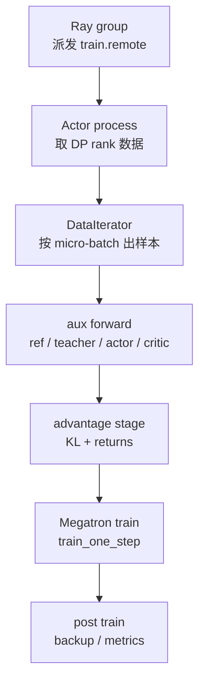
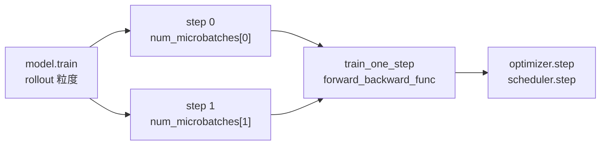

# 训练步骤 · 核心概念

本页先建立一次训练 step 的心理模型。读完后，你应该能把 Ray 派发、rank-local 数据恢复、aux forward、advantage/return 计算、Megatron train step 和 post-train metrics 分开定位。

## 先建立模型

把 Train Step 想成一台 **训练转换器**。左边输入的是 rollout 侧交出的 `Box(ObjectRef)`；右边输出的是 Megatron optimizer step 后的新 actor 权重。中间不是一次简单 forward-backward，而是先补齐训练所需的“判分材料”，再执行真正的 loss backward。



这个模型有三个层次：

| 层次 | 代表函数 | 负责什么 | 不负责什么 |
|------|----------|----------|------------|
| Ray 编排层 | `RayTrainGroup.async_train` | 给每个 actor 发远程调用，处理 `external_data` 是 list 还是广播 dict | 不执行 Megatron 训练 |
| Actor 业务层 | `MegatronTrainRayActor.train_actor/train_critic` | 恢复 rollout 数据、补齐 log-prob/value、计算 advantage、选择 loss | 不直接实现 pipeline 调度 |
| Megatron 执行层 | `model.train/train_one_step` | 调 `forward_backward_func`、optimizer step、scheduler step、日志 | 不知道 rollout 函数如何生成样本 |

## 核心对象

| 对象 | 来源 | 生命周期 |
|------|------|----------|
| `rollout_data_ref` | RolloutManager `ray.put` 后返回 | 主循环传给 critic/actor；每个 DP rank 取自己的 `Box` |
| `rollout_data` | `_get_rollout_data` | rank-local 训练字段，含 tokens、mask、reward、schedule metadata |
| `DataIterator` | `get_data_iterator` | 按 `micro_batch_indices` 一次吐一个 micro-batch，可被多次 `reset` |
| `external_data` | critic `async_train` 返回值 | actor last PP stage 消费 `{"values": ...}` |
| `num_microbatches` | RolloutManager DP schedule | 每个 train step 的 micro-batch 数列表 |
| `global_batch_sizes` | RolloutManager DP schedule | 每个 train step 的 rollout 数，用于 loss 缩放和 scheduler |

## Critic 和 Actor 的分工

PPO + Critic 路径像一次“先估分、再改卷”：

1. Critic 拿同一份 rollout 数据，做 value forward。
2. Critic 用 values 算 returns/advantages，并用 `value_loss` 更新 critic。
3. Critic last PP stage 把 CPU values 作为 Ray 返回值交给 actor。
4. Actor 重算 ref/teacher/actor log-prob，注入 critic values，再算 policy advantage。
5. Actor 用 `policy_loss` 更新 actor，并备份最新 actor 权重。

源码入口：来源：slime/backends/megatron_utils/actor.py L402-L428

```python
# 来源：slime/backends/megatron_utils/actor.py L408-L427
rollout_data.update(forward_only(get_values, self.args, self.model, data_iterator, num_microbatches))

compute_advantages_and_returns(self.args, rollout_data)

self.args.loss_type = "value_loss"
train(
    rollout_id,
    self.model,
    self.optimizer,
    self.opt_param_scheduler,
    data_iterator,
    num_microbatches,
    global_batch_sizes,
)

if mpu.is_pipeline_last_stage() and "values" in rollout_data:
    from slime.backends.megatron_utils.data import tensors_to_cpu

    return {"values": tensors_to_cpu(rollout_data["values"])}
return {}
```

不变量：只有 PP last stage 拿到 response-aligned `values`，所以非 last stage 返回 `{}` 是正常现象。

## 为什么 Actor 常常要重算 log-prob

Rollout 阶段可以带 `rollout_log_probs`，但训练侧仍经常重算 actor/ref/teacher log-prob，因为训练 loss 需要的是 Megatron 当前权重、当前并行布局和可选 routing replay 下的一致口径。

源码入口：来源：slime/backends/megatron_utils/actor.py L439-L510

```python
# 来源：slime/backends/megatron_utils/actor.py L466-L493
self._switch_model("old_actor" if self.args.keep_old_actor else "actor")
can_reuse_log_probs_in_loss = (
    len(num_microbatches) == 1
    and self.args.loss_type == "policy_loss"
    and self.args.kl_coef == 0
    and not self.args.use_rollout_logprobs
    and not self.args.get_mismatch_metrics
    and not self.args.use_critic
    and not self.args.keep_old_actor
    and not self.args.use_opd
    and not self.args.use_routing_replay
    and self.args.advantage_estimator != "gspo"
)
if (
    not self.args.use_rollout_logprobs or self.args.get_mismatch_metrics
) and not can_reuse_log_probs_in_loss:
    rollout_data.update(
        self.compute_log_prob(
            data_iterator,
            num_microbatches,
            store_prefix="",
        )
    )
```

这个复用条件很窄。只要启用 critic、KL、mismatch metrics、old actor、OPD、routing replay 或 GSPO，就需要训练侧重新 forward。

## Megatron train 与 train_one_step 的区别

`train()` 面向一个 rollout，可能包含多个 step；`train_one_step()` 面向其中一个 step，执行一次 Megatron pipeline forward-backward 与 optimizer step。



源码入口：来源：slime/backends/megatron_utils/model.py L704-L845

```python
# 来源：slime/backends/megatron_utils/model.py L734-L745
assert len(num_microbatches) == len(global_batch_sizes), (
    f"num_microbatches and global_batch_sizes must have the same length, "
    f"got {len(num_microbatches)} vs {len(global_batch_sizes)}"
)

for iterator in data_iterator:
    iterator.reset()

# Turn on training mode which enables dropout.
for model_module in model:
    model_module.train()
```

关键点：动态 batch 不是“一个 rollout 一个 step”的固定形态。`num_microbatches[i]` 和 `global_batch_sizes[i]` 必须一一对应。

## 读代码时抓住的五个边界

- Ray 边界：`async_train` 返回 ObjectRef 列表，主进程用 `ray.get` 等结果。
- DP 边界：`process_rollout_data` 按 DP rank 取 `rollout_data_ref[dp_rank]`。
- PP 边界：log-prob、values、advantage 只在 last PP stage 有完整结果。
- Loss 边界：Train Step 只选择和传入 `loss_type`，算法细节在 loss 模块。
- 权重边界：本专题结束于 actor/critic 训练完成；权重推送看 [[Slime-分布式权重同步]]。

## 运行验证

Train Step 的概念边界可以用一次检索连起来：Ray actor、actor/critic 分工、logprob 重算、Megatron train step 和 loss type。

```powershell
rg -n 'class MegatronTrainActor|def async_train|def train\(|def process_rollout_data|rollout_log_probs|use_rollout_logprobs|is_pipeline_last_stage|train_one_step|num_microbatches|global_batch_sizes|loss_type|update_weights' slime/slime/ray/train_actor.py slime/slime/backends/megatron_utils/actor.py slime/slime/backends/megatron_utils/model.py slime/slime/backends/megatron_utils/loss.py
```

读输出时先看 Ray 层 `train_actor.py` 如何把调用转到 Megatron actor；再看 `actor.py` 对 critic values、ref/old/current logprob 的分支；最后看 `model.py` 的 `train/train_one_step` 和 `loss.py` 的 `loss_type`，确认训练 step 只组织数据和调用 loss。
