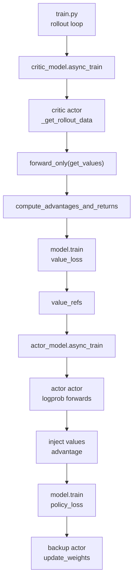

# 训练步骤 · 源码走读

## 读者任务

这篇只追一条主线：RolloutManager 已经返回 `rollout_data_ref`，训练主循环如何让 critic 先产出 values，再让 actor 用同一批 rollout 数据完成 policy 更新，最后进入权重同步。

读完后应能解释：

- `async_train` 为什么只是 Ray 派发，不是 Megatron 的异步训练。
- `external_data=value_refs` 为什么是 PPO + Critic 的关键连接。
- `_get_rollout_data` 在 DP rank、本地 GPU、CP slicing 之间做了什么。
- Actor 为什么可能做 ref/teacher/actor 三类 log-prob forward。
- `model.train_one_step` 如何把 rollout 字段接入 Megatron `forward_backward_func`。
- actor/critic 并行拓扑如何同时影响 DP schedule 和 values 的 worker 对齐。
- 哪些长生命周期状态没有异常回滚，为什么失败后原地重试不可靠。

## 长文读法

这篇按“同一批 rollout_data 如何先喂 critic、再喂 actor”读：`train.py` 决定 critic 与 actor 的顺序，`ActorGroup.async_train` 只把 Ray refs 派发到各 worker，Megatron actor 进程先把 rank-local rollout_data 拉到 GPU，再按角色走 critic value loss 或 actor policy loss。PPO + Critic 的关键连接是 critic 返回的 `value_refs` 被作为 actor 的 `external_data` 注入。

| 读者任务 | 先读 | 要抓住的判断 |
|----------|------|--------------|
| 第一次建立训练步主线 | 主线地图、1 到 3 | 主循环只安排顺序，真正的数据恢复和 GPU tensor 化发生在每个 Megatron actor 进程内 |
| 理解 critic 为什么先跑 | 1、4、6 | critic 先 forward values 并训练 value loss，actor 再用这些 values 计算 PPO advantage |
| 区分 Ray async 与 Megatron 训练 | 2、8、9 | `async_train` 是 Ray fan-out；Megatron 的 forward/backward/optimizer step 在 `model.train_one_step` 里 |
| 排查 rollout_data 字段没到 GPU | 3、5 | `_get_rollout_data` 处理 DP rank、本地 GPU、CP slicing 和可选多模态/logprob 字段 |
| 排查 ref / teacher / old_actor logprob | 5 到 6 | actor 会按配置切换备份权重，补齐 ref、teacher 或 actor logprob 后再训练 |
| 排查 advantage 为空或只部分 rank 有值 | 6 到 7 | advantage / returns 只在 last PP stage 真正产生，中间 stage 会早退 |
| 理解 loss 缩放和 optimizer step | 8 到 10 | `train` 把 rollout 切成多个 step，`loss_function` 决定 policy/value/SFT/custom 分支并按 microbatch、DP/CP 缩放 |

读的时候不要从 Megatron optimizer 开始。先追 `rollout_data_ref -> rank-local rollout_data -> forward_only 补材料 -> compute_advantages_and_returns -> train_one_step`，这样 critic/actor 两条线才不会混在一起。

## 主线地图



## 1. 主循环决定 critic 与 actor 的顺序

系统压力：一次 rollout 之后，PPO + Critic 必须先拿到 old values，再训练 actor。否则 actor 算 GAE 时没有 value baseline。

设计选择：`train.py` 先调用 critic group；当 `actor_trains_this_step` 为真时，把 critic 返回的 Ray refs 原样传给 actor 的 `external_data`。

源码入口：来源：train.py L63-L89

```python
# 定位骨架（基于 `train.py` L67-L89；省略保存周期分支）
rollout_data_ref = ray.get(rollout_manager.generate.remote(rollout_id))

if args.offload_rollout:
    ray.get(rollout_manager.offload.remote())

actor_trains_this_step = (not args.use_critic) or rollout_id >= args.num_critic_only_steps

if args.use_critic:
    value_refs = critic_model.async_train(rollout_id, rollout_data_ref)
    if actor_trains_this_step:
        ray.get(actor_model.async_train(rollout_id, rollout_data_ref, external_data=value_refs))
    else:
        ray.get(value_refs)
else:
    ray.get(actor_model.async_train(rollout_id, rollout_data_ref))

offload_train(actor_trains_this_step)
if args.offload_rollout:
    ray.get(rollout_manager.onload_weights.remote())
actor_model.update_weights()
```

执行逻辑：

- `rollout_data_ref` 是 rollout 侧已经切好的 `list[Box]`。
- `num_critic_only_steps` 会让前几轮只训 critic，不训 actor。
- 同步主循环在 actor 训练完成后才进入 `update_weights`，避免 rollout engine 提前看到半更新状态；async 主循环则按 `update_weights_interval` 延迟同步。

## 2. async_train 只负责 Ray fan-out

系统压力：train group 里有多个 Ray actor handler，主进程需要把同一个 rollout ref 派发到每个 worker；critic 的返回值还要按 worker 对齐交给 actor。

设计选择：`async_train` 不碰 tensor，也不调用 Megatron；它只返回 `actor.train.remote(...)` 的 ObjectRef 列表。若 `external_data` 是 list，就逐 worker zip；否则广播同一个 dict。

源码入口：来源：slime/ray/actor_group.py L131-L149

```python
# 来源：slime/ray/actor_group.py L131-L149
def async_train(self, rollout_id, rollout_data_ref, external_data=None):
    """Do one rollout training. Returns a list of Ray refs (one per worker).

    For critics, each ref resolves to ``{"values": [cpu tensors...]}`` (or ``{}``
    for non-last-PP-stage workers). Actor refs resolve to ``None``.

    ``external_data`` may be a list (one item per worker) or a single dict
    broadcast to all workers.
    """
    if isinstance(external_data, list):
        assert len(external_data) == len(self._actor_handlers)
        return [
            actor.train.remote(rollout_id, rollout_data_ref, external_data=ed)
            for actor, ed in zip(self._actor_handlers, external_data, strict=False)
        ]
    return [
        actor.train.remote(rollout_id, rollout_data_ref, external_data=external_data)
        for actor in self._actor_handlers
    ]
```

不变量：critic refs 的列表长度必须等于 actor handlers 数量。这里的 “async” 是 Ray 调用异步，不代表 Megatron pipeline 与 optimizer 异步。

这个长度断言只证明 world-size 相同。refs 仍按 global worker 序号直连，不携带 PP/DP 坐标；若 actor/critic 的 PP-last-stage rank 集合不同，actor last stage 对应位置可能拿到 critic 非 last stage 返回的 `{}`。

## 3. Actor 进程先恢复 rank-local rollout_data

系统压力：Ray Object Store 里的数据在 CPU；每个 Megatron DP rank 只该取自己的切片；训练热路径字段要提前搬到当前 CUDA device。

设计选择：`MegatronTrainRayActor.train` 先处理 offload，再通过 `_get_rollout_data` 按 DP rank 拿数据，最后按 role 分派到 critic 或 actor。

源码入口：来源：slime/backends/megatron_utils/actor.py L380-L400

```python
# 来源：slime/backends/megatron_utils/actor.py L380-L400
def train(self, rollout_id: int, rollout_data_ref: Box, external_data=None):
    if self.args.debug_rollout_only:
        return None

    if self.args.offload_train:
        self.wake_up()

    with timer("data_preprocess"):
        rollout_data = self._get_rollout_data(rollout_data_ref)

    if self.role == "critic":
        result = self.train_critic(rollout_id, rollout_data)
    else:
        self.train_actor(rollout_id, rollout_data, external_data=external_data)
        result = None

    if self.args.offload_train:
        del rollout_data
        self.sleep()

    return result
```

源码入口：来源：slime/backends/megatron_utils/actor.py L222-L276

```python
# 定位骨架（基于 `slime/backends/megatron_utils/actor.py` L225-L245；省略注释与函数外层）
rollout_data = process_rollout_data(
    self.args,
    rollout_data_ref,
    mpu.get_data_parallel_rank(with_context_parallel=False),
    mpu.get_data_parallel_world_size(with_context_parallel=False),
)
device = torch.cuda.current_device()
rollout_data["tokens"] = [
    t.to(device=device, dtype=torch.long, non_blocking=True) for t in rollout_data["tokens"]
]
rollout_data["loss_masks"] = [
    t.to(device=device, dtype=torch.int, non_blocking=True) for t in rollout_data["loss_masks"]
]
if "rollout_mask_sums" in rollout_data:
    rollout_data["rollout_mask_sums"] = rollout_data["rollout_mask_sums"].to(
        device=device, dtype=torch.float32, non_blocking=True
    )
```

执行逻辑：

- `process_rollout_data` 根据 DP rank 从 `list[Box]` 中取一个对象。
- `tokens/loss_masks/rollout_mask_sums` 进入 GPU，避免后续 micro-batch 每次搬运。
- `rollout_log_probs/teacher_log_probs` 会按 CP response 区间切片后转成 GPU tensor。

## 4. Critic 路径：value forward 后立刻训练 value_loss

系统压力：critic 既要给自己训练 value head，又要把 old values 交给 actor。只有 last PP stage 有完整 value 输出。

设计选择：critic 使用 `forward_only(get_values)` 收集 values，先算 advantage/returns，再把 `loss_type` 改成 `value_loss` 调 Megatron train。训练结束后，last PP stage 返回 CPU values。

源码入口：来源：slime/backends/megatron_utils/actor.py L402-L428

```python
# 定位骨架（基于 `slime/backends/megatron_utils/actor.py` L404-L428；省略函数签名与空行）
data_iterator = get_data_iterator(rollout_data)
num_microbatches = rollout_data["num_microbatches"]
global_batch_sizes = rollout_data["global_batch_sizes"]

rollout_data.update(forward_only(get_values, self.args, self.model, data_iterator, num_microbatches))

compute_advantages_and_returns(self.args, rollout_data)

self.args.loss_type = "value_loss"
train(
    rollout_id,
    self.model,
    self.optimizer,
    self.opt_param_scheduler,
    data_iterator,
    num_microbatches,
    global_batch_sizes,
)

if mpu.is_pipeline_last_stage() and "values" in rollout_data:
    from slime.backends.megatron_utils.data import tensors_to_cpu

    return {"values": tensors_to_cpu(rollout_data["values"])}
return {}
```

不变量：非 last PP stage 返回 `{}` 不是异常；actor 侧也只在 last PP stage 注入 values。

## 5. forward_only 是“补材料”的通用前向

系统压力：训练前可能要补 value、ref log-prob、teacher log-prob、actor log-prob；这些前向不应累积梯度，但必须走同一套 Megatron pipeline 和 micro-batch schedule。

设计选择：`forward_only` 重置 iterator，构造 `get_batch`，把模型切到 eval，调用 `forward_backward_func(..., forward_only=True)`，最后只在 PP last stage 聚合结果。

源码入口：来源：slime/backends/megatron_utils/model.py L345-L506

```python
# 定位骨架（基于 `slime/backends/megatron_utils/model.py` L379-L417；省略注释与内部 docstring）
for iterator in data_iterator:
    iterator.reset()

batch_keys = [
    "tokens",
    "loss_masks",
    "multimodal_train_inputs",
    "total_lengths",
    "response_lengths",
]

def forward_step(
    data_iterator: DataIterator, model: GPTModel, return_schedule_plan: bool = False
):
    assert not return_schedule_plan, "forward_only step should never return schedule plan"

    batch = get_batch(
        data_iterator,
        batch_keys,
        args.data_pad_size_multiplier,
        args.allgather_cp,
    )
```

```python
# 定位骨架（基于 `slime/backends/megatron_utils/model.py` L471-L506；省略循环外上下文与注释）
for step_id in range(num_steps_per_rollout):
    forward_data_store += forward_backward_func(
        forward_step_func=forward_step_with_progress,
        data_iterator=data_iterator,
        model=model,
        num_microbatches=num_microbatches[step_id],
        seq_length=args.seq_length,
        micro_batch_size=args.micro_batch_size,
        forward_only=True,
    )

rollout_data = {}
if mpu.is_pipeline_last_stage():
    keys = forward_data_store[0].keys()
    for key in keys:
        values = []
        for value in forward_data_store:
            assert isinstance(value[key], list)
            values += value[key]
        if args.use_dynamic_batch_size:
            origin_values = [None] * len(values)
            origin_indices = sum(data_iterator[0].micro_batch_indices, [])
            for value, origin_index in zip(values, origin_indices, strict=False):
                origin_values[origin_index] = value
            values = origin_values
        rollout_data[f"{store_prefix}{key}"] = values
return rollout_data
```

读者抓手：动态 batch 下前向结果会按 `micro_batch_indices` 还原原始顺序，否则 advantage 与样本顺序可能错位。

还原本身使用 `zip(values, origin_indices, strict=False)`，没有断言两者等长，也不验证 indices 是 permutation。pipeline 少返回一项时 `origin_values` 可残留 `None`；多返回一项则可能被静默截断。动态 batch 验收应检查所有输出槽位而非只看 list 长度。

## 6. Actor 路径：补齐 log-prob、注入 values、计算 advantage

系统压力：actor 的 policy loss 需要当前 actor log-prob，可能还需要 ref/teacher log-prob、critic values、routing replay 状态和完整 rollout 级 advantage normalization。

设计选择：actor 在进入真正 train 前，按配置依次切换 ref、teacher、old_actor/actor，计算所需 log-prob；如果启用 critic，则从 `external_data` 注入 values；最后统一调用 `compute_advantages_and_returns`。

源码入口：来源：slime/backends/megatron_utils/actor.py L430-L555

```python
# 定位骨架（基于 `slime/backends/megatron_utils/actor.py` L439-L510；省略多条配置分支）
if self.args.compute_advantages_and_returns:
    if "ref" in self.weights_backuper.backup_tags:
        self._switch_model("ref")
        rollout_data.update(
            self.compute_log_prob(
                data_iterator,
                num_microbatches,
                store_prefix="ref_",
            )
        )

    if "teacher" in self.weights_backuper.backup_tags:
        self._switch_model("teacher")
        rollout_data.update(
            self.compute_log_prob(
                data_iterator,
                num_microbatches,
                store_prefix="teacher_",
            )
        )

    self._switch_model("old_actor" if self.args.keep_old_actor else "actor")
    ...
    if self.args.use_critic:
        if external_data is not None and mpu.is_pipeline_last_stage():
            values = external_data.get("values")
            if values is not None:
                from slime.backends.megatron_utils.data import tensors_to_gpu

                rollout_data["values"] = tensors_to_gpu(values)
    if self._active_model_tag != "actor":
        self._switch_model("actor")

    compute_advantages_and_returns(self.args, rollout_data)
```

源码入口：来源：slime/backends/megatron_utils/actor.py L520-L555

```python
# 定位骨架（基于 `slime/backends/megatron_utils/actor.py` L520-L555；省略 profiling 与条件分支）
if self.args.use_routing_replay:
    os.environ["ROUTING_REPLAY_STAGE"] = "replay_backward"
with timer("actor_train"):
    train(
        rollout_id,
        self.model,
        self.optimizer,
        self.opt_param_scheduler,
        data_iterator,
        num_microbatches,
        global_batch_sizes,
    )

self.prof.step(rollout_id=rollout_id)
...
self.weights_backuper.backup("actor")
...
if (
    self.args.ref_update_interval is not None
    and (rollout_id + 1) % self.args.ref_update_interval == 0
    and "ref" in self.weights_backuper.backup_tags
):
    with timer("ref_model_update"):
        if is_megatron_main_rank():
            logger.info(f"Updating ref model at rollout_id {rollout_id}")
        self.weights_backuper.backup("ref")

log_perf_data(rollout_id, self.args, extra_metrics=self.weight_updater.pop_metrics())
```

关键点：Train Step 不直接把权重发给 SGLang；它只备份 actor/ref，主循环随后调用 `actor_model.update_weights()`。

## 7. advantage 只在 last PP stage 真正产生

系统压力：intermediate PP stage 没有完整 logits/value 输出，不应伪造 advantage；不同算法又需要共享 KL、reward、mask、value 的基础字段。

设计选择：`compute_advantages_and_returns` 先根据 `args.use_rollout_logprobs` 选择 log-prob 口径，然后在非 last PP stage 直接返回；last stage 根据 estimator 分支写入 `advantages/returns`。

源码入口：来源：slime/backends/megatron_utils/loss.py L661-L760

```python
# 定位骨架（基于 `slime/backends/megatron_utils/loss.py` L686-L713；省略注释与类型上下文）
rollout_log_probs: list[torch.Tensor] | None = rollout_data.get("rollout_log_probs")
log_probs: list[torch.Tensor] | None = (
    rollout_log_probs if args.use_rollout_logprobs else rollout_data.get("log_probs")
)
ref_log_probs: list[torch.Tensor] = rollout_data.get("ref_log_probs")
rewards: list[float] = rollout_data.get("rewards")
values: None | list[torch.Tensor] = rollout_data.get("values")
response_lengths: list[int] = rollout_data.get("response_lengths")
loss_masks: list[torch.Tensor] = rollout_data.get("loss_masks")
total_lengths: list[int] = rollout_data.get("total_lengths")
if not mpu.is_pipeline_last_stage():
    return

if args.kl_coef == 0 or not log_probs:
    xs = log_probs or rollout_log_probs or values
    kl = [torch.zeros_like(x, dtype=torch.float32, device=x.device) for x in xs]
else:
    kl = [
        compute_approx_kl(
            log_probs[i],
            ref_log_probs[i],
            kl_loss_type=args.kl_loss_type,
        )
        for i in range(len(log_probs))
    ]
rollout_data["kl"] = kl
```

```python
# 定位骨架（基于 `slime/backends/megatron_utils/loss.py` L720-L738；选取 estimator 分支）
elif args.advantage_estimator in ["grpo", "gspo", "cispo"]:
    rewards = torch.tensor(rewards, dtype=torch.float32, device=kl[0].device)
    returns = get_grpo_returns(rewards, kl)
    advantages = [r for r in returns]

elif args.advantage_estimator == "ppo":
    old_rewards = rewards
    rewards = []
    kl_coef = -args.kl_coef
    cp_rank = mpu.get_context_parallel_rank()
    for reward, k in zip(old_rewards, kl, strict=False):
        k *= kl_coef
        if cp_rank == 0:
            k[-1] += reward
        rewards.append(k)
    advantages, returns = get_advantages_and_returns_batch(
        total_lengths, response_lengths, values, rewards, args.gamma, args.lambd
    )
```

排障抓手：PPO 分支需要 `values`；GRPO/GSPO/CISPO 分支不依赖 critic values。

## 8. model.train 把一个 rollout 切成若干 train_one_step

系统压力：动态 batch 可能把一个 rollout 切成多个训练 step；每个 step 的 micro-batch 数和 global batch size 都可能不同。

设计选择：`train()` 先 reset iterator、打开 train mode、配置 grad/param sync，然后循环调用 `train_one_step`。

源码入口：来源：slime/backends/megatron_utils/model.py L704-L845

```python
# 定位骨架（基于 `slime/backends/megatron_utils/model.py` L820-L835；省略循环注释）
for step_id in range(num_steps_per_rollout):

    loss_dict, grad_norm = train_one_step(
        args,
        rollout_id,
        step_id,
        data_iterator,
        model,
        optimizer,
        opt_param_scheduler,
        num_microbatches[step_id],
        global_batch_sizes[step_id],
        microbatch_pbar=microbatch_pbar,
    )
```

不变量：`num_microbatches` 和 `global_batch_sizes` 长度相同；日志里的 `train/*global_batch_size` 是每个 step 的 rollout 数，不是固定配置常量。

## 9. train_one_step 接入 loss_function 并执行 optimizer step

系统压力：Megatron pipeline engine 只知道如何跑 `forward_step_func`；Slime 要把 rollout 字段、policy/value loss、动态 batch 缩放塞进这个接口。

设计选择：`train_one_step` 的内部 `forward_step` 从 `DataIterator` 拿 batch，调用模型 forward，然后返回 `partial(loss_function, ...)`。Megatron 完成 backward 后，Slime 调 optimizer 和 scheduler。

源码入口：来源：slime/backends/megatron_utils/model.py L509-L680

```python
# 定位骨架（基于 `slime/backends/megatron_utils/model.py` L576-L638；省略模型参数构造分支）
batch = get_batch(
    data_iterator,
    _with_rollout_top_p_token_keys(
        args,
        [
            "tokens",
            "multimodal_train_inputs",
            "packed_seq_params",
            "total_lengths",
            "response_lengths",
            "loss_masks",
            "log_probs",
            "ref_log_probs",
            "values",
            "advantages",
            "returns",
            "rollout_log_probs",
            "teacher_log_probs",
            "rollout_mask_sums",
        ],
    ),
    args.data_pad_size_multiplier,
    args.allgather_cp,
)
...
output_tensor = model(**forward_kwargs)
...
return output_tensor, partial(loss_function, args, batch, num_microbatches, step_global_batch_size)
```

```python
# 定位骨架（基于 `slime/backends/megatron_utils/model.py` L640-L680；省略 valid-step 判定细节）
forward_backward_func = get_forward_backward_func()
losses_reduced = forward_backward_func(
    forward_step_func=_wrap_forward_step_with_microbatch_pbar(forward_step, microbatch_pbar),
    data_iterator=data_iterator,
    model=model,
    num_microbatches=num_microbatches,
    seq_length=args.seq_length,
    micro_batch_size=args.micro_batch_size,
    decoder_seq_length=args.decoder_seq_length,
    forward_only=False,
)
...
if valid_step:
    update_successful, grad_norm, num_zeros_in_grad = optimizer.step()

    assert update_successful
    opt_param_scheduler.step(increment=step_global_batch_size)
```

## 10. loss_function 决定 policy/value/SFT/custom 分支和缩放

系统压力：同一套 Megatron train loop 要支持 policy loss、value loss、SFT loss、自定义 loss；还要处理 rollout 级平均、per-token loss、CP allgather 防死锁和动态 batch 缩放。

设计选择：`loss_function` 根据 `args.loss_type` 分派，再把 loss 缩放成 Megatron 梯度累积需要的数值。

源码入口：来源：slime/backends/megatron_utils/loss.py L1220-L1320

```python
# 定位骨架（基于 `slime/backends/megatron_utils/loss.py` L1254-L1299；省略 recompute 与返回日志结构）
num_tokens = sum([torch.clamp_min(loss_mask.sum(), 1) for loss_mask in batch["loss_masks"]])

sum_of_sample_mean = get_sum_of_sample_mean(
    batch["total_lengths"],
    batch["response_lengths"],
    batch["loss_masks"],
    batch["rollout_mask_sums"],
    args.calculate_per_token_loss,
)

match args.loss_type:
    case "policy_loss":
        func = policy_loss_function
    case "value_loss":
        func = value_loss_function
    case "sft_loss":
        func = sft_loss_function
    case "custom_loss":
        func = load_function(args.custom_loss_function_path)
    case _:
        raise ValueError(f"Unknown loss type: {args.loss_type}")
...
if args.allgather_cp and mpu.get_context_parallel_world_size() > 1:
    loss = loss + 0 * logits.sum()

if not args.calculate_per_token_loss:
    loss = (
        loss
        * num_microbatches
        / step_global_batch_size
        * mpu.get_data_parallel_world_size(with_context_parallel=True)
    )
else:
    loss = loss * mpu.get_context_parallel_world_size()
```

读者抓手：`rollout_mask_sums` 来自 RolloutManager，保证 compact/subagent 场景仍按 rollout 级分母归一化。

## 11. actor 与 critic 通过两条隐式坐标链耦合

系统压力：critic values 必须与 actor 的 rank-local 样本逐项对齐；RolloutManager 也只能按一套训练并行配置生成 partitions。

设计现状：actor/critic GPU 数量被固定相同，但 role-specific Megatron YAML 除 `num_nodes/num_gpus_per_node` 外可以覆盖任意已知参数。创建完成后，actor group 先、critic group 后调用 `set_rollout_manager`；各自 rank 0 会把 `train_parallel_config` 写给 RolloutManager，所以 critic 配置最终覆盖 actor 配置。训练时 critic refs 又按 worker list position 交给 actor。

源码入口：来源：slime/utils/arguments.py L1597-L1624

源码入口：来源：slime/ray/placement_group.py L152-L216

源码入口：来源：slime/ray/train_actor.py L123-L128

源码入口：来源：slime/ray/actor_group.py L131-L149

这意味着当前 PPO + Critic 路径实际上要求两组拓扑兼容：

- RolloutManager 使用的 `dp_size/cp_size/vpp_size/mb_group` 必须能被 actor 和 critic 同时消费。
- critic PP-last-stage global ranks 必须与 actor PP-last-stage global ranks 对齐，否则 values 落不到 actor 的消费 rank。
- 即使 DP size 相同，CP 不同也会改变 dynamic token cap；VPP/mb-group 不同会改变 micro-batch 对齐。

源码没有执行这组完整比较。要支持真正异构的 actor/critic，需要按 sample identity 重新路由和重分片 values，而不是依赖 worker 序号。

## 12. 训练状态修改没有事务式回滚

系统压力：一次训练会触碰 model mode、iterator、DDP callbacks、梯度、GC、环境变量、进度条和 offload 状态；任一层异常都可能让下一次调用从脏状态开始。

当前实现的关键边界：

- `forward_only` 先 `model.eval()`，正常结束才 `model.train()`；无 `try/finally`。
- `train` 的 manual-GC 分支无条件关闭自动 GC 并 collect，`manual_gc_interval` 只参与非负断言，全库没有周期消费点。
- `overlap_grad_reduce` 入口要求 `config.no_sync_func is None`，随后把 callback 写入 config；Slime wrapper 末尾不显式清空。
- distributed optimizer 会临时禁用 forward pre-hook 和 `param_sync_func`；只有正常跑过第一 step 才恢复。
- `train_one_step` 的 optimizer/zero-grad，以及 actor 的 `sleep()`，都不在统一 finally 中。

源码入口：来源：slime/backends/megatron_utils/model.py L345-L506

源码入口：来源：slime/backends/megatron_utils/model.py L704-L845

源码入口：来源：slime/backends/megatron_utils/actor.py L380-L400

因此异常后不能只 reset `DataIterator` 就重试。生产处置应先证明所有入口状态已恢复；当前缺少统一恢复协议，无法证明时重建 Ray actor。

## 13. async 主循环显式引入 policy lag

`train_async.py` 在训练当前 batch 前已经启动下一轮 generate。每到 `update_weights_interval` 边界，它先等待这次 generation 完成，再同步 actor 权重。因此刚完成的下一批 rollout 明确来自同步前策略；interval 大于 1 时，rollout engine 还会跨多个 actor optimizer step 保持旧版本。

源码入口：来源：train_async.py L30-L69

这不是普通“并发优化”细节，而是训练数据的行为策略版本契约。应同时记录 generation weight version、actor train version 和 rollout engine sync version。参数当前没有 `> 0` 校验，值为 0 会在取模表达式处失败。

## 运行验证

- PPO + Critic：运行或阅读 `tests/test_qwen3_4B_ppo.py`。预期第 0 step 的 `train/ppo_kl` 和 `train/kl_loss` 在 CI 检查中接近 0。
- Critic-only warmup：设置 `--num-critic-only-steps 1`。预期 rollout 0 只等待 `value_refs`，不调用 actor train。
- 动态 batch：关注日志 `train/*global_batch_size`。预期它跟每个 step 的实际 rollout 数一致。
- Ray 返回值：在 `RayTrainGroup.async_train` 处断点，预期 critic refs 解析为 dict 或 `{}`，actor refs 解析为 `None`。
- actor/critic topology：打印两组 parallel config 与 PP-last-stage global ranks，预期兼容；只比较 handlers 数量不够。
- 异常注入：分别在 aux forward、第一 train step、optimizer step 前后抛错，预期若无统一恢复则销毁 actor，不原地继续。
- async 版本账：`update_weights_interval>1` 时记录三类 weight version，预期已预取的下一批属于同步前策略。

## 复盘迁移

- Train Step 的主线不是“函数调用很多”，而是“rollout batch 转成 Megatron 更新”。
- PPO + Critic 的关键连接是 `external_data=value_refs`，不是共享某个全局变量。
- `forward_only` 是补材料，不是训练；`train_one_step` 才产生 optimizer step。
- PP last stage 才有 log-prob、values、advantages；其他 stage 沉默是设计。
- Loss 缩放依赖 `global_batch_sizes` 和 `rollout_mask_sums`，这把本专题和 RolloutManager 紧密接在一起。
- PPO + Critic 还依赖两组并行拓扑和 worker 坐标一致；world-size 相同不是充分条件。
- 训练入口会修改多类长生命周期状态，但当前没有事务式回滚；异常恢复是 actor 生命周期问题，不只是数据 iterator 问题。
