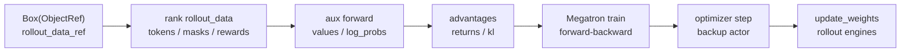
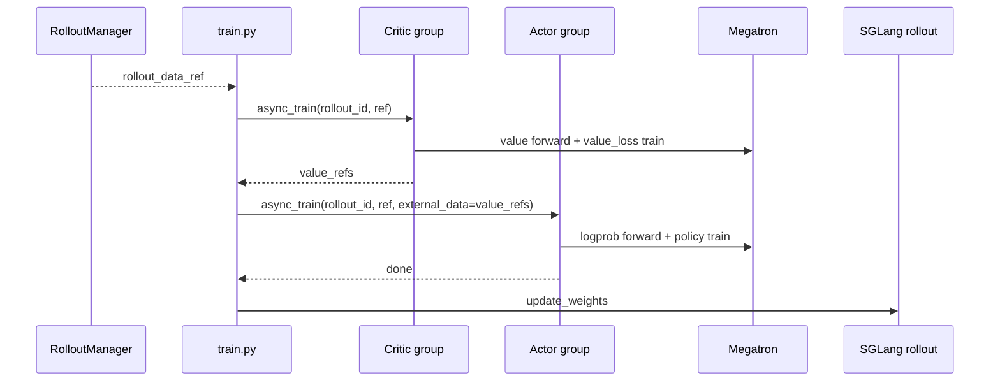

# 训练步骤

> **Slime 训练后端**
> **源码范围：** `train.py`、`train_async.py`、`slime/ray/actor_group.py`、`slime/backends/megatron_utils/actor.py`、`model.py`、`data.py`、`loss.py`

## 读者为什么要读

RolloutManager 已经把一次 rollout 的样本放进 Ray Object Store。Train Step 回答下一个问题：Megatron actor 如何把这包样本变成一次参数更新，并把 critic values、log-prob、advantage、loss、optimizer step 串成闭环。

读完本专题，应该能排查：

- `async_train` 卡住、返回值不符合预期，或者误以为它是 Megatron 异步训练。
- PPO + Critic 路径里 actor 没拿到 `values`，导致 advantage 不对。
- 动态 batch 下 `num_microbatches` 和 `global_batch_sizes` 对不上。
- rollout log-prob、ref log-prob、actor train log-prob 口径混淆。
- offload、routing replay、pipeline last stage 造成的训练分支误判。

## 一句话模型

Train Step 是一个 **两遍训练转换器**：第一遍把 rollout 包恢复成 GPU 上的训练字段，并补齐 log-prob/value/advantage；第二遍把这些字段交给 Megatron pipeline 做 backward、optimizer step 和日志。

## 首次阅读路径

| 文件 | 读它解决什么 |
| ------ | -------------- |
| [[Slime-训练步骤-核心概念]] | 建立“训练转换器”模型，分清 Ray、Actor、Megatron 三层 |
| [[Slime-训练步骤-源码走读]] | 沿 PPO + Critic 主线追踪一次真实训练更新 |
| [[Slime-训练步骤-数据流]] | 看 `rollout_data`、`DataIterator`、`external_data` 如何变形 |
| [[Slime-训练步骤-排障指南]] | 按症状定位 offload、log-prob 复用、critic-only、PP last stage 等问题 |
| [[Slime-训练步骤-学习检查]] | 用图、问题和命令验收自己是否真的读通 |

## 主线位置

源码入口：来源：train.py L63-L89

这条主线的关键不是“调用了几个函数”，而是四个边界：

- Ray 边界：主进程只拿 ObjectRef，不直接训练。
- DP 边界：每个 Megatron DP rank 只取自己的 `Box`。
- PP 边界：只有 pipeline last stage 产出 `values/log_probs/advantages`。
- 闭环边界：actor train 完成后，下一步才把权重推回 rollout engines。

## 与上下游的关系

| 方向 | 模块 | 关系 |
|------|------|------|
| 上游 | [[Slime-RolloutManager]] | 生产 `list[Box]`，并按 DP rank 切好训练数据 |
| 上游 | [[Slime-Megatron-Actor初始化]] | 初始化 Ray train actor、model、optimizer、backup tags |
| 并行 | [[Slime-训练数据]] | 解释 `process_rollout_data`、`get_data_iterator`、`get_batch` |
| 并行 | [[Slime-Advantage计算]] | 解释 KL、advantage、return 的算法分支 |
| 并行 | [[Slime-Policy-Loss]] | 解释 policy/value/SFT/custom loss 细节 |
| 下游 | [[Slime-分布式权重同步]] | actor 参数更新后推送到 SGLang engines |

## 验证抓手

- PPO + Critic：看 `tests/test_qwen3_4B_ppo.py`，关注 `--use-critic`、`--num-critic-only-steps`、`--advantage-estimator ppo`。
- Debug 复放：用 rollout debug 数据验证 `_get_rollout_data → train_actor`，不用重新跑 SGLang。
- 日志：关注 `train/step`、`train/*global_batch_size`、`train/ppo_kl`、`train/kl_loss`、`train/train_rollout_logprob_abs_diff`。
- 审计：本专题的源码引用应通过 `node maintenance\audit_source_evidence.mjs --note ...`。
