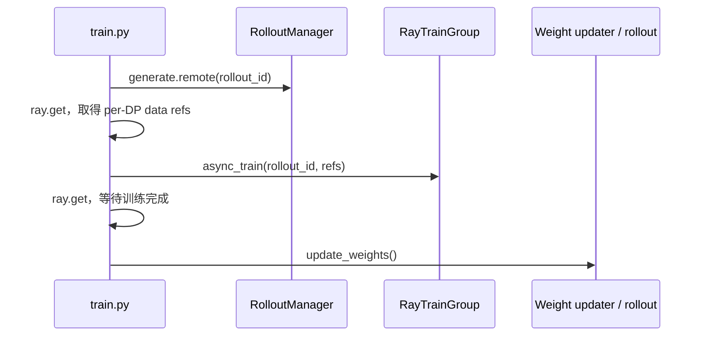
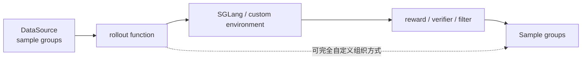
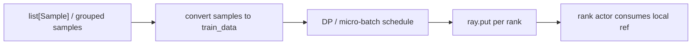
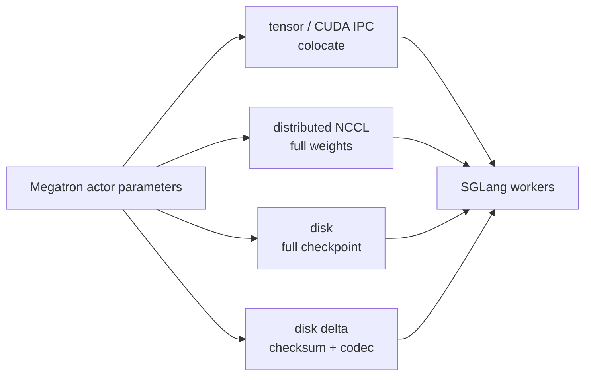
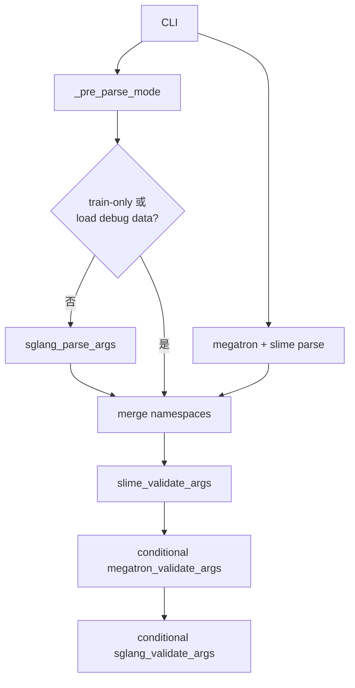

# 阅读方法 · 数据流

## 你为什么要读

一轮 RL 同时存在控制流、样本流、训练数据流、权重流和资源状态流。把它们画成一条调用链，会掩盖 Ray future、对象存储、rank-local 切分和权重可见性。本页把五条流拆开，再说明它们在哪里重新汇合。

## 1. 控制流：同步主循环的事务边界



这里最重要的不是函数名，而是两个等待点：同步入口先等 rollout manager 完成生成与切分，再等训练完成，随后才发布权重。`async_train` 只是远程发起接口；紧随其后的 `ray.get` 使本轮控制流仍是同步的。

`train_async.py` 只把“下一轮 generation”提前，与当前轮 train 重叠。到达 `update_weights_interval` 时，它会先等待仍在途的 generation，再发布权重，避免同一批生成在中途看到两版权重。它不是 fully async，也不支持 colocate。

## 2. 样本流：从 prompt 到 Sample



默认 SGLang rollout 会从 DataSource 取得 group，发请求，计算 reward/过滤并返回 Sample。自定义 full rollout function 可以重写这条外层路径，所以图中的 generate 与 RM 不是所有配置都必经的固定函数。阅读 hook 时要先确定替换层级，再谈调用顺序。

## 3. 训练数据流：Sample 不是训练侧最终输入



converter 不重新生成 token 或 rollout logprob；它校验/整理字段、构造 loss mask 与训练字典，并计算训练需要的归一化和调度信息。随后 `_split_train_data_by_dp()` 为各 rank 构造数据并 `ray.put`。因此：

- RolloutManager `generate()` 的返回值是每个 DP rank 的数据引用集合；
- `RayTrainGroup` 把同一组 refs 扇出给 actors；
- rank-local 选择发生在 worker 内部，而不是主循环为每个 actor 手工挑一个 Python dict。

## 4. 权重流：四条发布路线



“训练权重回灌 SGLang”是统一语义，不是统一 transport。当前 updater 选择大致分为 colocate tensor、full+NCCL、full+disk、delta+disk；不同路线的进程边界、缓冲区、故障恢复和一致性检查不同。`megatron_to_hf` 负责命名/layout 转换，不等于传输本身。

## 5. 参数控制流：先决定是否需要 SGLang



`_pre_parse_mode()` 先读取会改变解析路径的 debug/backend 参数。train-only 或加载保存的 rollout 数据时，SGLang 独立解析会被跳过；之后才合并 pre-parsed、Megatron/Slime 与可选的 SGLang namespace。`slime_validate_args` 还会派生和改写字段，因此 CLI 文本不等于最终运行事实。

## 6. Debug 分支改变了什么

| 模式 | 保留的主链 | 被跳过/替换的部分 | 首查入口 |
|------|------------|-------------------|----------|
| rollout-only | 资源 + rollout + 记录 | Megatron 训练验证/训练模型路径 | 参数 validator、placement group |
| train-only | 已保存数据 → converter/训练 | SGLang 解析与 server 实例化 | `load_debug_rollout_data` 分支 |
| 正常同步 | generate → train → publish | 无 | `train.py` |
| pipeline async | next generate ∥ current train | 更新前仍收口在途生成 | `train_async.py` |

debug flag 不是日志开关，而是会改变 parser、资源分配和后端实例化的控制变量。

## 7. 运行验证

从知识库根目录执行：

```powershell
rg -n 'rollout_data_ref = ray.get|async_train|update_weights' slime/train.py
rg -n 'rollout_data_next_future|sync generate before update weights|assert not args.colocate' slime/train_async.py
rg -n 'def generate|_convert_samples_to_train_data|_split_train_data_by_dp|ray.put' slime/slime/ray/rollout.py
rg -n 'skip_sglang|sglang_parse_args|slime_validate_args|megatron_validate_args|sglang_validate_args' slime/slime/utils/arguments.py
```

预期：

- 同步入口能找到“等待生成—等待训练—发布”的顺序；
- async 入口能找到预取 future、更新前收口和禁止 colocate；
- RolloutManager 能找到“样本—转换—DP 切分—对象存储”的完整链；
- 参数入口能看到 SGLang parse/validate 都是条件执行。

若只能找到函数名，仍说不清每一步的对象类型、所有者和等待点，就还没有读懂数据流。
