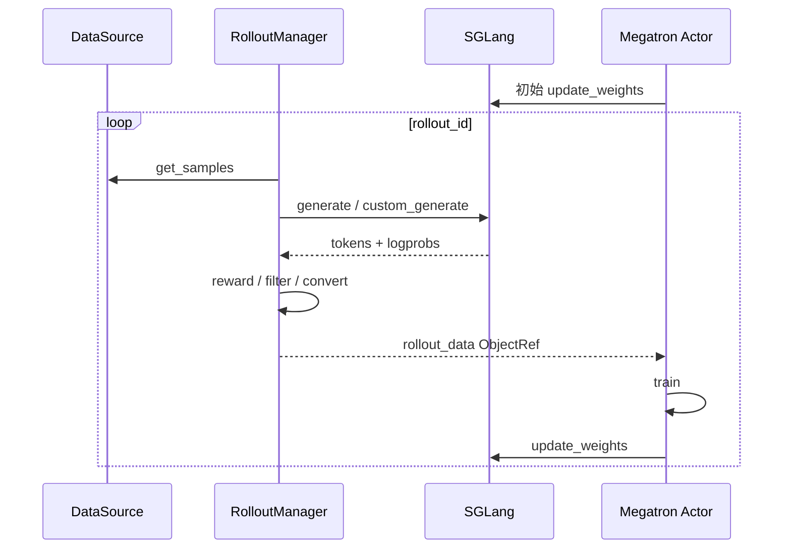
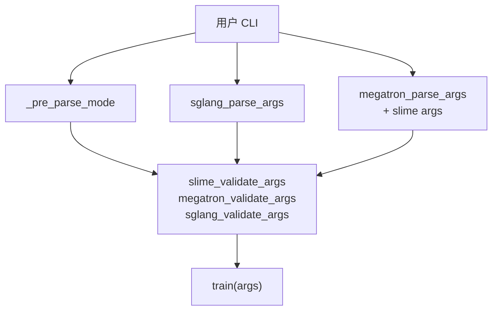
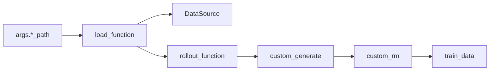
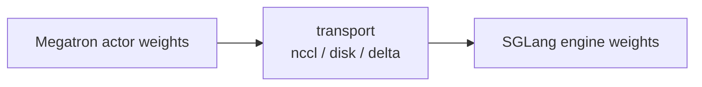
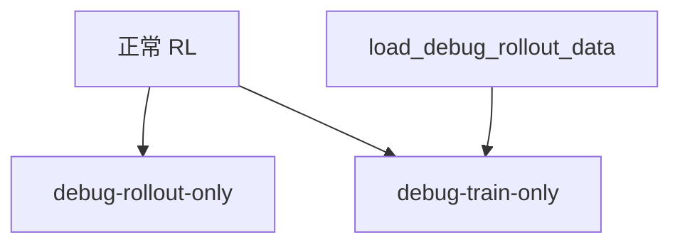

# 阅读方法 · 数据流

## 你为什么要读

本页把 Slime 方法论落到可追踪的数据流上。读完后，你应该能把后续专题中的 RL 数据闭环、CLI 控制面、debug 分支和权重同步分开看，而不是把所有函数调用都混成一条训练主循环。

这一篇把方法论落成三条流：RL 数据闭环、CLI 控制面、debug 分支。读后续专题时，先判断自己正在看哪条流。

## 1. RL 数据闭环



这条流说明 Data Buffer 是逻辑角色，不一定是独立进程。它覆盖 DataSource、RolloutManager、Sample group、train_data 转换和 Ray ObjectRef 交付。

## 2. CLI 控制面

README 把参数分成 Megatron、SGLang、Slime 自身三类。来源：README.md L164-L168

实际 parse 也按这个边界执行：先 pre-parse debug/train-backend，再独立解析 SGLang 参数，再解析 Megatron + Slime 参数，最后合并并验证。来源：slime/utils/arguments.py L1546-L1589



读参数专题时，关键不是记住所有 flag，而是确认参数归属：它最终影响 SGLang server、Megatron training，还是 Slime 自己的 Ray/rollout/dataflow 编排。

## 3. Customization 数据生成流



这条流解释了为什么方法论要先读 [[Slime-自定义扩展]] 的思想，再看 examples。用户自定义逻辑可以接入不同槽位，但最后必须回到训练侧可消费的数据形状。

## 4. 权重回灌流

权重同步是闭环的反向边：训练更新 Megatron 权重后，下一轮 rollout 必须使用新 policy。参数里 `--update-weight-transport` 区分 `nccl` 和 `disk`，delta 模式只走 disk。来源：slime/utils/arguments.py L145-L155



因此 [[Slime-分布式权重同步]] 和 [[Slime-磁盘权重同步]] 不是部署边角，而是 RL loop 能否正确迭代 policy 的核心。

## 5. Debug 分支



`load_debug_rollout_data` 会把 `debug_train_only` 置为 true，并提示不会实例化 SGLang servers。来源：slime/utils/arguments.py L1844-L1849

| 模式 | 目的 | 读源码入口 |
|------|------|------------|
| 正常 RL | 跑完整闭环 | [[Slime-训练主循环]] |
| rollout-only | 只测 SGLang rollout 吞吐和样本形状 | [[Slime-SGLang-Rollout]] |
| train-only | 用已保存 rollout 数据重放训练 | [[Slime-训练步骤]] |

## 6. 与外部生态的边界

README 里的 vime、Relax、OpenClaw-RL 等生态项目说明一个事实：Slime 可以作为 RL substrate 被扩展，但核心语义仍围绕训练、rollout、Data Buffer 和权重同步。

如果外部项目替换 rollout backend、拆分服务集群或增加 agent 环境，读者仍应回到三条问题：

- 样本如何进入 Data Buffer。
- 训练如何消费样本并更新权重。
- 新权重如何回到 rollout 或 serving 侧。

## 7. 运行验证

这篇的方法论主线可以用一条静态命令复核：rollout 数据入口、自定义函数加载、debug 分支和权重同步参数必须同时可定位。

```powershell
rg -n 'get_rollout_data|DataSource|rollout_function|load_function|load_debug_rollout_data|debug_rollout_only|debug_train_only|update_weight_transport|update_weights|nccl|disk|delta' slime/train.py slime/slime/ray/rollout.py slime/slime/utils/arguments.py slime/slime/ray/placement_group.py
```

如果命令只命中参数而不命中 rollout manager 或训练主循环，说明“RL 闭环”被拆过，需要重新整理本页的数据流图。
