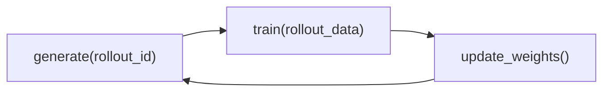

# 阅读方法 · 核心概念

## 你为什么要读

Slime 的读法可以压成一句话：它不是把一个 trainer 包上 rollout service，而是把训练、在线采样、自定义环境和权重更新组织成同一个 RL 后训练闭环。

## 1. 两大能力

README 对 Slime 的定义是两大核心能力：高性能训练和灵活数据生成。来源：README.md L9-L16

| 能力 | 依赖 | 源码阅读时对应的主题 |
|------|------|----------------------|
| 高性能训练 | Megatron、Ray、权重同步 | 训练主循环、Ray 编排、训练后端、loss、checkpoint |
| 灵活数据生成 | SGLang、custom generate、reward/verifier、agent workflow | RolloutManager、SGLang rollout、RM/filter、Customization、Examples |

这两者不是并列工具箱，而是互相喂数据：当前 policy 生成样本，训练更新 policy，再把新权重同步给 rollout 引擎。

## 2. Training / Rollout / Data Buffer 三角

| 角 | 逻辑职责 | 代表对象 |
|----|----------|----------|
| Training | 消费 rollout 数据、计算 loss、更新 Megatron 权重 | `TrainRayActor`、actor/critic、optimizer |
| Rollout | 根据当前 policy 在线生成响应、调用 RM 或 verifier | SGLang engine、router、`generate_rollout` |
| Data Buffer | 管 prompt、sample group、train data 交付 | DataSource、RolloutManager、`Sample`、Ray ObjectRef |

README 的架构总览把这三者写成 training 读 Data Buffer、rollout 写 Data Buffer、training 后同步参数到 rollout。来源：README.md L84-L92

## 3. 闭环节拍

最小同步节拍是：

异步训练会移动等待点，但语义仍是这个闭环。博文明确说 Ray `.remote()` 让异步训练自然成立，改变同步策略可以通过移动 `ray.get` 完成，并且 Slime 没有把主循环包进 trainer class，而是暴露 `train.py`。来源：docs/en/blogs/introducing_slime.md L43-L45

## 4. Native engine pass-through

Slime 选择深度绑定 Megatron + SGLang，而不是把多个推理/训练后端抽象成公共子集。

| 维度 | Slime 的选择 | 读源码时的含义 |
|------|--------------|----------------|
| SGLang | server-based mode、`--sglang-*` 参数透传、rollout-only debug | SGLang 参数和服务能力尽量原生暴露 |
| Megatron | 直接读取 Megatron 参数、保留 TP/PP/EP/CP | 训练侧复杂性留在 Megatron 体系内 |
| Slime 自身 | 只维护 RL loop、dataflow、sync、correctness | 框架核心保持轻量 |

博文把目标概括为 versatile、performant、maintainable。来源：docs/en/blogs/introducing_slime.md L15-L21

## 5. Customization 的位置

自定义 rollout、RM、DataSource、agent harness 并不是方法论之外的“插件边角”，而是 Slime 数据生成自由度的主入口。README 明确说 math、code、search、tool、sandbox、verifier、environment、multi-agent 等都作为 data generation 或 reward workflow 接入，不需要 fork training kernel。来源：README.md L22-L26

因此读 [[Slime-自定义扩展]] 时，要把它看成方法论的落地：用户逻辑可以很复杂，但最后必须回到 `Sample`、Data Buffer 和训练数据契约。

## 6. 包和依赖透露的边界

`setup.py` 把包名设为 `slime`，同时包含 `slime*` 和 `slime_plugins*`。来源：setup.py L31-L38

依赖里有 `ray[default]`、`sglang-router`、`httpx[http2]`、`safetensors`、`wandb`、`xxhash`、`zstandard` 等。来源：requirements.txt L1-L26

这些依赖告诉读者：Slime 不是纯算法库。它同时承担分布式编排、HTTP serving、权重文件、监控、delta sync 和 agent/tool 生态的系统职责。

## 7. 按任务选择文档

同一专题会按读者任务拆成不同文档。先选当前问题需要的类型，不必顺序读完：

| 文件 | 当前职责 |
|------|----------|
| 专题入口 | 告诉读者为什么读、读完能解决什么问题、后续去哪 |
| 核心概念 | 建立心理模型和术语边界 |
| 源码走读 | 按一条场景主线给源码证据 |
| 数据流 | 画对象流、控制流和跨模块边界 |
| 排障指南 | 按症状和误解排障 |
| 学习检查 | 给可执行验收和自测题 |

首次建立模型时可以先读解释页；每次要修改实现或验证结论，都要回到 upstream 源码、测试和运行证据。
