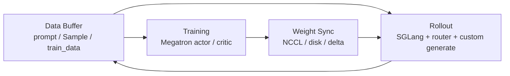

# 阅读方法

> 源码范围：`README.md`、`README_zh.md`、`docs/en/blogs/introducing_slime.md`、`setup.py`、`requirements.txt`、`slime/backends/sglang_utils/arguments.py`

## 你为什么要读

这个专题解决“读 Slime 应该先抓住什么”的问题。Slime 的源码很多，但第一层模型很简单：它把 Megatron 训练、SGLang rollout 和 Data Buffer 放进同一条 RL 后训练闭环，让自定义数据生成不需要 fork 训练 kernel。

读完本专题后，读者应该能做到：

- 用一句话说明 Slime 的两大能力：高性能训练与灵活数据生成。
- 画出 Training / Rollout / Data Buffer 三角。
- 口述 `generate → train → update_weights` 的闭环节拍。
- 解释 native engine pass-through 为什么是 Slime 与多 backend 抽象框架的核心差异。
- 知道后续专题应从训练主循环、参数系统、Ray 编排、Rollout、训练后端、权重同步一路读下去。

## 先建立的模型

官方 README 把三块职责写清楚：training 从 Data Buffer 读取数据并把参数同步到 rollout；rollout 生成新数据并写回 Data Buffer；data buffer 管 prompt 初始化、自定义数据与 rollout 生成方法。来源：README.md L84-L92

## 阅读顺序

| 顺序 | 文件 | 读者任务 |
|------|------|----------|
| 1 | [[Slime-阅读方法-核心概念]] | 建立三角闭环、native 透传、轻量框架三件事 |
| 2 | [[Slime-阅读方法-源码走读]] | 用 README、博文和参数透传代码证明这个模型 |
| 3 | [[Slime-阅读方法-数据流]] | 把逻辑闭环、CLI 控制面、debug 分支串起来 |
| 4 | [[Slime-阅读方法-排障指南]] | 按读者常见误解排障：Data Buffer、SGLang 前置、veRL 对比 |
| 5 | [[Slime-阅读方法-学习检查]] | 用自测和命令检查专题质量 |

## 源码证据地图

| 文件 | 本专题关注 |
|------|------------|
| `README.md` / `README_zh.md` | 两大能力、三模块、参数三类、生态定位 |
| `docs/en/blogs/introducing_slime.md` | versatile / performant / maintainable、SGLang-native、暴露 `train.py` |
| `slime/backends/sglang_utils/arguments.py` | SGLang 参数前缀透传的具体实现 |
| `slime/utils/arguments.py` | 三阶段 parse 与 debug 分支 |
| `setup.py` / `requirements.txt` | 包结构、平台假设、运行依赖边界 |

## 后续衔接

方法论不是源码细节的终点，而是后续阅读的坐标系。看到任何 Slime 模块时，都先问它服务的是三角里的哪条边：生成样本、训练消费、权重回灌，还是把用户自定义逻辑接进数据通路。
