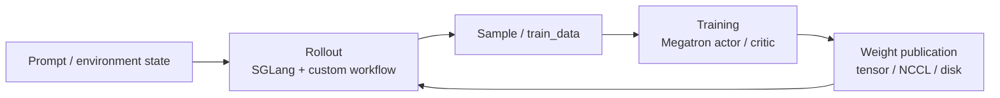
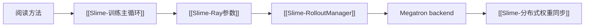

# 阅读方法

> 源码范围：`README.md`、`README_zh.md`、`docs/en/blogs/introducing_slime.md`、`train.py`、`train_async.py`、`slime/utils/arguments.py`、`slime/ray/rollout.py`、`slime/ray/actor_group.py`、`slime/backends/sglang_utils/arguments.py`、`setup.py`、`requirements.txt`

## 你为什么要读

Slime 横跨 Ray、Megatron、SGLang、数据生成与 RL 算法。如果按目录逐个文件读，很容易知道许多类名，却说不清“一批样本为何能用某一版 policy 生成、被哪组训练 rank 消费、何时再发布成下一版权重”。

本专题给出一套可重复使用的读法：先用官方设计材料确定系统承诺，再沿运行对象追实现契约，最后用测试、日志或命令验证。读完后，你应能：

- 用 Training / Rollout / Data Buffer 三角说明 Slime 的系统边界；
- 用“资源、样本、训练、版本、等待”五本账追一轮 RL；
- 区分宣传性架构角色、Python 对象、Ray actor、GPU 资源与进程；
- 区分同步主循环、pipeline async 与 fully async，而不被函数名误导；
- 判断一段笔记是设计解释、源码事实，还是仍待运行验证的推断。

## 第一张图：闭环，不是调用栈

官方 README 用 Training、Rollout、Data Buffer 描述架构角色。源码里却没有一个包办所有职责的“Data Buffer daemon”：prompt 获取在 DataSource，生成编排与转换在 RolloutManager/rollout function，训练数据常经 Ray object store 交给 rank actor。阅读时要在“逻辑角色”和“实现对象”之间做映射，不能把架构图当进程图。

## 第二张图：五本账

| 账本 | 每一步要问什么 | 常见入口 |
|------|----------------|----------|
| 资源账 | GPU bundle 属于谁，是否 colocate，何时 offload/onload | `placement_group.py`、`rollout.py`、训练 actor |
| 样本账 | prompt、token、reward、mask、rollout 身份在哪里产生和改写 | `types.py`、`data_source.py`、rollout function |
| 训练账 | 样本如何转换、按 DP 切分、形成 micro-batch 并归一化 loss | `ray/rollout.py`、Megatron actor/loss |
| 版本账 | 哪一版 actor 生成了样本，新权重何时对 serving 可见 | `train*.py`、actor group、weight updater |
| 等待账 | 哪个 `.remote()` 只是发起，哪个 `ray.get` 才建立先后关系 | `train.py`、`train_async.py`、Ray actor methods |

五本账共同回答 correctness。只追函数名会漏掉对象所有权；只看对象字段又会漏掉异步等待和版本可见性。

## 三层证据

| 层级 | 能证明什么 | 不能单独证明什么 |
|------|------------|------------------|
| 设计材料 | 项目目标、公开边界、设计取舍 | 当前版本每个分支的实际行为 |
| 源码与测试 | 参数派生、对象契约、调用和等待关系 | 指定硬件/workload 下的性能与长时稳定性 |
| 运行证据 | 某环境下的 shape、rank、版本、吞吐、数值与失败模式 | 未覆盖配置的普遍结论 |

因此，README 适合回答“为什么这样设计”，函数体适合回答“当前究竟怎么做”，运行记录适合回答“在我的环境里是否成立”。三者冲突时，应明确版本与证据等级，不能用愿景文字覆盖当前实现。

## 阅读顺序

| 顺序 | 文件 | 读者任务 |
|------|------|----------|
| 1 | [[Slime-阅读方法-核心概念]] | 建立五本账、三层证据和对象边界 |
| 2 | [[Slime-阅读方法-源码走读]] | 从官方承诺走到参数、主循环和依赖证据 |
| 3 | [[Slime-阅读方法-数据流]] | 分开控制流、样本流、训练流、版本流和 debug 分支 |
| 4 | [[Slime-阅读方法-排障指南]] | 用症状—原因—入口—操作—预期纠正常见读偏 |
| 5 | [[Slime-阅读方法-学习检查]] | 亲手定位对象、等待点和版本边界 |

## 后续专题怎么接

每进入一个专题，先写出它改变了哪本账，再追具体函数。若一段实现同时影响多本账——例如 offload 同时改变资源、等待和版本发布——就分别记录，不要塞进一个含糊的“训练流程”箭头里。
