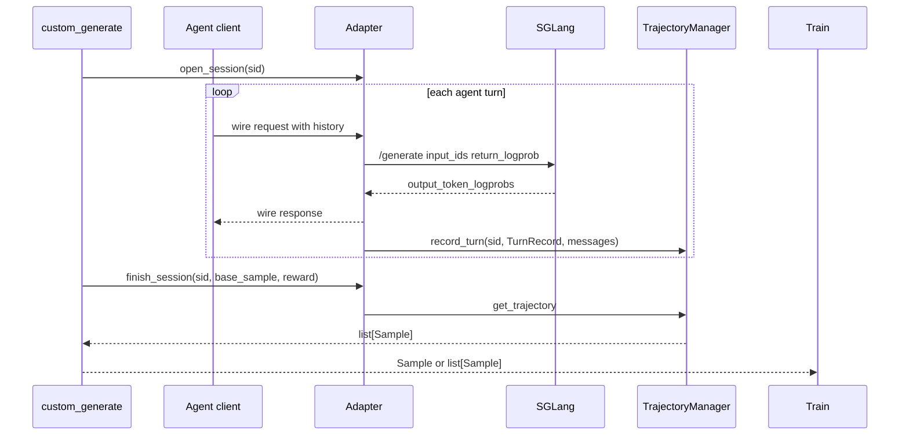

# Agent轨迹 · 数据流

## 你为什么要读

本篇只看边界和对象形态。Agent trajectory 横跨四个世界：客户端 wire 协议、SGLang token 生成、TrajectoryManager 消息树、Slime 训练 `Sample`。每个边界都要避免把文本语义误当成 token 事实。

## 端到端数据流



## 1. Wire 层和 manager 层的 message 形态不同

OpenAI wire response 需要 `tool_calls[].id` 和 JSON string arguments；manager message 则要丢掉 id，并把 arguments 保持为 dict，保证下一轮客户端重放历史时能通过 dict equality 匹配树节点。

```python
# 来源：slime/agent/adapters/openai.py L211-L265
def _build_reply_parts(parsed: ParsedModelOutput, finish: str) -> tuple[dict[str, Any], dict[str, Any], str]:
    """Return (wire_message, manager_message, wire_finish).

    wire_message follows the OpenAI Chat-Completions spec: tool_calls[].id is a
    unique correlation id and tool_calls[].function.arguments is a JSON-encoded
    string (clients depend on this).

    manager_message is the shape fed to record_turn: arguments is a dict so
    chat-template replay succeeds and the manager's history match (dict equality)
    holds against the echo on the next turn, and the wire-only id is omitted.
    """
```

Anthropic wire 层也有类似分离：`tool_use` block 需要 wire id；manager message 用 `tool_call_dict` 去掉 id。

```python
# 来源：slime/agent/adapters/anthropic.py L147-L190
def _build_reply_parts(
    parsed: ParsedModelOutput,
    finish: str,
) -> tuple[list[dict], str, dict[str, Any]]:
    """Return (anthropic blocks, wire stop_reason, manager_message).

    The tool_calls inside manager_message use canonical args (tool_call_dict) so
    this assistant turn compares equal (dict equality) to the same turn replayed
    as history on the next request.
    """
```

## 2. Session id 同时隔离轨迹树和提示路由

adapter 用 sid 查 `store`、`inflight`、`closed`，manager 用 sid 查 `_trees`。SGLang 请求头也用同一个 sid 做 routing key。

```python
# 来源：slime/agent/adapters/common.py L396-L473
def sid_from_bearer(request: web.Request) -> str | None:
    """sid from the Authorization: Bearer <sid> header, or None if absent."""
    auth = request.headers.get("Authorization", "")
    if auth.lower().startswith("bearer "):
        return auth[7:].strip() or None
    return None

def sid_from_body(body: dict | None) -> str | None:
    """sid from the OpenAI-shape body (metadata.session_id / user), or None."""
    if not body:
        return None
```

官方文档也把 stable `session_id` 和 SGLang session affinity 放在一起说明。

```markdown
# 来源：docs/en/get_started/agent.md L40-L55
Instantiate the protocol-specific adapter in your custom generate function, run its `app` with aiohttp, then manage each rollout through the adapter instance:

```python
from slime.agent.adapters import AnthropicAdapter

adapter = AnthropicAdapter(
    tokenizer=tokenizer,
    sglang_url=sglang_url,
    tool_parser=tool_parser,
    reasoning_parser=reasoning_parser,
)

adapter.open_session(session_id, sampling_defaults=sampling_params)
```
```

数据不变量：同一个 agent run 必须使用稳定 sid；否则消息树被拆散，SGLang prefix cache 也难以复用。

## 3. SGLang 输出到 TurnRecord 是 token 边界

adapter 发给 SGLang 的是 `input_ids`，不是文本；SGLang 回来的是 `output_token_logprobs`。这一层之后，训练相关 token 事实已经确定。

```python
# 来源：slime/agent/adapters/common.py L475-L518
        meta = data.get("meta_info") or {}
        output_token_logprobs = meta.get("output_token_logprobs") or []
        output_ids = [x[1] for x in output_token_logprobs]
        output_log_probs = [float(x[0]) for x in output_token_logprobs]
        finish = (meta.get("finish_reason") or {}).get("type", "stop") or "stop"
    except (asyncio.CancelledError, aiohttp.ClientError, asyncio.TimeoutError) as e:
        logger.debug("[%s] sid=%s rid=%s turn aborted: %s", adapter.log_prefix, session_id, rid, type(e).__name__)
        try:
            async with aiohttp.ClientSession(timeout=aiohttp.ClientTimeout(total=5)) as s2:
```

边界：`parse_model_output` 可以提取 reasoning 和 tool calls，但不能重写 `output_ids`。

## 4. tree 分支由 message equality 决定

`record_turn` 的 tree 层只看 message dict 的结构是否相等。token drift 在第二层 builder 处理，不影响 message tree 的匹配。

```python
# 来源：tests/test_agent/test_trajectory_manager_branching.py L1-L32
"""Branching-matrix tests for TrajectoryManager via record_turn / get_trajectory.

This script drives the two public interfaces of
``slime.agent.trajectory.TrajectoryManager`` and exhaustively covers the
ways a trajectory can branch, organized as a two-axis matrix:

  * LAYER 1 — routing tree (record_turn). DFS merges on (role, message-equality)
    only, so MESSAGE IDENTITY determines tree shape; token ids are irrelevant here.
  * LAYER 2 — linearization (get_trajectory). TOKEN-ID prefix determines how each leaf
    chain becomes Samples (clean continuation / drift case A·B1·B2 / cross-leaf
    dedup / reward split).
```

这解释了两个常见现象：

- 同一 wire 消息如果 canonical dict 不一致，会在 tree 层 fork。
- message tree 没 fork，不代表 token builder 不会 fork；下一轮 prompt ids 仍可能 drift。

## 5. 多 leaf 到多 Sample 的 fan-out

官方文档要求一条 rollout 拆出多个训练段时返回 `list[Sample]`，并让 sibling samples 共享 `rollout_id`。

```markdown
# 来源：docs/en/get_started/agent.md L21-L26
Most agentic RL tasks should start with `--custom-generate-function-path`. This function converts one agent execution into slime-trainable `Sample` objects: fill `tokens`, `response_length`, `loss_mask`, and `status`, then either fill `reward` directly or let `--custom-rm-path` compute it.

The agent workflow itself may speak in strings, chat messages, tool calls, environment observations, or framework-specific events. The training target, however, should stay token based. Preserve the model-sampled token ids and use `loss_mask` to separate trainable model output from prompt, template, tool-observation, or environment text.

If one prompt rollout corresponds to one training sample, return a single `Sample`. If one rollout splits into multiple trainable segments, such as subagent trajectories, main-agent continuations, or pre/post-compaction segments, return `list[Sample]` and set the same `rollout_id` on all sibling samples. slime then keeps those samples together for train-step splitting and loss aggregation instead of counting them as independent rollouts.
```

`TrajectoryManager.get_trajectory` 也明确是每个 routing leaf 产出一个或多个 `Sample`，并把同一个 reward 赋给每个 sample。

```python
# 来源：slime/agent/trajectory.py L307-L344
def get_trajectory(
    self,
    sid: str,
    *,
    base_sample: Sample,
    reward: float = 0.0,
    extra_metadata: dict[str, Any] | None = None,
    max_sample_tokens: int = 0,
) -> list[Sample]:
    """Linearize this sid's routing tree into slime ``Sample`` objects and
    consume the session.
```

## 6. adapter 测试覆盖真实 HTTP 边界

adapter 测试不是只测纯函数。它用 real aiohttp `TestServer/TestClient` 和 fake SGLang server 跑完整链路。

```python
# 来源：tests/test_agent/test_adapters.py L1-L32
"""Unit tests for the agent HTTP adapters (Anthropic + OpenAI) and parsing.

Every test drives a REAL adapter over a real aiohttp loopback
(``TestServer``/``TestClient``) and a real ``/generate`` upstream
(:class:`tests.test_agent._fakes.FakeSGLangServer`) -- so the whole
translate -> sglang -> parse -> record_turn -> finish_session path runs
unmocked; only the model server and tokenizer are faked. Covers both wire
protocols plus the standalone parsing helpers in ``slime.agent.parsing``.
```

数据流验收看这三类断言：

- SGLang request 里 `sampling_params` 和 routing key 是否正确。
- Sample 的 `tokens`、`loss_mask`、`rollout_log_probs`、`response` 是否对齐。
- 多轮 tool call 后是否至少产生一个带训练信号的 sample。

## 复盘

- wire message 是给客户端看的；manager message 是给树匹配看的。
- `TurnRecord` 是训练 token 事实；parse 只是结构化回复文本。
- tree fork 和 token drift fork 是两层机制。
- `finish_session` 是 destructive read；custom generate 应把返回 samples 缓存并交给训练流程。
