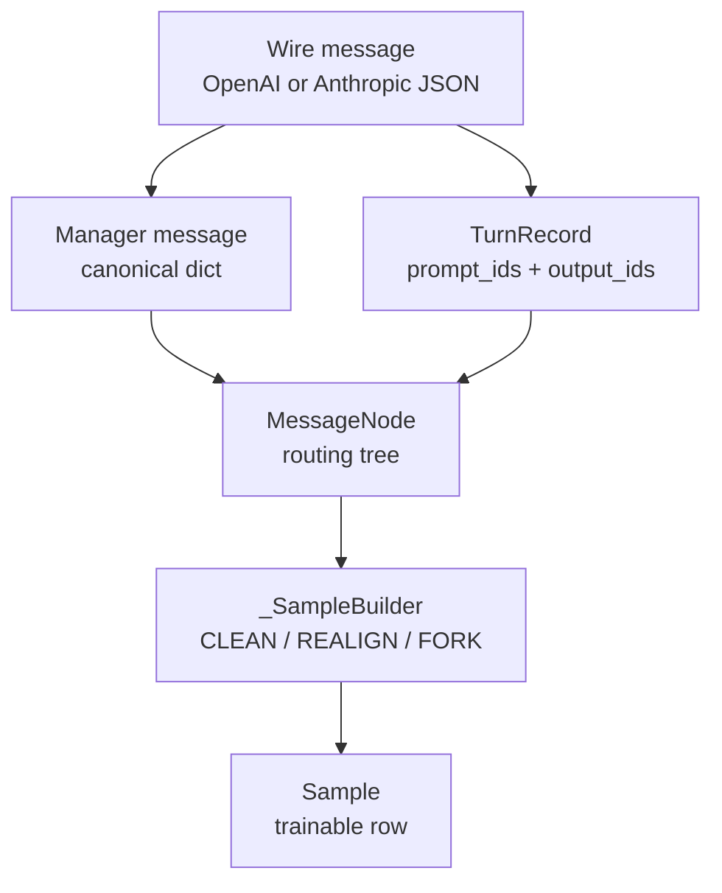

# Agent轨迹 · 核心概念

本页先建立 agent trajectory 的两层模型。读完后，你应该能区分 session message tree、generated turn、routing-only message、drift realign/fork，以及最终写入训练的 `Sample` token/loss mask/logprob 账。

Agent trajectory 的核心模型是两层：第一层用 message tree 记录一个 session 的多轮历史和分支，第二层用 `_SampleBuilder` 把每条 leaf path 上的 generated assistant turn 变成 token 序列、loss mask 和 rollout logprobs。

## 先建立模型



| 对象 | 心理模型 | 关键字段 |
|------|----------|----------|
| `TurnRecord` | 一次 SGLang 生成快照 | `prompt_ids`、`output_ids`、`output_log_probs`、`finish_reason` |
| `MessageNode` | session 消息树上的一个节点 | `role`、`message`、`turn`、`response_trained` |
| `DriftKind` | 下一轮 prompt 与已持有 tokens 的关系 | `CLEAN`、`REALIGN`、`FORK` |
| `_SampleBuilder` | 一条可训练 token 轨迹的累加器 | `tokens`、`loss_mask`、`logprobs`、`leading_prompt_len` |
| `Sample` | 训练后端消费的行 | `tokens`、`response_length`、`loss_mask`、`rollout_log_probs` |

## TurnRecord：adapter 和 manager 的契约

`TurnRecord` 不存文本，它存 SGLang 返回的 token 事实。这样训练 forward 看到的 token id 和 rollout 时采样的 token id 保持一致。

```python
# 来源：slime/agent/trajectory.py L28-L38
@dataclasses.dataclass(frozen=True)
class TurnRecord:
    """One sglang ``/generate`` snapshot: the contract between an adapter and the
    manager. Adapters build it from a turn's prompt/output token ids; ``record_turn``
    consumes it."""

    prompt_ids: list[int]
    output_ids: list[int]
    finish_reason: str
    output_log_probs: list[float] = dataclasses.field(default_factory=list)
    ill_formed: bool = False
```

不变量：如果 `output_log_probs` 非空，长度必须等于 `output_ids`。否则 `record_turn` 会断言失败。但“空 logprob 列表”是合法的：builder 会为这些仍然 `loss_mask=1` 的 response token 补 `0.0`。所以长度对齐不等于 rollout logprob 真实可用，算法若依赖 old logprob，还必须检查来源完整性。

## MessageNode：generated 和 routing-only 的分界

一个 node 是否参与训练，不看 role 名字，而看 `turn` 是否存在。generated assistant node 持有 `TurnRecord`；system/user/tool 以及 replay 进来的 assistant 通常只是 routing-only。

```python
# 定位骨架（基于 `slime/agent/trajectory.py` L46-L82；只展示 `MessageNode` 构造主干）
class MessageNode:
    """One node in a session's routing tree, carrying a single chat message
    (``None`` for the dummy root and for an assistant leaf we generated but
    whose ``response_message`` was empty)."""

    def __init__(
        self,
        *,
        role: str | None = None,
        message: dict[str, Any] | None = None,
        metadata: dict[str, Any] | None = None,
        parent: MessageNode | None = None,
    ) -> None:
        self.role = role
        self.message = message
        self.metadata = dict(metadata or {})
        self.parent: MessageNode | None = parent
        self.children: list[MessageNode] = []
        self.turn: TurnRecord | None = None
```

`response_trained` 是跨 leaf 去重标记。多个 branch 共享同一个 generated assistant 前缀时，DFS 遍历首先遇到它的 leaf 训练它，后续 leaf 只把它当上下文。这是“全棵树计数一次”，不是“每个 branch 都拥有它的一份训练信号”；归属哪个 sample 由 children/leaf 顺序决定。

## DriftKind：TITO 漂移的三种处理

TITO 漂移指“token in, token out”重放后不再逐 token 对齐。`_SampleBuilder` 通过 common prefix 判断下一轮 prompt 是否能接到当前 builder。

```python
# 定位骨架（基于 `slime/agent/trajectory.py` L130-L191；只展示 drift 类型与 builder 状态）
class DriftKind(enum.Enum):
    CLEAN = "clean"  # drift == 0: prompt_ids exactly extends held tokens; append the tail beyond them
    REALIGN = "realign"  # drift inside the most-recent response span and short incoming response; replace that span (loss_mask=0)
    FORK = "fork"  # everything else: close this builder, open a fresh one as a fork

class _SampleBuilder:
    def __init__(self, fork_threshold: int) -> None:
        self._fork_threshold = fork_threshold
        self.tokens: list[int] = []
        self.loss_mask: list[int] = []
        self.logprobs: list[float] = []
        self.last_response_start_idx: int | None = None
        self.leading_prompt_len: int = 0
```

| 分类 | 条件 | 行为 |
|------|------|------|
| `CLEAN` | 当前 tokens 是下一轮 `prompt_ids` 的精确前缀 | 追加 prompt tail，再追加新 output |
| `REALIGN` | 漂移落在最近 response span 内，且“当前新 output 总长度”小于阈值 | 从最近 response 起点起用新 prompt 覆盖，整段改为 `loss_mask=0` |
| `FORK` | 漂移过早、过大，或没有可 realign 的 response span | 关闭当前 builder，新开一个 sample |

## Sample 输出只训练 response 区域

`append_turn` 会把 prompt tail 作为 `loss_mask=0`，generated output 作为训练区域。`to_sample` 输出时保留完整 tokens，但 `loss_mask` 和 `rollout_log_probs` 只从首轮 prompt 之后开始。

```python
# 定位骨架（基于 `slime/agent/trajectory.py` L193-L261；只展示 append 入口）
def append_turn(self, turn: TurnRecord, kind: DriftKind, *, trained: bool = True) -> None:
    """Append one turn into this SampleBuilder, branching on ``kind``: for REALIGN
    we overwrite the already-saved response span, for CLEAN we just append this
    turn's prompt tail."""
    assert kind is not DriftKind.FORK, "append_turn called on a builder that would fork"

    is_first_turn = self.last_response_start_idx is None

    if kind is DriftKind.REALIGN:
        self._align_to_prompt(turn.prompt_ids)
    else:
        self._append_tokens(turn.prompt_ids[len(self.tokens) :], loss_mask=0)
```

读者抓手：`tokens` 可以包含 prompt、tool result、环境观测和 response；但训练信号只由 `loss_mask` 标出。

### 截断不是安全的“只截上下文”

`max_sample_tokens` 从 token 序列尾部直接切掉，不会先保证首轮 prompt 后至少留一个训练 token。当上限小于 `leading_prompt_len` 时，`response_length = len(loss_mask) - leading_prompt_len` 甚至可为负数；当上限只落在 prompt 内时，`has_trained_response()` 又是在截断前判定的。因此 context cap 必须大于首轮 prompt 并预留 response 空间，不能把该参数当作自动左截断器。

### fan-out reward 是复制，不是分摊

`get_trajectory` 把传入的 `reward` 原样赋给每个 emitted sample。一个 session 如果因 tree leaf 或 token drift 产生 N 个 sample，就会得到 N 份相同 reward，不会自动除以 N。这与官方“sibling 共享 rollout_id，一起做 loss aggregation”的下游契约紧密相关；自定义 reward/loss 必须明确这个口径。

## Adapter 不只是协议翻译

`BaseAdapter` 持有一个共享 `TrajectoryManager`，按 sid 管多棵树。子类负责 wire 翻译和回复格式，但 adapter 整体还拥有 session store、closed set、inflight task、turn cap、context cap、SGLang abort 和 destructive finish 等 serving 状态；所以排障时不能把它当成纯函数 codec。

```python
# 定位骨架（基于 `slime/agent/adapters/common.py` L141-L176；只展示共享状态初始化）
self.tokenizer = tokenizer
self.sglang_url = sglang_url.rstrip("/") if isinstance(sglang_url, str) else sglang_url
self.tool_parser = tool_parser
self.reasoning_parser = reasoning_parser
self.store: dict[str, Any] = {}
self.inflight: dict[str, set[asyncio.Task]] = {}
self.closed: set[str] = set()
self.app = web.Application(client_max_size=64 * 1024 * 1024)

mgr_kwargs: dict[str, int] = {}
if fork_threshold_tokens is not None:
    mgr_kwargs["fork_threshold_tokens"] = fork_threshold_tokens
self.manager = TrajectoryManager(**mgr_kwargs)
```

## 官方推荐从 custom generate 接入

Slime 文档建议大多数 agentic RL 从 `--custom-generate-function-path` 开始。adapter 只是这个 custom generate 内部常用的协议桥。

```markdown
# 来源：docs/en/get_started/agent.md L21-L26
Most agentic RL tasks should start with `--custom-generate-function-path`. This function converts one agent execution into slime-trainable `Sample` objects: fill `tokens`, `response_length`, `loss_mask`, and `status`, then either fill `reward` directly or let `--custom-rm-path` compute it.

The agent workflow itself may speak in strings, chat messages, tool calls, environment observations, or framework-specific events. The training target, however, should stay token based. Preserve the model-sampled token ids and use `loss_mask` to separate trainable model output from prompt, template, tool-observation, or environment text.

If one prompt rollout corresponds to one training sample, return a single `Sample`. If one rollout splits into multiple trainable segments, such as subagent trajectories, main-agent continuations, or pre/post-compaction segments, return `list[Sample]` and set the same `rollout_id` on all sibling samples. slime then keeps those samples together for train-step splitting and loss aggregation instead of counting them as independent rollouts.
```

复盘：agent trajectory 的正确性不是“回复文本看起来对”，而是 token、logprob、loss mask 和 session 分支都能对齐。

还要加一条：线性化不是事务。`_split_chain_into_builders` 在构建 sample 时就把 node 的 `response_trained=True`；只有整个 `get_trajectory` 成功走完才 pop tree。如果中途因截断、Sample 构造或其他异常失败，tree 还在，但部分去重标记已改变，重试可得到不同训练归属。
