# Agent轨迹 · 源码走读

## 读者任务

这篇沿一条真实主线走：一个 OpenAI 或 Anthropic agent client 向 adapter 发起一轮请求，adapter 调 SGLang 生成，等客户端拿到响应后记录到 trajectory，最后 `finish_session` 把多轮树线性化成 `Sample`。读完后你应该能定位 token 对齐、session 路由、tool call 重放、分支 fan-out 和 loss mask 生成的位置。

## 长文读法

这篇按一个 agent turn 到训练 `Sample` 的路径读：wire adapter 只处理协议翻译，`BaseAdapter` 串起 render、`/generate`、parse、respond、`record_turn`，`TrajectoryManager` 维护 session tree，`finish_session` 时按 routing leaves 线性化成 `Sample` 并处理 token drift、fork 和 `loss_mask`。

| 你的任务 | 先读 | 抓住什么 |
|----------|------|----------|
| 先分清 adapter 职责 | 1 | OpenAI / Anthropic route 不拥有训练数据结构，只接入共享 turn pipeline |
| 排查 wire 字段差异 | 2 | tool arguments、message role、wire-only id 要先规范化 |
| 排查生成和 session 路由 | 3 | prompt render 后进入 SGLang `/generate`，session id 决定写入哪棵树 |
| 排查 tool / reasoning parse | 4 | parser 把模型文本转成 response 和可记录的 tool call 结构 |
| 排查多轮记录 | 5 | `record_turn` 维护 tree，不只是 append 一条线性历史 |
| 排查训练样本落地 | 6 到 8 | `finish_session` 沿 routing leaves 生成 `Sample`，同时处理 fork、token drift 和 `loss_mask` |

## 贯穿场景

```mermaid
flowchart LR
    Req["POST /v1/messages<br/>or /chat/completions"]
    Translate["wire -> chat-template<br/>messages"]
    Render["apply_chat_template<br/>prompt_ids"]
    Generate["SGLang /generate<br/>return_logprob"]
    Parse["parse output<br/>tools / reasoning"]
    Respond["flush wire response"]
    Record["TrajectoryManager.record_turn"]
    Finish["finish_session"]
    Samples["list[Sample]"]

    Req --> Translate --> Render --> Generate --> Parse --> Respond --> Record --> Finish --> Samples
```



## 1. 协议 adapter 只注册 wire route，共享 turn pipeline

OpenAI adapter 注册 `/v1/chat/completions`，Anthropic adapter 注册 `/v1/messages` 和 count tokens。两者都把 route 绑定到 `BaseAdapter._run_turn`，协议差异留在 hook 里。

```python
# 定位骨架（基于 `slime/agent/adapters/openai.py` L38-L73；只展示 route 与 hook）
class OpenAIAdapter(BaseAdapter):
    """OpenAI Chat-Completions-compatible HTTP adapter: wire translation and
    reply framing only; the turn machinery is inherited from BaseAdapter."""

    logger = logger
    log_prefix = "openai_adapter"
    max_token_keys = ("max_completion_tokens", "max_tokens", "max_output_tokens")
    stop_keys = ("stop",)

    def _register_routes(self, app: web.Application) -> None:
        app.router.add_post("/v1/chat/completions", self._run_turn)

    def _session_id(self, request: web.Request, body: dict) -> str:
        return _request_session_id(request, body)
```

```python
# 定位骨架（基于 `slime/agent/adapters/anthropic.py` L39-L75；只展示 route 与 hook）
class AnthropicAdapter(BaseAdapter):
    """Anthropic Messages-compatible HTTP adapter: wire translation and reply
    framing only; the turn machinery is inherited from BaseAdapter."""

    logger = logger
    log_prefix = "anthropic_adapter"
    max_token_keys = ("max_tokens",)
    stop_keys = ("stop_sequences",)

    def _register_routes(self, app: web.Application) -> None:
        app.router.add_post("/v1/messages", self._run_turn)
        app.router.add_post("/v1/messages/count_tokens", _count_tokens)
```

读者抓手：adapter 不是训练数据结构的所有者；它只是把不同 wire 协议收敛成同一条 turn pipeline。

但“协议薄层”不能理解成无状态 codec。`BaseAdapter` 还拥有 `store`、`inflight`、`closed`、每 sid turn cap、context cap 与共享 manager。OpenAI 子类只注册 `/v1/chat/completions`；模块 docstring 明确说 `/v1/responses` out of scope，因此项目总览中的“Responses API”不能作为当前能力。

## 2. wire message 先被规范化成 manager message

OpenAI tool call 的 `arguments` 在线上协议里常是 JSON 字符串，但 manager 用 dict equality 匹配历史。adapter 必须把它转成 dict，并丢掉 wire-only id。

```python
# 定位骨架（基于 `slime/agent/adapters/openai.py` L79-L164；只展示 arguments 归一化）
def _arguments_as_dict(arguments: Any) -> dict[str, Any]:
    """Coerce wire-shape tool_calls[].function.arguments into a dict.

    OpenAI sends arguments as a JSON-encoded string; the chat template and the
    trajectory manager's history matching both expect a mapping. Malformed
    payloads fall back to {"_raw_arguments": s}.
    """
    if isinstance(arguments, dict):
        return arguments
    if arguments is None:
        return {}
    if isinstance(arguments, str):
        s = arguments.strip()
        if not s:
            return {}
```

Anthropic adapter 也把 `tool_use` block 转成 canonical tool call dict，并把 mid-list system message 折进 user block，避免 chat template 拒绝非首位 system。

```python
# 定位骨架（基于 `slime/agent/adapters/anthropic.py` L81-L121；只展示消息翻译入口）
def _translate_messages(msgs: list[dict], system: Any) -> list[dict]:
    """Anthropic messages + system -> chat-template messages. Pure function."""
    translated: list[dict] = []
    if system:
        translated.append({"role": "system", "content": flatten_content(system)})
    for m in msgs:
        if not isinstance(m, dict):
            continue
        role, content = m.get("role"), m.get("content")
        if role == "user":
            blocks = content if isinstance(content, list) else [{"type": "text", "text": flatten_content(content)}]
```

这些转换有明确的信息损失：

- OpenAI 未知 role 被静默丢弃；tool result 丢 `tool_call_id`；manager reply 丢 reasoning，并只保留第一个 tool call。
- Anthropic 的一个 user content 中多个 text/tool-result block 会展开为多个 manager message；tool-use id 同样被丢弃。
- mid-list system 会修改 request body，嵌入之前最近的 user message（没有则放到之后第一个 user），因此原始 role 和相对位置不再保真。

这些都是为了稳定 chat template 和 dict equality 所做的兼容权衡，但新 client 必须做 wire→echo→manager 闭环测试。

## 3. `_run_turn` 是共享的一轮 agent 生产线

`_run_turn` 的顺序是本文最重要的调用链：解析 body，拿 sid，检查 session 关闭和 turn cap，翻译 messages，渲染 prompt ids，调用 SGLang，解析模型输出，构造 wire reply，先响应客户端，再 `record_turn`。

```python
# 定位骨架（基于 `slime/agent/adapters/common.py` L318-L391；只展示 turn pipeline 入口）
async def _run_turn(self, request: web.Request) -> web.StreamResponse:
    """One full agent turn: translate -> sglang -> parse -> append -> respond.

    The wire-specific steps are delegated to the subclass hooks; the rest
    (sid resolution, closed/cap guards, inflight tracking, record_turn) is
    shared across protocols.
    """
    body = await request.json()
    self._preprocess_body(body)
    sid = self._session_id(request, body)
    if sid in self.closed:  # session drained; refuse stragglers
        self.logger.debug("[%s] sid=%s request after session closed", self.log_prefix, sid)
        return web.Response(status=503, text="session closed")
```

客户端响应必须先 flush 成功。`_respond` 如果因断连抛错，函数返回 499 或继续传播取消，后续不会记录训练 turn。

```python
# 定位骨架（基于 `slime/agent/adapters/common.py` L359-L391；只展示 flush 后记录顺序）
            try:
                response = await self._respond(request, body, reply, in_tok, out_tok, stream)
            except (ConnectionResetError, asyncio.CancelledError) as e:
                self.logger.warning(
                    "[%s] sid=%s client disconnected before response flush: %s after %.1fs",
                    self.log_prefix,
                    sid,
                    type(e).__name__,
                    time.monotonic() - t0,
                )
                if isinstance(e, asyncio.CancelledError):
                    raise
                return web.Response(status=499, text="client disconnected")

            self._run_debug_callback(
                sid,
                translated,
                tools_schema,
                reply.manager_message,
                turn,
            )
```

设计理由：训练数据应该对应客户端真实收到并可能继续作为历史重放的响应，而不是服务端尝试生成过的响应。

并发边界：`inflight` 只是 task set，不是 per-sid 串行锁。两个同 sid 请求可同时 render 相同 history 并生成，然后按哪个 response 先 flush 成功的顺序记录为 sibling leaves。turn cap 也在 body 翻译和生成前先自增，后续失败不会退回计数。

## 4. SGLang 调用必须返回 token id 和 logprob

`call_sglang_generate` 使用 `input_ids` 调 `/generate`，并强制 `return_logprob=True`。输出 token id 和 logprob 直接来自 `meta_info.output_token_logprobs`。

```python
# 定位骨架（基于 `slime/agent/adapters/common.py` L416-L473；只展示 sampling 参数主干）
sp: dict[str, Any] = {
    "skip_special_tokens": False,
    "spaces_between_special_tokens": False,
    "no_stop_trim": True,
    "max_new_tokens": 4096,
    **(session.sampling_defaults or {}),
}

for key in max_token_keys:
    if body.get(key) is not None:
        sp["max_new_tokens"] = min(int(sp.get("max_new_tokens", body[key])), int(body[key]))
        break
```

同一函数还设置 `X-SMG-Routing-Key`，让多轮同 sid 请求有机会落到同一 SGLang worker，从而提高 prefix cache 命中。

```python
# 定位骨架（基于 `slime/agent/adapters/common.py` L472-L518；只展示 HTTP 请求入口）
    headers = {"X-SMG-Routing-Key": session_id} if session_id and session_id != "default" else None
    timeout = aiohttp.ClientTimeout(total=None, sock_read=900)
    try:
        async with aiohttp.ClientSession(timeout=timeout) as sess, sess.post(
            f"{sglang_url}/generate",
            json={
                "rid": rid,
                "input_ids": prompt_ids,
                "sampling_params": sp,
                "return_logprob": True,
            },
            headers=headers,
        ) as r:
```

不变量：不要 decode 再 tokenize 来恢复输出 token；这样会破坏 rollout logprob 与训练 token 的对齐。

adapter 实际上不读 `data["text"]` 恢复 token；它完全依赖 `meta_info.output_token_logprobs`。该列表缺失时，即使 upstream 有文本，`output_ids` 也是空。这是“拒绝伪造 token 真相”的正确选择，也使 `return_logprob=True` 成为必须监控的 upstream 契约。

## 5. parsing 只影响 reply 和 metadata，不改 token 事实

模型输出会被 decode 成文本用于 reasoning/tool parser，但训练 token 仍来自 SGLang 返回的 `output_ids`。解析失败会通过 `ill_formed` 标记进入 turn。

```python
# 定位骨架（基于 `slime/agent/parsing.py` L25-L56；只展示 parser 入口）
def parse_model_output(
    raw_output: str,
    *,
    tools_schema: list[dict] | None,
    tool_parser_name: str | None,
    reasoning_parser_name: str | None,
) -> ParsedModelOutput:
    """Parse raw model text into reasoning, visible text, and tool uses.

    The heavy format-specific work is delegated to SGLang's reasoning and
    function-call parsers. The XML fallback covers Anthropic-style tool-call
    text that some coding-agent models still emit occasionally.
    """
    reasoning, body_text = "", raw_output
```

如果没有 SGLang function-call parser 命中，XML fallback 会识别 Anthropic 风格的 `<tool_call>` 文本。

```python
# 定位骨架（基于 `slime/agent/parsing.py` L93-L110；只展示 XML fallback 主干）
def parse_xml_tool_uses(body_text: str, tools_schema: list[dict]) -> tuple[str, list[dict[str, Any]]]:
    """Fallback parser for Anthropic-style XML tool calls."""
    valid_tools = {t.get("function", {}).get("name") for t in tools_schema}
    tool_uses: list[dict[str, Any]] = []
    cleaned_parts: list[str] = []
    last = 0
    for m in re.finditer(
        r"<tool_call>\s*<function=([^>]+)>(.*?)</function>\s*</tool_call>",
        body_text,
        flags=re.DOTALL,
    ):
```

parser 的失败语义不对称：reasoning parser 的 import/解析异常没有在 `parse_model_output` 内捕获，会中断 turn；function-call parser 的 `parse_non_stream` 异常会记日志并退到 XML parser。`ill_formed=True` 只在 SGLang parser 返回的 `parameters` 不是合法 JSON 时设置；XML 未知工具、未匹配格式或 parser 抛错本身不一定会标 ill-formed。XML fallback 的 parameter value 也全是字符串，不按 schema 做类型转换。

## 6. `record_turn` 把这一轮挂到 per-session 消息树

`TrajectoryManager` 按 sid 建 tree。`record_turn` 先用 `prompt_messages` 找历史挂载点，再尝试合并短 assistant rewrite，然后挂载新增 prompt 后缀，并把本轮生成的 assistant response 作为 leaf。

```python
# 定位骨架（基于 `slime/agent/trajectory.py` L269-L344；只展示 manager 与 `record_turn` 入口）
class TrajectoryManager:
    def __init__(self, *, fork_threshold_tokens: int | None = None) -> None:
        self._fork_threshold: int = 1024 if fork_threshold_tokens is None else fork_threshold_tokens
        self._trees: dict[str, MessageNode] = {}
        self._turn_count: dict[str, int] = {}

    def record_turn(
        self,
        sid: str,
        *,
        turn: TurnRecord,
        prompt_messages: list[dict[str, Any]],
        response_message: dict[str, Any] | None,
        metadata: dict[str, Any] | None = None,
    ) -> None:
```

挂载点只用 role 和 dict equality，不做模糊匹配。

```python
# 定位骨架（基于 `slime/agent/trajectory.py` L352-L368；只展示 mount 匹配主干）
def _find_mount_point(self, root: MessageNode, messages: list[dict[str, Any]]) -> tuple[MessageNode, int]:
    """Walk down the tree matching each message by role and dict equality (==),
    returning the deepest node that still matches and where to mount the rest."""
    node = root
    depth = 0
    while depth < len(messages):
        msg = messages[depth]
        next_child = None
        for child in node.children:
            if child.role == msg.get("role") and child.message == msg:
                next_child = child
                break
```

读者抓手：如果 tool call arguments 形态不稳定，树会从这里 fork。

message tree 与 token tree 没有合并成一种近似匹配。相同 messages 下的两次生成会挂成两个 assistant leaves，即使 prompt token 完全相同；反之，messages 可以走同一条 routing path，但在 leaf linearization 时因 prompt token drift 再分成多个 builders。

## 7. `_SampleBuilder` 决定一条 leaf path 产出几个 Sample

每条 leaf path 中，只有 generated assistant nodes 会进入 builder。`classify_token_drift` 决定这一轮是接到当前 sample，还是开启新 sample。

```python
# 定位骨架（基于 `slime/agent/trajectory.py` L141-L191；只展示 builder 契约）
class _SampleBuilder:
    """Accumulates a chain's turns into the token sequence of one ``Sample``.

    A chain of turns is appended one at a time via :meth:`append_turn`. Ideally
    each turn's prompt exactly extends the tokens we already hold, but a replayed
    turn rarely re-tokenizes byte-for-byte: TITO round-trips and chat-template
    re-rendering both perturb the ids of content we've already seen. The builder
    handles this drift in a source-agnostic way, classified by where and how far
    the prompt diverges from the held tokens (see :meth:`classify_token_drift`):
```

shared assistant 前缀只训练一次。后续 leaf 再遇到同一 node 时，`trained=False`，输出会作为上下文重放。

```python
# 定位骨架（基于 `slime/agent/trajectory.py` L456-L500；只展示 builder 分裂入口）
def _split_chain_into_builders(self, chain: list[MessageNode]) -> list[_SampleBuilder]:
    """Pack the chain's generated turns into per-Sample token builders.

    Turns flow into the current builder until one can't extend it as an
    exact prefix (re-tokenization drift past what we can drop); that turn
    opens a new builder -- a fork. A generated turn shared by sibling leaves
    is trained only on the first leaf to claim it; later leaves re-emit it
    as loss_mask=0 context so the shared prefix isn't double-counted.
    """
    asst_nodes = [n for n in chain if n.role == "assistant" and n.turn is not None]
```

这个去重有顺序和事务边界：第一个 DFS leaf 在 builder 建立时就把 node 设为 `response_trained=True`。若后面 `to_sample` 抛异常，tree 还没 pop，但 claim 已发生；在原 manager 上重试会改变训练归属。

## 8. `finish_session` 是 session 到训练样本的出口

adapter 的 `finish_session` 先 drain inflight 请求，再从 manager destructive read 轨迹，最后用 tokenizer decode sample 的 response tail。manager 本身不依赖 tokenizer。

```python
# 定位骨架（基于 `slime/agent/adapters/common.py` L245-L276；只展示 finish 入口）
async def finish_session(
    self,
    sid: str,
    *,
    base_sample,
    reward: float = 0.0,
    extra_metadata: dict | None = None,
    wait_timeout: float = 5.0,
) -> list:
    """Drain a session's trajectory into fully-formed Sample objects.

    Waits out in-flight requests for the sid, linearises the per-sid tree,
    then decodes each sample's trained tail into .response (the manager is
    tokenizer-free, so the adapter that owns the tokenizer fills this in).
```

`get_trajectory` 会 pop sid，所以同一 session 只能消费一次。

```python
# 定位骨架（基于 `slime/agent/trajectory.py` L307-L344；只展示 destructive read 入口）
def get_trajectory(
    self,
    sid: str,
    *,
    base_sample: Sample,
    reward: float = 0.0,
    extra_metadata: dict[str, Any] | None = None,
    max_sample_tokens: int = 0,
) -> list[Sample]:
    """Linearize this sid's routing tree into slime ``Sample`` objects and
    consume the session.
```

finish 还有三条必须显式验收的口径：

- `shutdown_session` 先把 sid 加入 `closed`，等待或取消 inflight；这个 closed 标记不在 finish 后删除。
- `store` 在 manager 线性化之前被 pop；后续失败时 context cap/sampling defaults 已丢失。
- 每个 emitted sample 拿完整 reward，不按 sample 数分摊；`max_sample_tokens` 又是右截断，可切入首轮 prompt。

```python
# 来源：slime/agent/adapters/common.py L261-L275
        await self.shutdown_session(sid, wait_timeout=wait_timeout)
        session = self.store.pop(sid, None)
        max_sample_tokens = int(getattr(session, "max_context_tokens", 0) or 0) if session is not None else 0
        samples = self.manager.get_trajectory(
            sid,
            base_sample=base_sample,
            reward=reward,
            extra_metadata=extra_metadata,
            max_sample_tokens=max_sample_tokens,
        )
        for s in samples:
            rlen = int(s.response_length or 0)
            s.response = (
                self.tokenizer.decode(s.tokens[-rlen:], skip_special_tokens=False) if rlen and s.tokens else ""
            )
```

另外，当前官方 agent 文档示例写 `finish_session(session_id)`，但实现要求 keyword-only `base_sample`。调用方必须以函数签名为准。

## 运行验证

核心单测分两层：

```powershell
python -m pytest tests/test_agent/test_trajectory_manager_branching.py tests/test_agent/test_adapters.py -q
```

预期现象：

- branching 测试覆盖 record tree、drift fork/realign、rewrite merge、cross-leaf dedup、empty prompt、logprob 长度不一致。
- adapter 测试通过真实 aiohttp loopback 和 fake SGLang，验证 `translate -> sglang -> parse -> record_turn -> finish_session`。
- 当前环境两文件共收集 50 项：49 passed，1 skipped；skip 是本机无 SGLang 时的 qwen3 reasoning parser 用例，不代表该 parser 已通过。
- 整个 `tests/test_agent/` 共收集 63 项：62 passed，1 skipped，额外覆盖 CPU rollout 和 harness。
- 额外隔离边界脚本复现 4 项：OpenAI 只保留第一 tool call、两协议缺省 sid 都为 `default`、cap 可产生负 `response_length`、线性化异常后 tree 未 pop 但 claim 已改变。临时脚本与 `httpx` 占位已删除。

测试入口：`tests/test_agent/test_trajectory_manager_branching.py` L1-L32，`tests/test_agent/test_adapters.py` L1-L32。
