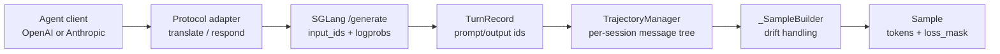

# Agent轨迹

本专题回答 agentic RL 里最容易错的一件事：运行时是 OpenAI/Anthropic 消息、tool calls、sandbox 交互和多轮重放，训练时却必须变成 `tokens + loss_mask + rollout_log_probs`。`TrajectoryManager` 和协议 adapter 的任务，就是把“一个 session 的多轮对话树”线性化成 Slime 可训练的 `list[Sample]`。

## 读者任务

| 读者处境 | 先读 | 读完能做什么 |
|----------|------|--------------|
| 第一次理解 agent 轨迹 | [[Slime-Agent轨迹-核心概念]] | 区分 wire message、manager message、TurnRecord、MessageNode、Sample |
| 想追一轮请求 | [[Slime-Agent轨迹-源码走读]] | 从 adapter `_run_turn` 追到 `record_turn` 和 `finish_session` |
| 正在处理多轮/分支 | [[Slime-Agent轨迹-数据流]] | 说明 session affinity、message tree、multi-leaf sample fan-out |
| 正在排障 | [[Slime-Agent轨迹-排障指南]] | 按 token 对齐、TITO drift、tool call canonicalization、客户端断连定位问题 |
| 做验收 | [[Slime-Agent轨迹-学习检查]] | 跑 agent tests 和专题审计 |

## 本专题边界

| 不负责 | 负责 |
|--------|------|
| 设计新的 agent framework | 接入已有 OpenAI/Anthropic 风格 agent runtime |
| 决定 reward 函数 | 把 agent 交互变成可打 reward 的 `Sample` |
| 管 SGLang backend 调度 | 用 `X-SMG-Routing-Key` 提供 session 级路由提示 |
| 重新 tokenize 模型文本 | 保留 SGLang 返回的 token ids 和 output logprobs |
| 替代 rollout 编排 | 作为 `--custom-generate-function-path` 的常见实现部件 |

## 源码范围

| 文件 | 负责什么 |
|------|----------|
| `slime/agent/adapters/common.py` | BaseAdapter session 生命周期、一轮 turn pipeline、SGLang `/generate` 调用 |
| `slime/agent/adapters/openai.py` | OpenAI Chat Completions wire 翻译、回复封装、session id 解析；不实现 `/v1/responses` |
| `slime/agent/adapters/anthropic.py` | Anthropic Messages wire 翻译、tool block、mid-list system 处理 |
| `slime/agent/parsing.py` | reasoning 和 tool call 解析，输出 `ParsedModelOutput` |
| `slime/agent/trajectory.py` | `TurnRecord`、`MessageNode`、drift 分类、tree 到 `Sample` 线性化 |
| `docs/en/get_started/agent.md` | 推荐集成方式：custom generate、fan-out、session affinity |
| `tests/test_agent/` | adapter、trajectory branching、harness、CPU rollout 验证 |

## 一页契约图

| 层 | 真正的判定键 | 不保证什么 |
|----|----------------|--------------|
| wire → manager message | 规范化后的 dict equality | 完整保留 wire 所有字段、id 和并行 tool call |
| manager routing tree | `(role, message ==)` 的最深前缀 | token ids 相同，或客户端语义一定相同 |
| leaf → builder | `prompt_ids` 与已持有 tokens 的 common prefix | 一棵 tree 只产生一个 sample |
| builder → Sample | `leading_prompt_len`、`loss_mask`、logprob 并行数组 | 截断后仍一定保留训练 token |
| session → fan-out | DFS leaf 顺序、`response_trained`、每个 sample 完整 reward | reward 在 sibling samples 间平分，或失败后可无损重试 |

两个最容易误解的边界：OpenAI adapter 只实现 `/v1/chat/completions`；官方 agent 文档的 `finish_session(session_id)` 示例省略了当前函数必需的 `base_sample`，不能原样复制运行。

## 阅读顺序

1. [[Slime-Agent轨迹-核心概念]]：先建立“消息树 + token builder”的心理模型。
2. [[Slime-Agent轨迹-源码走读]]：沿一轮 agent 请求到 `Sample` 的主线读源码。
3. [[Slime-Agent轨迹-数据流]]：看 OpenAI/Anthropic、SGLang、TrajectoryManager、custom generate 的边界。
4. [[Slime-Agent轨迹-排障指南]]：排查 drift、fork、重复训练、断连和 session id。
5. [[Slime-Agent轨迹-学习检查]]：用测试与审计验证。

## 前后衔接

- 上游：[[Slime-SGLang-Rollout]] 解释默认单轮 generate，本专题解释多轮 agent 如何替代那条路径。
- 下游：[[Slime-自定义扩展]] 解释 `--custom-generate-function-path`、`--custom-rm-path` 等挂接点。
- 下游：[[Slime-插件与示例]] 解释 Search-R1、coding agent、多 agent 示例如何落地。
