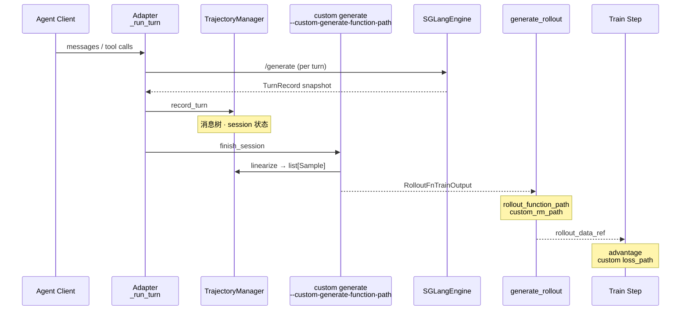

# 高级特性

> **你只需阅读本目录，不必打开 `slime/` 源码。**
> 内嵌代码对应 slime Git commit `22cdc6e1`。

---

## 本目录解决什么问题

前面的目录讲清了 Slime **默认 RL 闭环**。本目录回答：**多轮 Agent 对话如何线性化为可训练的 `Sample`？业务逻辑如何通过 `--*-path` 扩展接口注入而不改核心代码？**

两个专题覆盖高级扩展全链路：

| 模块 | 角色 | 一句话 |
|------|------|--------|
| [[Slime-Agent轨迹]] | 轨迹线性化 | TrajectoryManager、TurnRecord → `list[Sample]` |
| [[Slime-自定义扩展]] | 扩展接口 | 17 类 `--*-path`、`load_function`、Rollout/Train hooks |

---

## 端到端时序

这张图用于检查是否能解释 Agent 多轮对话如何经 TrajectoryManager 线性化为 Sample，以及如何按任务选择 `--custom-generate-function-path` 等扩展接口。

这张图的读法是：Agentic RL 的核心矛盾是 **运行时 chat 结构 vs 训练时 token+loss_mask**。TrajectoryManager 在中间维护 session 树并线性化，自定义扩展提供挂载点，让 generate、RM、loss 与 actor postprocess 等稳定边界可替换。

---

## 零基础一句话

**像「多集连续剧剪辑成一条片」：** Agent 轨迹把每集（turn）挂到总剧本（TrajectoryManager）上，最后剪成训练用的 Sample 片段；自定义扩展是可替换导演、编剧和评分员的一组稳定插槽。

---

## 推荐阅读顺序

建议先读自定义扩展的边界，再用 Agent 轨迹源码走读理解多轮对话如何变成训练样本。

| 顺序 | 文档 | 必读理由 |
|------|------|----------|
| 1 | [[Slime-自定义扩展-核心概念]] | 17 类接口总表与选型 |
| 2 | [[Slime-自定义扩展-源码走读]] | `load_function` 与 arguments 定义 |
| 3 | [[Slime-Agent轨迹-核心概念]] | TurnRecord、linearize 术语 |
| 4 | [[Slime-Agent轨迹-源码走读]] | TrajectoryManager 与 adapter 精读 |
| 5 | [[Slime-训练与Rollout参数-排障指南]] | `*-path` 与 plugin_contracts 对照 |

---

## 阶段衔接

| 方向 | 模块 | 衔接点 |
|------|------|--------|
| ← 权重同步 | [[Slime-分布式权重同步]] | Agent rollout 仍走 `update_weights` |
| → 插件与示例 | [[Slime-插件与示例]] | search-r1 / multi_agent 样板工程 |
| → Rollout | [[Slime-SGLang-Rollout]] | `--rollout-function-path` 替换默认 generate |
| → Reward 与过滤 | [[Slime-Reward与过滤]] | `--custom-rm-path` / dynamic filter |
| → 训练 | [[Slime-Advantage计算]] · [[Slime-Policy-Loss]] | `--custom-loss-path` / advantage hooks |
| → 参数 | [[Slime-训练与Rollout参数]] | 全部 `*-path` CLI 定义处 |

---

## 自测建议（零基础可试）

1. **接口选型：** 对照 [[Slime-自定义扩展-核心概念]]，说明 Agent 任务需挂载 `--custom-generate-function-path` 而非仅 `--rollout-function-path` 的场景。
2. **线性化：** 在 [[Slime-Agent轨迹-数据流]] 上，口述两轮 tool call 如何变成两个 `Sample` 的 `loss_mask`。
3. **交叉阅读：** 打开 [[Slime-自定义扩展-核心概念]] 接口表（对照 upstream `docs/en/get_started/customization.md`），核对 17 类接口与 CLI 名一一对应。

---

## 模块导航

| 目录 | 状态 |
| ------ | ------ |
| [[Slime-Agent轨迹|Agent-Trajectory]] | ✅ |
| [[Slime-自定义扩展|Customization]] | ✅ |

← [[Slime-权重同步]] · → [[Slime-扩展与生态]]
