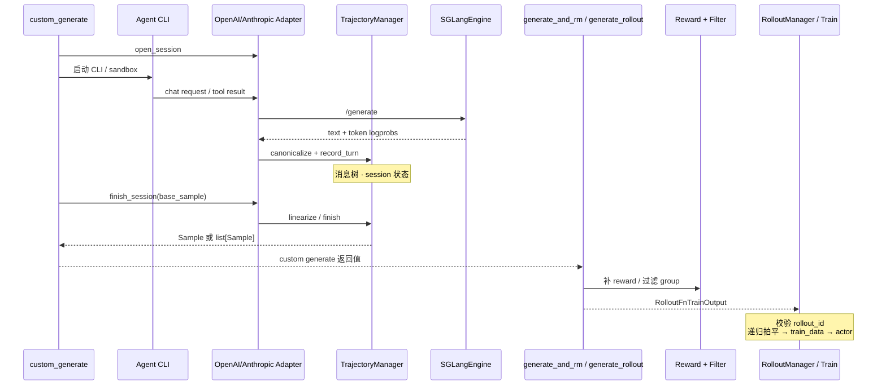

# 高级特性

> 本目录先提供连续的高级特性主线；准备修改实现、核对版本漂移或遇到证据争议时，仍应按 Git `22cdc6e1` 打开 `slime/` 源码验证。

---

## 本目录解决什么问题

前面的目录讲清了 Slime **默认 RL 闭环**。本目录回答：**多轮 Agent 对话如何线性化为可训练的 `Sample`？业务逻辑如何通过 `--*-path` 扩展接口注入而不改核心代码？**

两个专题覆盖高级扩展的两条主线：

| 模块 | 角色 | 一句话 |
|------|------|--------|
| [[Slime-Agent轨迹]] | 协议与轨迹线性化 | wire request → message tree → token builder → `list[Sample]` |
| [[Slime-自定义扩展]] | 扩展接口 | import path → generate/RM/filter/convert/train 调用边界 |

它们的交点是 `custom_generate`：上游把多轮交互整理成一个或多个 `Sample`，下游默认 rollout 继续做 reward、filter、拍平、训练数据转换与分发。这个交点也是高风险区，因为“返回 `list[Sample]`”会把 fan-out 嵌套形状传播到 group RM、partial abort 和 filter。

---

## 端到端时序

这张图用于检查是否能解释 Agent 多轮对话如何经 adapter 与 TrajectoryManager 线性化为 Sample，以及这些 Sample 如何重新接回默认 rollout。它刻意区分“协议/轨迹层”和“训练编排层”。

这张图的读法是：Agentic RL 的核心矛盾是 **运行时 chat/message tree vs 训练时 token、response span 与 loss mask**。TrajectoryManager 在中间维护 session 树并线性化，自定义扩展提供调用边界，让 generate、RM、filter、转换和 actor postprocess 可替换。框架不会自动证明这些插件的签名、长度和嵌套形状正确；contract tests 也只覆盖部分正常路径。

---

## 零基础一句话

**像「多集连续剧剪辑成训练片段」：** Agent 轨迹把每集（turn）挂到消息树上，再按分支剪成训练用的 `Sample`；自定义扩展像剪辑、评分和训练工位上的接口。类比只说明职责分层，不保证任意工位都能接收 fan-out、多进程副作用或错长 reward。

---

## 推荐阅读顺序

建议先读自定义扩展的边界，再用 Agent 轨迹源码走读理解多轮对话如何变成训练样本。

| 顺序 | 文档 | 必读理由 |
|------|------|----------|
| 1 | [[Slime-自定义扩展-核心概念]] | 先按对象边界选 hook，区分规范要求与源码强制 |
| 2 | [[Slime-Agent轨迹-核心概念]] | 建立 wire、tree、builder、Sample 与 fan-out 五层模型 |
| 3 | [[Slime-Agent轨迹-源码走读]] | 沿 adapter→record→linearize→finish 阅读真实状态变化 |
| 4 | [[Slime-自定义扩展-源码走读]] | 把 Sample 接回 generate、RM、filter、convert 与 actor |
| 5 | [[Slime-自定义扩展-排障指南]] | 处理 evaluation、错长 RM、嵌套 fan-out 和签名漂移 |

---

## 阶段衔接

| 方向 | 模块 | 衔接点 |
|------|------|--------|
| ← 权重同步 | [[Slime-分布式权重同步]] | Agent rollout 仍走 `update_weights` |
| → 插件与示例 | [[Slime-插件与示例]] | search-r1 / multi_agent 样板工程 |
| → Rollout | [[Slime-SGLang-Rollout]] | `--rollout-function-path` 替换默认 generate |
| → Reward 与过滤 | [[Slime-Reward与过滤]] | `--custom-rm-path` / dynamic filter |
| → 训练 | [[Slime-Advantage计算]] · [[Slime-Policy-Loss]] | reward postprocess、loss reducer、`--custom-loss-function-path` |
| → 参数 | [[Slime-训练与Rollout参数]] | 全部 `*-path` CLI 定义处 |

---

## 自测建议（零基础可试）

1. **接口选型：** 对照 [[Slime-自定义扩展-核心概念]]，说明何时只替换 `custom_generate`，何时必须接管完整 `rollout_function`。
2. **线性化：** 在 [[Slime-Agent轨迹-数据流]] 上，画出两轮 tool call 从 wire message、tree node、token builder 到 sibling `Sample` 的字段归属。
3. **组合边界：** 解释为什么 sibling 共享 `rollout_id` 仍不足以证明 fan-out × group RM/partial abort 安全。
4. **证据校验：** 在 `slime/` 目录运行四份 `tests/plugin_contracts/`，再完成 [[Slime-自定义扩展-学习检查]] 的静态边界脚本；预期 contract tests 通过，同时静态脚本确认当前基线仍存在文档记录的非严格回填与签名漂移。

---

## 模块导航

| 目录 | 首次阅读任务 |
|------|--------------|
| [[Slime-Agent轨迹|Agent-Trajectory]] | 先解释协议如何有损归一化，再跟踪 tree 如何线性化 |
| [[Slime-自定义扩展|Customization]] | 先选最窄 hook，再证明下游消费方能接住数据形状 |

← [[Slime-权重同步]] · → [[Slime-扩展与生态]]
