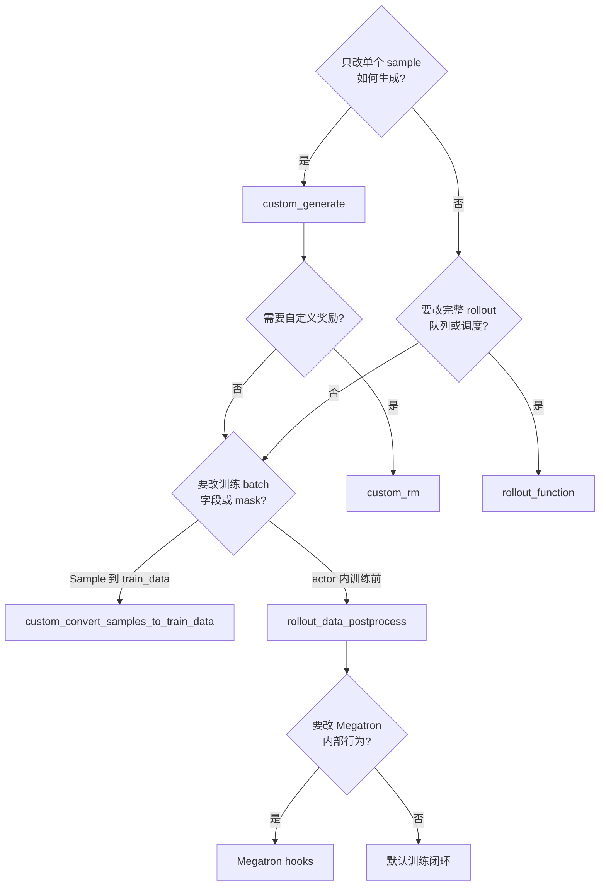
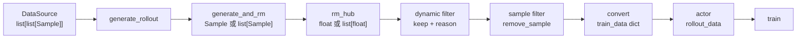
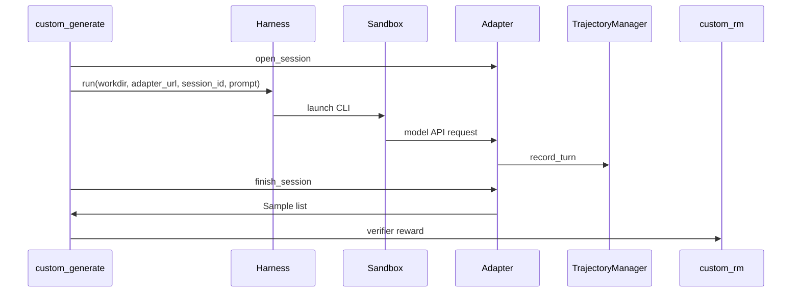

# 自定义扩展 · 数据流

## 你为什么要读

本页沿自定义 hook 介入后的对象流读：`Sample` 如何经过 generate、reward、filter、convert、actor postprocess 进入训练 batch。读完后应能判断哪些 hook 可以叠加，哪些边界不该混用。

这一篇只回答一个问题：自定义 hook 介入以后，数据对象从 `Sample` 到训练 batch 的形状如何变化，哪些边界可以叠加，哪些边界不该混用。

## 1. 选择树

默认建议是从最窄边界开始：能用 `custom_generate` 就不要替换完整 rollout，能改 reducer 就不要重写整个 loss。

## 2. 默认 rollout 上的 hook 点

`custom_generate` 只替换 `CG` 这一格，仍保留取样、并发水位、filter、RM、buffer 和训练数据交付。`rollout_function` 则直接替换 `RO`，需要自己维护后续能消费的数据形状。

## 3. 对象生命周期

| 阶段 | 主要对象 | 关键字段或不变量 |
|------|----------|------------------|
| 数据源取样 | `list[list[Sample]]` | 外层是 prompt group，内层是同 prompt 多 response |
| 单样本生成 | `Sample` 或 `list[Sample]` | `tokens/response/response_length/status/reward` 要完整 |
| fan-out | 兄弟 `Sample` | 共享 `rollout_id`，避免 group 语义断裂 |
| reward | float 或 reward list | batch RM 返回长度等于 samples 长度 |
| sample filter | 原始 `Sample` | 设置 `remove_sample`，不要直接删 group 元素 |
| train data | dict | `tokens/response_lengths/rewards/loss_masks` 等字段长度对齐 |
| rollout data | actor 内 batch | advantage/return 后可被 postprocess 原地修改 |

源码依据：`docs/en/get_started/customization.md` L131-L136 约束 RM 返回；L209-L211 约束 sample filter 副作用；`slime/backends/megatron_utils/actor.py` L511-L512 说明 actor 侧 postprocess 的调用位置。

## 4. Agent adapter 与 harness 数据流

harness 管 sandbox 和 CLI 进程，adapter 管 OpenAI/Anthropic 协议，TrajectoryManager 管消息树到 `Sample` 的线性化。Customization 负责把它们挂到 rollout 的 generate/RM 边界上。

## 5. train 与 eval 分离

`--eval-function-path` 默认可以复用 rollout 函数，但 eval 的目标不同：它通常需要更保守的 sampling、禁用训练专用噪声，或者输出 eval dataset 的 `rewards/truncated/samples`。来源：docs/en/get_started/customization.md L408-L409

如果 eval 只是生成策略不同，优先在 `custom_generate` 里接受 `evaluation` 参数；如果 eval 数据集和返回结构完全不同，再独立设置 `--eval-function-path`。

## 6. 日志与运行时 hook

runtime hook 主要是日志、reward 后处理、sample 转 train data、actor 侧 postprocess。契约测试把这些调用点固化为签名检查：

| hook | 签名核心 | 数据边界 |
|------|----------|----------|
| rollout log | `rollout_id, args, samples, metrics, time` | 已完成 rollout 的样本与指标 |
| eval log | `rollout_id, args, data, metrics` | eval dataset 输出 |
| reward postprocess | `args, samples` | advantage 前的 reward 列表 |
| convert samples | `args, samples` | `Sample` 到 train data dict |
| rollout data postprocess | `args, rollout_id, rollout_data` | actor 内训练前 batch |

源码依据：`slime/ray/rollout.py` L437-L449 显示 RolloutManager 加载这些 runtime hook；`slime/backends/megatron_utils/actor.py` L180-L184 显示 actor 侧 hook 加载。

## 7. contract tests 放在数据流边界

四个测试文件对应四组边界：

| 测试文件 | 覆盖对象 |
|----------|----------|
| `test_plugin_rollout_contracts.py` | 完整 rollout 函数签名、train/eval 输出、Sample 字段 |
| `test_plugin_generate_contracts.py` | default generate 分支、per-sample path 优先级、fan-out 返回 |
| `test_plugin_path_loading_contracts.py` | eval、RM、filter、data source 等 path 形状 |
| `test_plugin_runtime_hook_contracts.py` | 日志、reward postprocess、convert、actor postprocess |

这些测试之所以有价值，是因为它们贴着 Slime 的真实消费边界检查，而不是只测试函数能不能被 import。

## 8. 与相邻专题的分工

| 专题 | 负责的问题 |
|------|------------|
| [[Slime-Sample数据契约]] | `Sample` 字段和响应时间轴不变量 |
| [[Slime-SGLang-Rollout]] | 默认 rollout 外循环、并发水位、partial abort |
| [[Slime-Reward与过滤]] | RM、group RM、dynamic filter 的内部细节 |
| [[Slime-训练数据]] | train_data 到 per-rank rollout_data 的整形 |
| [[Slime-Agent轨迹]] | 多轮 agent 消息如何线性化成 `Sample` |

读 28 时不要把所有细节都塞进一个 hook。先确认对象边界，再跳到负责该对象的专题。
