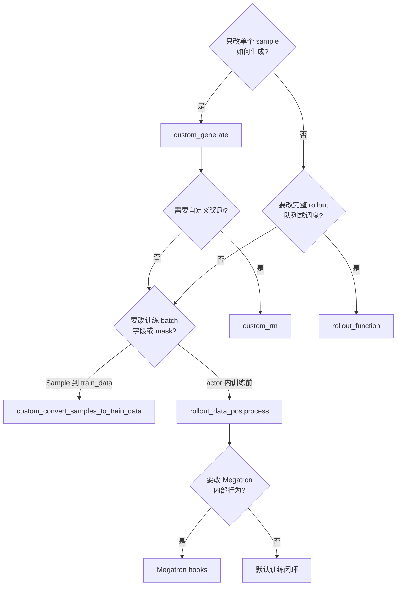
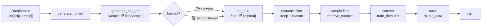
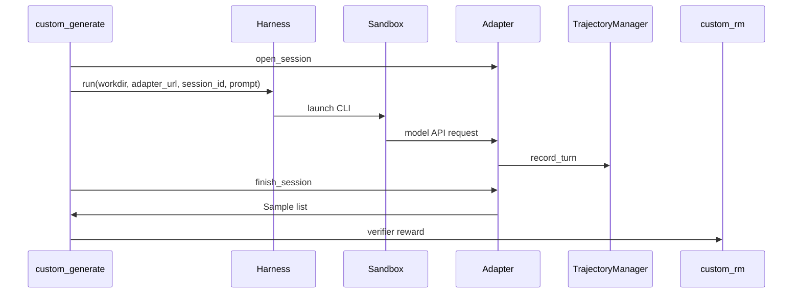

# 自定义扩展 · 数据流

## 你为什么要读

本页沿自定义 hook 介入后的对象流读：`Sample` 如何经过 generate、reward、filter、convert、actor postprocess 进入训练 batch。读完后应能判断哪些 hook 可以叠加，哪些边界不该混用。

这一篇只回答一个问题：自定义 hook 介入以后，数据对象从 `Sample` 到训练 batch 的形状如何变化，哪些边界可以叠加，哪些边界不该混用。

## 1. 选择树



默认建议是从最窄边界开始：能用 `custom_generate` 就不替换完整 rollout，能改 reducer 就不重写整个 loss。但边界越窄不代表自动安全；fan-out 会把一个窄 generate hook 的形状变化传播到 RM、filter、abort 和训练归约。

## 2. 默认 rollout 上的 hook 点



`custom_generate` 只替换 `CG` 这一格，仍进入取样、并发水位、filter、RM、buffer 和训练数据交付；因此它也必须满足这些消费方的形状假设。`rollout_function` 则直接替换 `RO`，需要自己维护后续能消费的数据形状。它本身是同步函数，内部如需 async 要像默认实现一样自己运行事件循环。

## 3. 对象生命周期

| 阶段 | 主要对象 | 关键字段或不变量 |
|------|----------|------------------|
| 数据源取样 | `list[list[Sample]]` | 外层是 prompt group，内层是同 prompt 多 response |
| 单样本生成 | `Sample` 或 `list[Sample]` | `tokens/response/response_length/status` 要完整；进入训练转换前 reward 必须补齐 |
| fan-out | 兄弟 `Sample`，随后形成嵌套 group | 显式共享非空 `rollout_id`；逐一维护 index/session/metadata 语义 |
| reward | float 或 reward list | 业务契约要求等长；源码用非严格 zip，插件必须自检 |
| sample filter | 原始 `Sample` | 设置 `remove_sample`，不要直接删 group 元素 |
| train data | dict | `tokens/response_lengths/rewards/loss_masks` 等字段长度对齐 |
| rollout data | actor 内 batch | advantage/return 后可被 postprocess 原地修改 |

源码依据：`docs/en/get_started/customization.md` L131-L136 给出 RM 返回契约；L209-L211 约束 sample filter 副作用；`slime/rollout/sglang_rollout.py` L267-L276 和 L326-L331 显示 reward 回填使用非严格 zip；`slime/backends/megatron_utils/actor.py` L511-L512 说明 actor 侧 postprocess 的调用位置。

### 3.1 fan-out 后的真实形状

假设 data source 给一个 prompt 复制出两个样本，两个 `custom_generate` 都各自 fan-out 为两个片段：

```text
生成前: list[Sample]                         # 长度 2
生成后: list[list[Sample]]                  # 外层仍长度 2，每项是两个片段
训练入口: 递归拍平为 list[Sample]            # 最终长度 4
eval: 当场 extend，直接得到 list[Sample]     # 最终长度 4
```

这解释了 train/eval 的形状不对称：训练 rollout 的 filter、group RM 和 abort 先看见嵌套形状，到了 `RolloutManager._get_rollout_data` 才拍平；eval 在 `eval_rollout_single_dataset` 内立即 `extend`。`len(group) == n_samples_per_prompt` 只检查原始 prompt 副本数，不检查 fan-out 后片段总数。

## 4. Agent adapter 与 harness 数据流



harness 管 sandbox 和 CLI 进程，adapter 管 OpenAI/Anthropic 协议，TrajectoryManager 管消息树到 `Sample` 的线性化。Customization 负责把它们挂到 rollout 的 generate/RM 边界上。

## 5. train 与 eval 分离

`--eval-function-path` 默认可以复用 rollout 函数，但 eval 的目标不同：它通常需要更保守的 sampling、禁用训练专用噪声，或者输出 eval dataset 的 `rewards/truncated/samples`。来源：docs/en/get_started/customization.md L408-L409

如果 eval 只是生成策略不同，优先在 `custom_generate` 里显式声明 `evaluation` 参数；只写 `**kwargs` 不会收到它。如果 eval 数据集和返回结构完全不同，再独立设置 `--eval-function-path`。默认 eval 明确禁止 group RM，却会把 fan-out 结果拍平，因此不能用训练路径的嵌套形状来推断 eval 插件输入。

## 6. 日志与运行时 hook

runtime hook 主要是日志、reward 后处理、sample 转 train data、actor 侧 postprocess。契约测试把这些调用点固化为签名检查：

| hook | 签名核心 | 数据边界 |
|------|----------|----------|
| rollout log | `rollout_id, args, samples, metrics, time` | 已完成 rollout 的样本与指标 |
| eval log | `rollout_id, args, data, metrics` | eval dataset 输出 |
| reward postprocess | `args, samples` | rollout 已拍平后、advantage 前的 reward 列表 |
| convert samples | `args, samples` | `Sample` 到 train data dict |
| rollout data postprocess | `args, rollout_id, rollout_data` | actor 内训练前 batch |

源码依据：`slime/ray/rollout.py` L437-L449 显示 RolloutManager 加载这些 runtime hook；`slime/backends/megatron_utils/actor.py` L180-L184 显示 actor 侧 hook 加载。

## 7. contract tests 放在数据流边界

四个测试文件对应四组边界：

| 测试文件 | 覆盖对象 |
|----------|----------|
| `test_plugin_rollout_contracts.py` | 完整 rollout 函数签名、train/eval 输出、Sample 字段 |
| `test_plugin_generate_contracts.py` | default generate 分支、per-sample path 优先级、fan-out 返回 |
| `test_plugin_path_loading_contracts.py` | eval、RM、filter、data source 等 path 形状 |
| `test_plugin_runtime_hook_contracts.py` | 日志、reward postprocess、convert、actor postprocess |

这些测试之所以有价值，是因为它们贴着 Slime 的若干真实消费边界检查，而不是只测试函数能不能被 import。但它们不是完整类型系统：当前没有覆盖同步 custom generate、`**kwargs` 的 evaluation 传播、RM 长度错位、fan-out × group RM/abort/filter，以及多 Ray 进程 import 副作用。

## 8. 与相邻专题的分工

| 专题 | 负责的问题 |
|------|------------|
| [[Slime-Sample数据契约]] | `Sample` 字段和响应时间轴不变量 |
| [[Slime-SGLang-Rollout]] | 默认 rollout 外循环、并发水位、partial abort |
| [[Slime-Reward与过滤]] | RM、group RM、dynamic filter 的内部细节 |
| [[Slime-训练数据]] | train_data 到 per-rank rollout_data 的整形 |
| [[Slime-Agent轨迹]] | 多轮 agent 消息如何线性化成 `Sample` |

读本专题时不要把所有细节都塞进一个 hook。先确认对象边界，再跳到负责该对象的专题。
