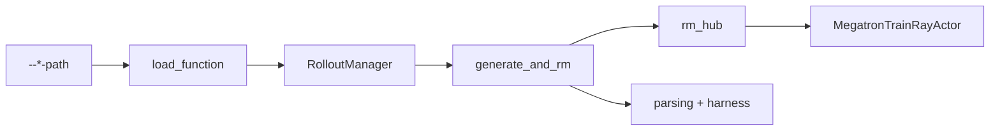

# 自定义扩展 · 源码走读

本篇用一个具体场景串源码：你要接一个 coding-agent 任务，生成阶段在 sandbox 里跑 CLI agent，奖励阶段用 verifier，训练前还要根据 metadata 调整 loss mask。这个场景不应直接重写整个训练闭环，而是优先组合 `custom_generate`、`custom_rm`、必要的转换/后处理 hook。

走读主线是：



## 长文读法

这篇按 hook 层级选择扩展点读：所有 path 先走 `load_function`，但 `RolloutManager` 级 hook、sample-level `custom_generate`、RM hook、训练后处理、agent parsing / harness 是不同边界。先判断你要改的是整段 rollout、单个 sample、reward、训练数据，还是 coding-agent 协议接入。

| 你的任务 | 先读 | 抓住什么 |
|----------|------|----------|
| 排查 path 失效 | 1 | `load_function` 只 import 并取属性，签名错误会留到调用点暴露 |
| 改整段 rollout / eval / data conversion | 2 | 这类 hook 在 `RolloutManager` 启动期加载并缓存 |
| 改单样本 generate | 3 | `sample.generate_function_path` 优先级高于全局 `custom_generate_function_path` |
| 改 reward 或过滤 | 4 | RM hook 写的是 sample 契约，不应绕过 reward 后处理边界 |
| 改训练前 rollout_data | 5 | 训练 actor 的 hook 位于 Megatron backward 前，适合补字段或改 mask |
| 接 coding agent | 6 到 7 | parsing 和 harness 负责 wire / sandbox 交互，不应重写训练闭环 |
| 查官方签名 | 8 | docs 里的 customization signature 是长期维护时的对照表 |

## 1. path 字符串如何变成 callable

Slime 没有维护复杂的插件注册表。所有 path hook 都先回到一个很薄的加载器：拆 module path，import module，再取属性。

来源：slime/utils/misc.py L37-L45

```python
def load_function(path):
    """
    Load a function from a module.
    :param path: The path to the function, e.g. "module.submodule.function".
    :return: The function object.
    """
    module_path, _, attr = path.rpartition(".")
    module = importlib.import_module(module_path)
    return getattr(module, attr)
```

读法要点：

- 这里不捕获 `ImportError` 或 `AttributeError`，path 错误会 fail-fast。
- 这里不检查函数签名，真正的契约在调用点和 `tests/plugin_contracts/`。
- 同样是 path hook，有的启动期加载并缓存，有的每个 sample 动态加载，排障时要先确认调用位置。

## 2. RolloutManager 在启动期挂载外层扩展点

外层扩展点包括数据源、完整 rollout 函数、eval rollout 函数、reward 后处理和 sample-to-train-data 转换。这些都在 `RolloutManager` 初始化时解析，后续 rollout step 直接调用成员上的 callable。

来源：slime/ray/rollout.py L437-L449

```python
data_source_cls = load_function(self.args.data_source_path)
self.data_source = data_source_cls(args)

self.generate_rollout = load_function(self.args.rollout_function_path)
self.eval_generate_rollout = load_function(self.args.eval_function_path)
self.custom_reward_post_process_func = None
if self.args.custom_reward_post_process_path is not None:
    self.custom_reward_post_process_func = load_function(self.args.custom_reward_post_process_path)
self.custom_convert_samples_to_train_data_func = None
if self.args.custom_convert_samples_to_train_data_path is not None:
    self.custom_convert_samples_to_train_data_func = load_function(
        self.args.custom_convert_samples_to_train_data_path
    )
```

这段代码给出第一条选择原则：如果你的逻辑影响整个 rollout step 的取样、eval、buffer 或数据转换，才进 RolloutManager 这一层。只想把一个 prompt 交给 agent 跑，应该继续往下看 `generate_and_rm`。

## 3. `custom_generate` 替换单样本生成

默认 rollout 外循环会调用 `generate_and_rm`。这里先看 sample 级别有没有 `generate_function_path`，再看全局 `args.custom_generate_function_path`，最后才走内置 `generate`。

来源：slime/rollout/sglang_rollout.py L249-L260

```python
with state.dp_rank_context() as _:
    custom_func_path = getattr(sample, "generate_function_path", None) or args.custom_generate_function_path

    if custom_func_path is not None:
        custom_generate_func = load_function(custom_func_path)
        if "evaluation" in inspect.signature(custom_generate_func).parameters:
            sample = await custom_generate_func(args, sample, sampling_params, evaluation=evaluation)
        else:
            sample = await custom_generate_func(args, sample, sampling_params)
    else:
        sample = await generate(args, sample, sampling_params)
```

这段是 agentic 任务的核心入口：

- per-sample path 优先级高于全局 path，方便混合不同任务。
- 函数每次调用时解析，适合 sample 自带不同生成策略。
- 如果签名包含 `evaluation`，Slime 会把 eval 标志传进去。
- 所有分支都会 `await`，所以自定义 generate 必须返回 awaitable。
- 返回值可以是 `Sample` 或 `list[Sample]`，fan-out 时必须维护共同 `rollout_id`。

官方文档也把这个接口放在 agentic workflow 的推荐路径上：多数 agent 场景先用 `--custom-generate-function-path` 加 `--custom-rm-path`，只有默认 rollout 循环不足时才替换完整 rollout。来源：docs/en/get_started/customization.md L58-L59

## 4. reward hook 的单样本和 batch 入口

生成之后进入 RM hub。普通模式可以按单样本打分；group RM 模式需要把同组样本一起交给 verifier。batch 入口一旦发现全局 `custom_rm_path`，就直接调用用户函数。

来源：slime/rollout/rm_hub/__init__.py L97-L99

```python
if args.custom_rm_path is not None:
    rm_function = load_function(args.custom_rm_path)
    return await rm_function(args, samples, **kwargs)
```

官方契约区分两种签名。来源：docs/en/get_started/customization.md L131-L136

```python
async def custom_rm(args, sample: Sample) -> float

async def batched_custom_rm(args, samples: list[Sample]) -> list[float]
```

这里的关键不是“有没有自定义 RM”，而是输入维度：单样本签名返回一个数字，batch 签名必须返回与 `samples` 等长的 reward list。长度错位会把 reward 对到错误样本上，后续 advantage 和 loss 都会失真。

## 5. filter hook 改的是控制流或 loss mask

Customization 文档把过滤拆成几类，是因为它们改变的边界不同。

来源：docs/en/get_started/customization.md L168-L172

```python
@dataclass
class DynamicFilterOutput:
    keep: bool
    reason: str | None
```

dynamic sampling filter 决定一个 group 是否进入训练池，并给出原因，便于日志统计。它适合 DAPO/GRPO 类按 group 质量筛样的场景。

来源：docs/en/get_started/customization.md L209-L211

```python
def filter_function(args, samples: list[Sample]) -> None
```

rollout sample filter 则依赖副作用：原地设置 `Sample.remove_sample`。这不是从列表里删除样本，而是保留样本边界，后续转换时把对应 loss mask 置为不可训练。这样可以避免破坏 `n_samples_per_prompt`、reward normalization 和 rollout 日志统计。

## 6. 从 `Sample` 到训练数据

如果要重写 sample 转训练 batch 的形状，用 `--custom-convert-samples-to-train-data-path`。如果要在 actor 里根据已经算好的 logprob、advantage 或额外字段改 batch，用 `--rollout-data-postprocess-path`。

`rollout_data_postprocess` 在训练 actor 初始化时加载。

来源：slime/backends/megatron_utils/actor.py L180-L184

```python
self.rollout_data_postprocess = None
if self.args.rollout_data_postprocess_path is not None:
    from slime.utils.misc import load_function

    self.rollout_data_postprocess = load_function(self.args.rollout_data_postprocess_path)
```

它的调用点在 advantage/return 计算之后、日志和训练之前。

来源：slime/backends/megatron_utils/actor.py L511-L512

```python
if self.rollout_data_postprocess is not None:
    self.rollout_data_postprocess(self.args, rollout_id, rollout_data)
```

这个时机很强也很危险：hook 可以修改即将被日志和 `train` 同时看到的数据，因此必须保持 `tokens`、`response_lengths`、`loss_masks`、`rewards` 等字段长度一致。

## 7. 完整 rollout hook 是最高权限替换点

当默认外循环不够用时，可以替换 `--rollout-function-path`。官方签名是：

来源：docs/en/get_started/customization.md L58-L59

```python
def generate_rollout(args, rollout_id, data_source, evaluation=False) -> RolloutFnTrainOutput | RolloutFnEvalOutput
```

使用这个 hook 后，你要自己负责：

- 从 data source 取样本并维护 group 结构。
- 区分 train/eval 返回。
- 保留 metrics、debug dump、partial rollout、dynamic filter、buffer 回填等语义。
- 确保每个 `Sample` 满足 [[Slime-Sample数据契约-核心概念]] 里的字段契约。

所以它适合完整多 agent 编排、跨 rollout 队列或 fully async 实验，不适合只给每个 prompt 加工具调用。

## 8. DataSource 是可恢复的样本池

自定义数据源不是普通 iterator。官方要求它至少承担五项能力：取样、回填、保存、加载和长度统计。来源：docs/en/get_started/customization.md L387-L401

这背后的运行原因是：rollout 可能 partial abort，dynamic filter 可能丢 group，buffer 可能回填，续训要恢复游标。若数据源只会单向 `yield`，它无法配合 Slime 的训练闭环。

返回形状也要注意：默认路径期待 `list[list[Sample]]`，外层 list 是 prompt group，内层 list 是同 prompt 的多个 response。

## 9. pg loss reducer 只改归约，不改整个 loss

有些算法只想改变 policy gradient loss 的分母或 per-token/per-sample 归约方式，这时不需要重写完整 loss。

来源：docs/en/get_started/customization.md L288-L294

```python
def get_pg_loss_reducer(
    total_lengths: list[int],
    response_lengths: list[int],
    loss_masks: list[torch.Tensor],
    calculate_per_token_loss: bool = False,
) -> Callable[[torch.Tensor], torch.Tensor]
```

这个 hook 拿长度和 mask，返回一个 reducer callable。它不拿模型、optimizer 或 rollout data，说明它的职责只限 loss tensor 的归约语义。

## 10. Megatron hooks 位于训练栈内部

训练侧还有 Megatron init、logprob 前、train step 前三类 hook。

来源：docs/en/get_started/customization.md L421-L443

```python
def custom_init(args) -> None

def custom_hook(args, model, store_prefix) -> None

def custom_hook(args, rollout_id, step_id, model, optimizer, opt_param_scheduler) -> None
```

它们接触分布式模型、optimizer 和 scheduler。使用这类 hook 时，核心风险不是返回结构，而是所有 rank 的副作用是否一致。

## 11. Agent 输出解析先交给 SGLang parser

agent 任务里，模型输出可能混合 visible text、reasoning 和 tool call。Slime 先用 SGLang 的 function-call parser，解析失败时保留可诊断状态。

来源：slime/agent/parsing.py L67-L85

```python
if tool_parser_name and tools_schema:
    from sglang.srt.entrypoints.openai.protocol import Function, Tool
    from sglang.srt.function_call.function_call_parser import FunctionCallParser

    sg_tools = [Tool(type="function", function=Function(**d["function"])) for d in tools_schema]
    parser = FunctionCallParser(tools=sg_tools, tool_call_parser=tool_parser_name)
    calls = []
    if parser.has_tool_call(body_text):
        try:
            body_text, calls = parser.parse_non_stream(body_text)
        except Exception:
            logger.exception("[agent.parsing] sglang tool-call parsing failed; falling back")
    for c in calls:
        try:
            args = json.loads(c.parameters or "{}")
        except json.JSONDecodeError:
            args = {"_raw_arguments": c.parameters}
            ill_formed = True
        tool_uses.append({"name": c.name or "tool", "input": args})
```

当没有标准 tool call 结果时，XML fallback 扫描 Anthropic 风格片段，并只接受 schema 中声明过的 tool name。

来源：slime/agent/parsing.py L99-L110

```python
for m in re.finditer(
    r"<tool_call>\s*<function=([^>]+)>(.*?)</function>\s*</tool_call>",
    body_text,
    flags=re.DOTALL,
):
    name, inner = m.group(1), m.group(2)
    if name in valid_tools:
        args = {
            p.group(1): p.group(2).strip()
            for p in re.finditer(r"<parameter=([^>]+)>(.*?)</parameter>", inner, flags=re.DOTALL)
        }
        tool_uses.append({"name": name, "input": args})
```

这说明 parsing 层只做协议整理，不负责 reward。格式错误可以通过 `ill_formed` 或 raw arguments 继续传给 verifier。

## 12. harness 只管 sandbox 内的 CLI 生命周期

外部 coding-agent CLI 的安装、配置、启动和轨迹落盘由 harness 负责。`run_agent` 是共享执行骨架。

来源：slime/agent/harness/common.py L107-L121

```python
async def run_agent(sb: Sandbox, *, workdir: str, start_cmd: str, env: dict[str, str], time_budget_sec: int) -> int:
    """Launch the agent (start_cmd) and run it to completion, returning its exit code."""
    meta_dir = f"{workdir}/.harness"
    await sb.exec(f"mkdir -p {meta_dir} && chown agent:agent {meta_dir}", user="root", check=True, timeout=30)
    exit_code, _ = await exec_and_wait(
        sb,
        cmd=start_cmd,
        user="agent",
        env=env,
        workdir=workdir,
        out_file=f"{meta_dir}/trajectory.jsonl",
        time_budget_sec=time_budget_sec,
        tag="run",
        want_output=False,
    )
```

CLI 安装也有固定重试预算。

来源：slime/agent/harness/common.py L141-L150

```python
for attempt in range(NPM_INSTALL_RETRIES):
    exit_code, last_log = await exec_and_wait(
        sb, cmd=install_cmd, user="root", time_budget_sec=300, tag="harness-npm-install"
    )
    if exit_code == 0:
        return
    if attempt + 1 < NPM_INSTALL_RETRIES:
        await asyncio.sleep(NPM_INSTALL_BACKOFF_SEC * (attempt + 1))
```

harness 不知道任务奖励，也不负责 `Sample` 字段。它的输出要通过 adapter、trajectory manager 和 custom generate 接回 rollout 主线。

## 13. 运行验证：contract tests 检查插件边界

官方给出 CPU-only 插件契约测试。来源：docs/en/get_started/customization.md L476-L481

```bash
python -m pytest \
  tests/plugin_contracts/test_plugin_rollout_contracts.py \
  tests/plugin_contracts/test_plugin_generate_contracts.py \
  tests/plugin_contracts/test_plugin_path_loading_contracts.py \
  tests/plugin_contracts/test_plugin_runtime_hook_contracts.py
```

这些测试不证明你的业务 reward 正确，但能提前发现四类问题：path 不能加载、签名不对、返回结构不符合 Slime 预期、依赖副作用的 hook 没有真的修改对象。

**预期：** 四组 contract tests 通过；若失败，应能先归类到加载、签名、返回结构或副作用，而不是直接进入分布式训练碰运气。

## 14. 串回场景

对于开头的 coding-agent 场景，合理组合通常是：

1. `--custom-generate-function-path`：在 sandbox 内运行 agent CLI，把多轮轨迹整理成一个或多个 `Sample`。
2. `--custom-rm-path`：调用 verifier，普通模式返回 float，group RM 返回 reward list。
3. `--rollout-sample-filter-path` 或 `--custom-convert-samples-to-train-data-path`：控制哪些片段参与 loss。
4. `--rollout-data-postprocess-path`：只有在需要 actor 侧 logprob/advantage 后处理时才使用。
5. `--rollout-function-path`：仅当默认 rollout 外循环无法表达队列、并发或多 agent 编排时再替换。

Customization 的不变量是：策略可以替换，数据形状不能失真；hook 可以有副作用，但必须发生在源码允许的对象边界上。
