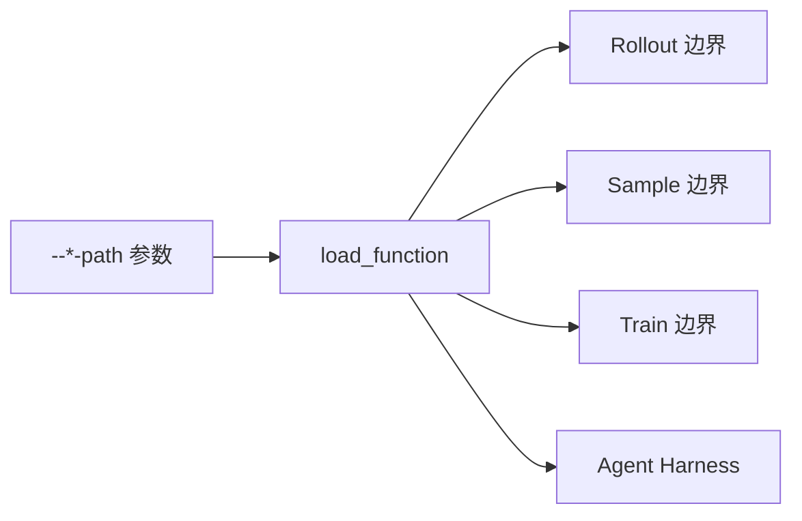

# 自定义扩展

> **Slime 高级特性 · 自定义扩展** | Git：`22cdc6e1`  
> **源码范围：** `docs/en/get_started/customization.md`、`slime/utils/misc.py`、`slime/ray/rollout.py`、`slime/rollout/sglang_rollout.py`、`slime/rollout/rm_hub/__init__.py`、`slime/backends/megatron_utils/actor.py`、`slime/agent/*`

## 你为什么要读

读这个专题是为了解决一个具体问题：当你要把自己的 agent、RAG、verifier、数据源、loss 或训练侧 hook 接进 Slime 时，应该改哪个扩展点、函数签名长什么样、返回对象会被谁继续消费。

读完以后应该能做到三件事：

- 在 `custom_generate`、`custom_rm`、`rollout_function`、`data_source`、`rollout_data_postprocess` 之间做出正确选择。
- 根据源码调用点判断 hook 看到的是 `Sample`、`list[Sample]`、`train_data` 还是 `rollout_data`。
- 用 `tests/plugin_contracts/` 先验证 import path、签名、返回结构和副作用，再跑真实训练。

## 先建立的模型

Customization 不是“在任意位置插函数”，而是一组 import-path 槽位。每个槽位固定在一个调用边界上：启动期加载、rollout 外层、单样本生成、reward、过滤、样本转训练数据、训练侧后处理、Megatron 内部 hook、agent harness。这里的“固定”只指当前基线的调用位置，不等于框架会替你验证签名、返回类型和长度。

源码依据：`docs/en/get_started/customization.md` L58-L59 明确外层 rollout 函数签名；L131-L136 区分单样本 RM 与 batch RM；L476-L481 给出插件契约测试入口。实际调用点还显示：外层 rollout 是同步 callable，`custom_generate` 才会被无条件 `await`；两者不能混用同一套 async 心智模型。

## 阅读顺序

| 顺序 | 文件 | 读者任务 |
|------|------|----------|
| 1 | [[Slime-自定义扩展-核心概念]] | 先弄清 hook 家族、加载方式和对象形状 |
| 2 | [[Slime-自定义扩展-源码走读]] | 沿 agentic 任务主线看 path 如何被加载和调用 |
| 3 | [[Slime-自定义扩展-数据流]] | 把 `Sample` 到 `rollout_data` 的生命周期串起来 |
| 4 | [[Slime-自定义扩展-排障指南]] | 按症状定位签名、fan-out、RM、filter、loss 等常见问题 |
| 5 | [[Slime-自定义扩展-学习检查]] | 用可执行命令验收自定义插件和本专题文档 |

## hook 选择速查

| 你要做什么 | 优先选哪个接口 | 为什么 |
|------------|----------------|--------|
| 给每个 prompt 接 agent、RAG、工具调用 | `--custom-generate-function-path` | 保留默认 rollout 外循环，只替换单样本生成 |
| 按规则、测试或外部服务打分 | `--custom-rm-path` | RM hub 已处理单样本和 group RM 两种入口 |
| 完全替换采样队列或多 agent 编排 | `--rollout-function-path` | 你需要自己返回 Slime 能继续消费的 train/eval 输出 |
| 改 prompt 池、buffer、续训恢复 | `--data-source-path` | 数据源承担取样、回填、保存和加载 |
| 根据 logprob、advantage 或 mask 调整训练 batch | `--rollout-data-postprocess-path` | 这个 hook 位于 Megatron actor 内、训练前 |
| 改 loss 或 loss reducer | `--custom-loss-function-path` 或 `--custom-pg-loss-reducer-function-path` | 只影响训练目标或 policy loss 归约 |
| 接外部 coding-agent CLI | agent harness + `custom_generate` | harness 管 CLI 生命周期，generate 管样本产出 |

> [!warning] fan-out 不是默认闭环的一等公民
> 当前基线允许 `custom_generate` 返回 `list[Sample]`，但默认训练路径随后会形成 `list[list[Sample]]` 的嵌套 group。普通 RM 能处理单次 fan-out，group RM、partial abort、dynamic/sample filter 等路径却仍按扁平 `Sample` 访问元素。若要 fan-out，先把它视为需要端到端契约测试的高级扩展，而不是只补一个共同 `rollout_id` 就安全。

## 与相邻专题的关系

← [[Slime-训练与Rollout参数]] 负责解释这些 CLI 参数如何进入 `args`。
← [[Slime-Agent轨迹]] 负责解释多轮 agent wire message 如何变成 `Sample`。
→ [[Slime-插件与示例]] 负责把这些接口落到 search-r1、multi-agent 等实例。

本专题的边界是“扩展点如何被 Slime 调用”。具体 RM、DataSource、SGLang Rollout、Agent Trajectory 的内部细节，分别回到对应专题继续读。
